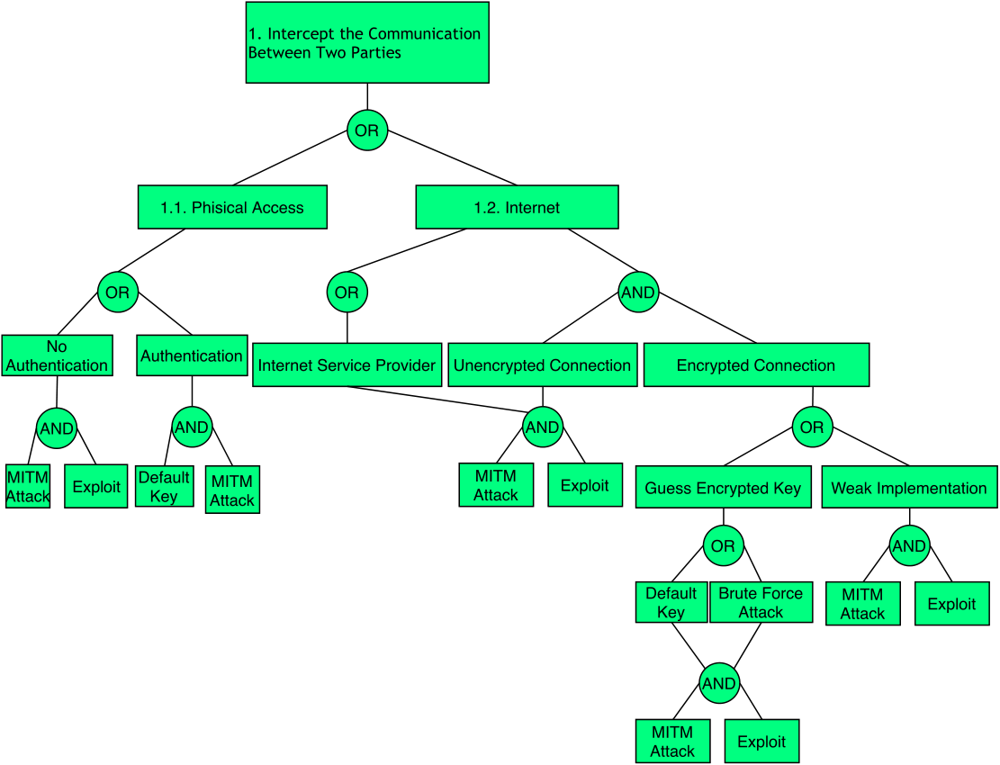
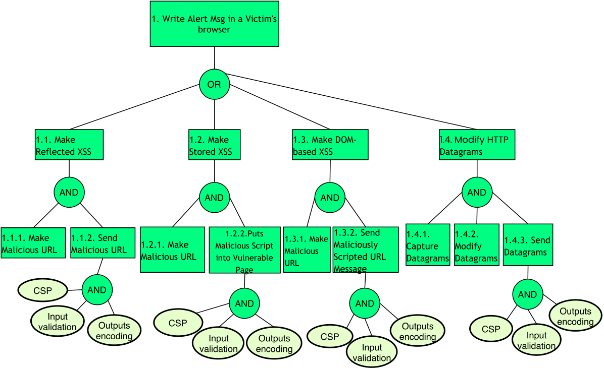
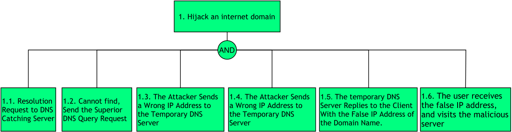
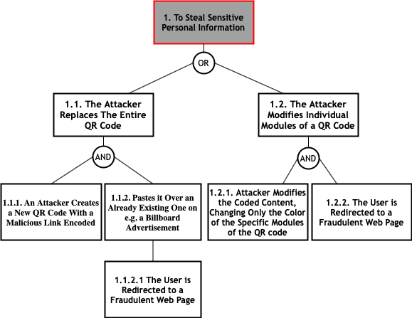
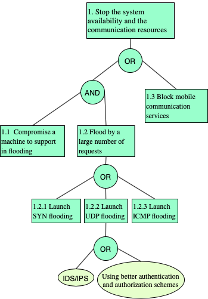
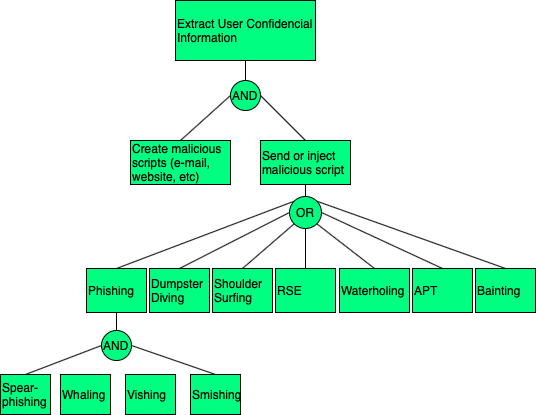
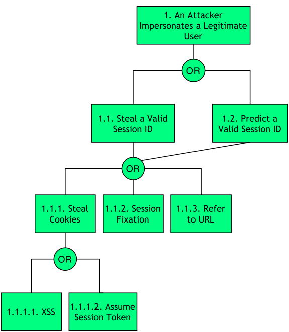
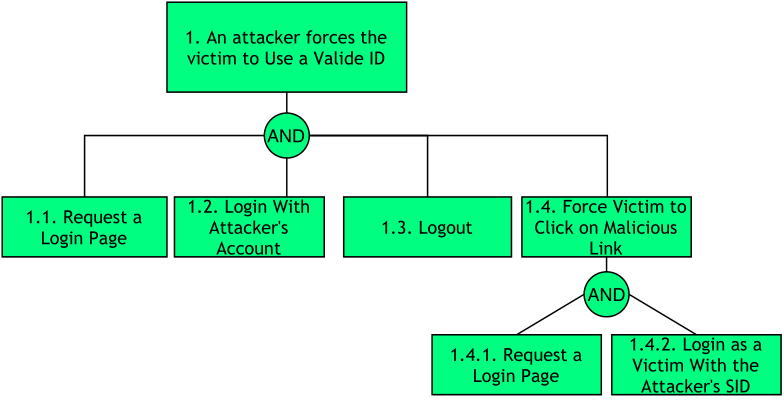
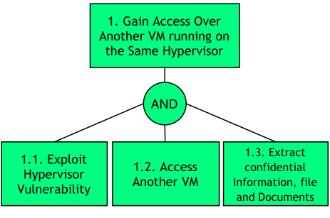

# Final Report  

|                           |                                                              |  
|  :--------                |  :---------                                                  |  
|  Architeture              |  Hybrid Application ; Web Application                        |  
|  Application domain type  |  m-Health                                                    |  
|  Authentication           |  Username and Password                                       |  
|  Has DB                   |  Yes                                                         |  
|  Type of data storage     |  SQL                                                         |  
|  Which DB                 |  MySQL                                                       |  
|  Type of data stored      |  Personal Information ; Confidential Data ; Critical Data    |  
|  User Registration        |  Yes                                                         |  
|  Type of Registration     |  The users will register themselves                          |  
|  Programming Languages    |  HTML5 ; PHP                                                 |  
|  Input Forms              |  Yes                                                         |  
|  Upload Files             |  Yes                                                         |  
|  The system has logs      |  Yes                                                         |  
|  The system has regular updates|  Yes                                                         |  
|  The system has third-party|  Yes                                                         |  
|  System Cloud Environments|  Public Cloud                                                |  
|  Hardware Specification   |  Yes                                                         |  
|  HW Authentication        |  Basic Authentication (user/pass)                            |  
|  HW Wireless Tech         |  4G / LTE ; 3G ; Bluetooth  ; Wi-Fi  ; GPS  ; NFC            |  
|  Data Center Phisical Access|  Yes                                                         |  

# Man-in-the-Middle Attack

In this type of attack an active Man listening and changing communications between Mobile Device and Cloud. In other hand, in this attack an intruder enters in the ongoing conversation between sender and the receiver and makes them believe that conversation is taking place between them only.

## Definition

This type of attack occurs whenever an attacker intends to intercept communications in order to interpret or alter the original data in transit between the sender and the receiver establishing a conversation.

## Attacker Powers

The attacker generally and depending on whether the communication situation is encrypted or not, is able to modify the cryptographically unprotected communication or modify the cryptographically protected communication. More specifically, it will have the following powers:

 * Steal encryption key;
 * Discover cryptographic key using cryptanalysis;
 * Exploit vulnerabilities in cryptographic algorithm;
 * Exploit vulnerabilities in cryptographic protocol.
 
## Man-in-the-Middle Attack Diagram

# Cross Site Scripting Attacks

In short, Cross Site Scripting (XSS) allows an attacker to execute a browser script bypassing access control mechanisms such as the same origin policy. During this attack a malicious script is injected into web content and user considering it to be authentic executes it over its own machine, thus giving either control of the machine or exposure of confidential information to the attacker.

## Definition

Being an attack that exploits vulnerabilities in web applications, the attacker in this type of attack executes malicious database claims, exploiting improper validation of data flowing from the user to the database. The attacker's goal is to access the intended party's confidential data by inserting malicious code into the user's web page in order to redirect them to their site. There are two ways to forge this type of attack:

 * Stored XSS (uninterruptedly stores malicious code in a resource managed by the web application);
 * Reflective XSS (promptly reflects malicious code against the user and therefore does not store it permanently;
 * XSS based on DOM (Document Object Model).

## Attacker Powers

 * Circumvent the policy of same origin;
 * Impersonate you to websites and/or web applications you regularly use by obtaining/altering/destroying various types of content.

## Cross Site Scripting Attacks Diagram

# DNS Poisoning Attacks

DNS poisoning attack is tricking the domain name server (DNS) to send traffic in the wrong direction by modifying DNS cache content maliciously. The cloud customers must ensure that cloud service providers are taking proper steps to secure their DNS infrastructure.

## Definition

In this kind of attack, the contents of the cookie are changed to get access to an unauthorized application or web page. The cookie contains sensitive credentials about user's data and when the hacker gains access to these contents then he also gains access to the content within these and can perform illegal activities.
  
## Attacker Powers

 * Access confidential information from legitimate/authorized users;
 * Perpetrate other types of attacks like Main-in-the-Middle.

 
## DNS Poisoning Attacks Diagram

# Malicious QR Code Attacks

In this type of attacks, attackers encode malicious links that lead e.g. to phishing sites or to execute fraudulent code. These malicious QR codes can be printed on small stickers and pasted over already existing QR codes. Furthermore, attackers can modify selected modules from white to black and vice-versa in order to override the originally encoded content.

## Definition

QR code-based attack is defined as an attack that attempts to lure victims into scanning a QR code that directs them to malicious websites. The key idea behind QR code attacks is that victims might trust the web page or the printed material on which the QR code is displayed, and assume that the associated code is harmless. In addition, attackers use malicious QR codes to direct users to fraudulent web sites, which masquerade as legitimate web sites aiming to steal sensitive personal information such as usernames, passwords or credit card information. 

## Attacker Powers

 * Direct the user to an exploit or phishing site;
 * Perform other attacks such as phishing, farming and botnet;
 * Distribute malware;
 * Extraction of personal and confidential data from smartphones and tablets via command injection or traditional buffer overflows by reader software;
 * Steal users' Money via fraud;
 * Social Engineering attacks via spear phishing e.g. leaving a poster of a QR Code on the parking lot of a company (instead of the traditional attack with an USB drive) offering discount in a nearby restaurant is a new attack vector which is likely to be successful.

## Malicious QR Code Attacks Diagram

# CAPTCHA Breaking Attacks

CAPTCHAs were developed in order to prevent the usage of internet resources by bots or computers. They are used to prevent spam and overexploitation of network resources by bots. But recently, it has been found that the spammers (attackers) are able to break the CAPTCHA. In this case, we will be in the presence of an attack of this nature, Captcha Breaking.

## Definition

In this type of attacks, the attacker can break the CAPTCHAs by using an audio system, can read the CAPTCHAs by using speech to text conversion software and can also break image-based scheme and video-based scheme. 

## Attacker Powers

 * Spamming;
 * Conducting DoS and DDoS attacks;
 * Excessive exploitation of network resources by bots.

## CAPTCHA Breaking Attacks Diagram

# SQL Injection Attacks

In this type of attack, an attacker could provide malicious input with a clever mix of characters and meta characters from a form (e.g., login form) to alter the logic of the SQL command.

** Definition **

Structured Query Language (SQL) Injection Attack is a code injection technique commonly used to attack web applications where an attacker enters SQL characters or keywords into an SQL statement through superuser input parameters for the purpose. to change the logic of the desired query.

** Attacker Powers **

 * Identify parameters vulnerable to injection;
 * Discover DBMS and version;
 * Discover relational scheme;
 * Extract data;
 * Add / modify data;
 * Cause denial of service;
 * Evade detection;
 * Bypass authentication;
 * Execute commands;
 * Elevate privileges.
 
## SQL Injection Attacks Diagram

# Denial of Services

In a DoS attack scenario, the attacker attempts to disrupt the network or disable services provisioned by a server by sending uninterrupted data packets to the target server and without changing nodes, data packets, or decrypting encrypted data. Typically, these data packets take up bandwidth and consume server resources.

** Definition **

In such attacks, the attacker attempts to prevent a service or feature that is signed by authorized users from being released by launching various types of floods - SYN flooding, User Datagram Protocol (UDP) flooding, Internet Control Message Protocol (ICMP) attacks ) flooding, etc - on the server.

** Attacker Powers **

 * Prevent the availability of a service or resource to authorized users;
 * Perpetrating other types of attacks while services or features are unavailable, such as Spoofing.

 
## Denial of Services Attacks Diagram

# Distributed Denial of Services Attacks

Distributed Denial of Services (DDoS) is an enhanced DoS attack type, originating from multiple network attack surfaces that were previously compromised to disrupt the services or resources provided by the target server. It differs from DoS in that it generates more traffic, so that the targeted server cannot handle requests.

** Definition **

The DDoS attack attempts to make a service unavailable to intended users by draining the system or network resource. Attackers can now launch various DDoS attacks, including resource-focused attacks (eg, network bandwidth, memory, and CPU) and app-focused attacks (eg, mobile applications, database service) from almost every attack. places.
  
** Attacker Powers **

 * Make features and services unavailable to authorized users;
 * Perpetrate other types of attacks and even extract sensitive and critical data.

 
## Distributed Denial of Services Attacks Diagram

# Eavesdropping or Sniffing

This type of attack is carried out by attackers who use applications that can capture data packets in transit over a network, and if they are not heavily encrypted, can be read or interpreted. The goal of the attacker is to spy on all kinds of conversations and recordings and to listen to communication channels.

## Definition

This type of attack consists of implant eavesdropping tools in specific network for spying on communication channels, capturing the network traffic behavior and getting the network map. Eavesdropping is dangerous threat that leads to break down the integrity and confidentiality which causes financial and personal failures. There are several ways to get a sniffing attack on a smartphone, as there is a vulnerability in GSM's encryption function for call and SMS privacy, A5 / 1 (it can be stopped second). This vulnerability puts all GSM subscribers at risk of sniffing attacks. 
  
## Attacker Powers

 * Tracking, capture and theft of confidential information;
 
## Sniffing Attacks Diagram

# Domain Name Server Attacks

In this type of attack the attacker uses DNS to convert the domain name to an IP address for the purpose of accessing the user's confidential data. On the other hand, sender and a receiver get rerouted through some evil connection.

## Definition

In DNS reflection attacks, attackers send DNS requests toward multiple open DNS servers with spoofed source address of the target, which results in a large number of DNS responses to the target from DNS servers. Since the cloud has its own DNS servers to answer DNS queries from hosted tenants, there should not be any DNS responses from the Internet to the cloud. Therefore, any activity of inbound DNS responses may signify a potential DNS reflection attack. Inbound DNS reflection attacks often come from up to 6K distinct sources (with 1500 byte full-size packets). We only observed outbound DNS responses from a single VIP hosting a DNS server at 5666 packets per second for a couple of days repeatedly.
  
## Attacker Powers

 * Access confidential information from legitimate/authorized users;
 * Perpetrate other types of attacks like DDoS and Main-in-the-Middle.

 
## DNS Attacks Diagram

# Reused IP Address Attacks

IP address is reassigned and reused by other customer. The address still exists in the DNS cache, it violating the privacy of the original user.

## Definition

Each node of a network has an IP address which is allocated to a particular user when that user leaves the network, the IP address associated with him is assigned to a new user. The chances of accessing previous user data by the new user exist as the address still exist in DNS cache and hence the data belonging to one person can be accessed by another.
  
## Attacker Powers

 * Access confidential information from legitimate/authorized users;

 
## Reused IP Address Attacks Diagram

# Phishing Attack

In phishing attack, an adversary sets up a fake URL identical to real Web application fooling the users to enter a valid credentials and certificates.

## Definition

Phishing is the attempt to acquire sensitive information or to make somebody act in a desired way by masquerading as a trustworthy entity in an electronic communication medium. They are usually targeted at large groups of people. Phishing attacks can be performed over almost any channel, from physical presence of the attacker to websites, social networks or even cloud services. On the other hand, phishing attacks are typically fraudulent email messages which directs to spoofed website. In PaaS cloud environment, these attacks affect both enterprise and users. This is a type of social engineering attack. These attackers convince the customers to reveal their most important data like password or other sensitive information by using bogus web pages, emails, or bloggers.
  
## Attacker Powers

 * Access confidential information from legitimate users by collecting data through malware;
 * Perpetrate other types of attacks like Botnet.

 
## Phishing Attack Diagram

# Botnet Attacks

In short, Cross Site Scripting (XSS) allows an attacker to execute a browser script bypassing access control mechanisms such as the same origin policy.

** Definition **

A botnet is a set of zombie devices that are infected by malware so that hackers can remotely control them. When a number of smartphones are compromised and remotely controlled, a mobile botnet is formed. Botnets impose serious security threats to the Internet, and most of them are used in organized crime, launching attacks to gain money.

** Attacker Powers **

 * Sending spam;
 * Perform attacks like DoS;
 * Collecting information that can be used for illegal purposes;

 
## Botnet Attacks Diagram

# XML Injection Attacks

It is an attacking technique used against XML-based applications to modify or compromise their normal operation.

## Definition **

XML Injection (XMLi) attacks are carried out by injecting pieces of XML code along with malicious content into user inputs in order to produce harmful XML messages. The aim of this type of attacks is to compromise the system or system component that receives user inputs, making it malfunction (e.g. crash), or to attack other systems or subsequent components that process those injected XML messages. This type of attack can be classified into 4 categories:
  
 * Deforming: Attack input values of Type 1 are XML meta-characters, such as <, >, ]] >, that are intro- duced to compromise the structure of generated XML messages;
 * Random closing tags: Attack input values of Type 2 are random XML closing tags (e.g., < /test>), aiming at deforming the generated XML messages to reveal their structure;
 * Replicating: Attack input values of Type 3 are strings of characters consisting of XML tag names and malicious content;
 * Replacing: Attack input values of Type 4 are similar to those of Type 3 but they involve multiple input fields in order to comment out some existing XML elements and inject new ones with malicious content.

## Attacker Powers

 * Obtain confidential information;
 * Change the underlying business logic of the destination.
 
 
## XML Injection Attacks Diagram

# Session Hijacking Attack

An attacker impersonates a legitimate user through stealing or predicting a valid session ID.

## Definition

The Session Hijacking can be facilitated by the architectural
weakness of “not securing the storage of session identifiers”. As reported in the CVE-2002-0121, the PHP project vesions 4.0 through 4.1.1 suffered from this architectural flaw because its original design stored each data session in plain textual files in a temporary directory without using a security tactic to store these session files in a secure way (such as encryption).
 
## Attacker Powers

 * Steal Session ID;
 * Impersonation of a legitimate user and confidential information from a legitimate user.
 
 
## Session Hijacking Attack Diagram

# Session Fixation Attack

An attacker has a valid session ID and forces the victim to use this ID.

## Definition

Session Fixation is an attack in which the victim is tricked into using a SID value that is controlled, and thus known, by the attacker. This can be achieved either by supplying a crafted URL including this SID as a parameter to the victim (in case that the vulnerable Web application accepts parameter-based SIDs) or by finding a way to set a copy of this SID cookie to the victim’s browser.

## Attacker Powers

 * Steal SID and access otherwise restricted resources utilizing the victim’s authorization context.
 
 
## Session Fixation Attack Diagram

# Spoofing Attacks

In a nutshell, spoofing attacks consist of spoofing the caller ID in order to impersonate a trusted entity and thus obtain confidential information in a disguised manner.

## Definition

In this type of attack, the attacker can spoof the "Caller ID" and impersonate him as a legitimate user, i.e., an attacker could spoof the "Caller ID" and impersonate a trusted party. Recent studies have also shown how to spoof MMS messages that appeared to be messages from a number that operators use to send alerts or update notifications. In addition, base stations can also be counterfeited. On the other hand, there is also the mobile application spoofing attack, which consists of an attack where a malicious mobile application mimics the visual appearance of another one. The goal of the adversary is to trick the user into believing that she is interacting with a genuine application while she interacts with one controlled by the adversary. If such an attack is successful, the integrity of what the user sees as well as the confidentiality of what she inputs into the system can be violated by the adversary. 
  
## Attacker Powers

 * Faker caller ID;
 * Monitoring of calls and access to the confidential information of legitimate users from voice or text messages.

 
## Spoofing Attacks Diagram

# VM Migration Attacks

A malicious user can start or redirect the migration process to a different network in which he has access or untrusted host, or it can just be copied and used elsewhere, which compromise the VM with the passwords, credentials on it and in case of coping it makes it difficult to trace the attacker.

## Definition

VMs roll back to their previous state if an error occurs. Unfortunately, this factor can re-expose them to security vulnerabilities, and attackers can gain benefit to attack on this compromised hypervisor. It is important to protect the data during migration. In fact, this is the defending of data privacy and integrity from various network attacks during migration. Live migration might be susceptible to many attacks like ”man-in-the-middle”, ”denial-of-service” and ”replay. The data during the migration can be sniffed or tampered easily as it is not encrypted.
  
## Attacker Powers

 * Launch attacks such as man-in-the-middle, DoS and replay;
 * Detect or tamper with data during migration as it is not encrypted.

 
## VM Migration Attacks Diagram

# Malicious Insiders Attacks

When there is a malicious entity (client, employee, Hypervisor, Cloud Provider/Broker, etc.) that takes advantage of its privileges to covertly carry out any malicious activity such as information theft and data destruction or physical infrastructures.

## Definition

Malicious Hypervisor, Malicious Clients, Malicious Cloud Provider/Broker, etc. are all the other terms which can also be used as an alternative to malicious insiders. This kind of attack occurs from client to server when the person, employee or staffs who know how the system runs, can implant malicious codes to destroy everything in the cloud system.
  
## Attacker Powers

 * Implants malicious codes to destroy everything in the cloud system;
 * Steals confidential data.

 
## Malicious Insiders Attacks Diagram

# VM Escape Attacks

This type of attack occurs when an application escapes from the VM and gains control of VMM, as it escapes the VM privilege and obtains the root privilege.

## Definition

VM escape is where an application running on a VM can directly have access to the host machine by bypassing the hypervisor, being the root of the system it makes this application escape the VM privilege and gain the root privilege. In this type of attack the attackers attempt to break down the guest OS in order to access the hypervisor or to penetrate the functionalities of other guest OS and underlying host OS. This breaking of the guest OS is called as escape. If the attackers escapes the guest OS it may compromise the hypervisor and as a result it may control over the entire guest OS. In this way the security breach in single point in hypervisor may break down all the hypervisor. If the attacker controls the hypervisor, it can do anything to the VM on the host system.
  
## Attacker Powers

 * Shutdown and eliminate target or victim VMs, resulting in the loss and destruction of data or information;
 * Compromise the hypervisor and other resources.

 VM Escape Attacks Diagram

# Cross VM Attacks (Side channel attacks)

Side-channel attacks are used to extract cryptographic keys from a victim device or process in a virtualized layer of the cloud ecosystem where a Cross-VM attack exploits the nature of multi-tenancy, which enables that VMs belonging to different customers may co-reside on the same physical machine.

## Definition

Side-channel attack, which leverages low-bandwidth message channels (e.g., timing, power, cache misses) in a system to derive or leak security - sensitive information, has been proven to be realistic threats to modern computer systems. Among them, cache-based side-channel attacks have been shown practical to steal cryptographic information within a
single operating system. The main idea is that cryptographic algorithms usually have data-dependent memory access patterns, which can be revealed by observing and
analyzing the associated cache hit/miss statistics. Cache-based attacks then can rely on certain statistics during the encryption or decryption operations to extract the cryptographic key. Recent research has shown attackers can build up cross-VM side channels to obtain sensitive information. However, currently these channels are mostly based on shared CPU cache, networks, CPU loads and so on. These attacks are generally categorized into one of three classes:

 * Time-driven side-channel attack;
 * Trace-driven side-channel attacks;
 * Access-driven side-channel attacks.
  
## Attacker Powers

 * Steal cryptographic information;
 * Extract cryptographic key;
 * Obtains confidential data or sensitive information.

 Cross VM Attacks Diagram

# Malware Injection Attacks

This type of attack occurs whenever a user can install malware on a mobile device. In addition, this type of attack can be carried out remotely or locally.

## Definition

Attacks on the cloud and mobile application-level ecosystem can affect the integrity and confidentiality of data and applications through different strategies. E.g., by injecting malware. Malware can be  virus, worm, trojan, rootkit and botnet.
  
## Attacker Powers

 * Access and steal users confidential data;
 * Obtain root permissions on mobile devices and control the mobile device;
 * Directly affect the computational integrity of mobile platforms along with the application.

 
## Malware Injection Attacks Diagram

# Tampering Attacks

In this type of attack an attacker preforms physical modifications on the hardware where the software is implemented.  

## Definition

This type of attack occurs whenever an unauthorized user has physical access to the device. When this access is realized, it is possible to loss, leakage, access or unintentionally disclose of the data or applications to unauthorized users, if the mobile devices are misplaced, lost or theft.
  
## Attacker Powers

 * Sending high malicious traffic stream;
 * Huge messages to targeting mobile devices to make unused or reducing the capability;
 * Access and steal users confidential data.

 
## Tampering Attacks Diagram

