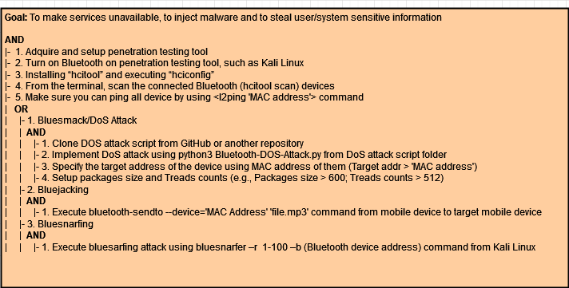
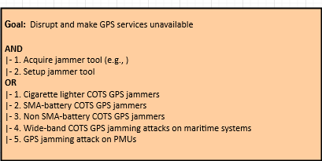
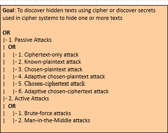
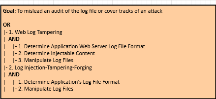
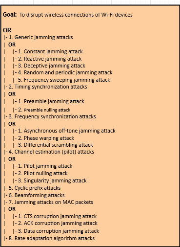
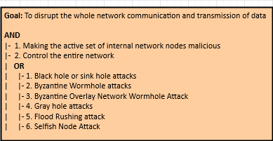

# Final Attack Models Report  

|                           |                                                              |  
|  :--------                |  :---------                                                  |  
|  Mobile Plataform         |  Android App                                                 |  
|  Application domain type  |  m-Health                                                    |  
|  Authentication           |  Yes                                                         |  
|  Authentication schemes   |  Biometric-based authentication ; Factors-based authentication ; ID-based authentication|  
|  Has DB                   |  Yes                                                         |  
|  Type of data storage     |  SQL                                                         |  
|  Which DB                 |  SQLite                                                      |  
|  Type of data stored      |  Personal Information ; Confidential Data ; Critical Data    |  
|  User Registration        |  Yes                                                         |  
|  Type of Registration     |  The users will register themselves                          |  
|  Programming Languages    |  Java                                                        |  
|  Input Forms              |  Yes                                                         |  
|  Upload Files             |  No                                                          |  
|  The system has logs      |  Yes                                                         |  
|  The system has regular updates|  Yes                                                         |  
|  The system has third-party|  Yes                                                         |  
|  System Cloud Environments|  Private Cloud                                               |  
|  Hardware Specification   |  Yes                                                         |  
|  HW Authentication        |  Basic Authentication (user/pass)                            |  
|  HW Wireless Tech         |  3G ; 4G/LTE ; 5G ; Bluetooth  ; Wi-Fi  ; GPS  ; NFC         |  
|  Data Center Phisical Access|  Yes                                                         |  

# Flooding or Distributed Denial of Services (DDoS)  Attacks

Flooding is an enhanced Denial of Service (DoS) attack type, originating from multiple network attack surfaces that were previously compromised to disrupt the services or resources provided by the target server. It differs from DoS in that it generates more traffic, so that the targeted server cannot handle requests. This type of attack generally exposes a weakness in rate limiting or flow.

## Definition

The Flooding attack attempts to make a service unavailable to intended users by draining the system or network resource. Attackers can now launch various DDoS attacks, including resource-focused attacks (eg, network bandwidth, memory, and CPU) and app-focused attacks (e.g., mobile applications, database service) from almost every attack places. This type of attack can be executed as follows:

 * TCP Flood;
 * UDP Flood;
 * ICMP Flood;
 * HTTP Flood;
 * SSL Flood;
 * Amplification;
 * ML Flood;
 * BlueSmacking.

## Technical Impact

  * Crash, Exit, or Restart;
  * Bypass protection mechanism;
  * Other.

## Typical Severity

  * Medium.

## Risk

  * High.

## Likelihood of Exploit
  * High.
  
## Attacker's Powers

 * Make features and services unavailable to authorized users;
 * Perpetrate other types of attacks and even extract sensitive and critical data.

## Recommendations

In order to ensure that the mobile application is resilient or immune to the Flooding attacks, it is recommended that the measures described in the good practice report and the security tests present in the full report are followed.

## References
1. [[https://cwe.mitre.org/data/definitions/400.html]

 
## Flooding Attacks Diagram

# Spoofing Attacks

In a nutshell, spoofing attacks consist of spoofing the caller ID in order to impersonate a trusted entity and thus obtain confidential information in a disguised manner.

## Definition

In this type of attack, the attacker can spoof the "Caller ID" and impersonate him as a legitimate user, i.e., an attacker could spoof the "Caller ID" and impersonate a trusted party. Recent studies have also shown how to spoof MMS messages that appeared to be messages from a number that operators use to send alerts or update notifications. In addition, base stations can also be counterfeited. On the other hand, there is also the mobile application spoofing attack, which consists of an attack where a malicious mobile application mimics the visual appearance of another one. The goal of the adversary is to trick the user into believing that she is interacting with a genuine application while she interacts with one controlled by the adversary. If such an attack is successful, the integrity of what the user sees as well as the confidentiality of what she inputs into the system can be violated by the adversary. 

## Technical Impact
  * Bypass Protection Mechanism; 
  * Gain Privileges or Assume Identity.

## Risk Analysis
  * Critical Risk.

## Likelihood of Exploit
  * High.
  
## Attacker Powers

 * Faker caller ID;
 * Monitoring of calls and access to the confidential information of legitimate users from voice or text messages.

## Recommendations

To ensure that the mobile application is resilient or immune to Spoofing attacks, it is recommended that the measures described in the good practice report and the security tests present in the full report are followed to ensure authenticity, integrity, privacy and authenticity of the data.

## References
  1. [https://cwe.mitre.org/data/definitions/290.html].
 
## Spoofing Attacks Diagram

# VM Migration Attacks

A malicious user can start or redirect the migration process to a different network in which he has access or untrusted host, or it can just be copied and used elsewhere, which compromise the VM with the passwords, credentials on it and in case of coping it makes it difficult to trace the attacker.

## Definition

VMs roll back to their previous state if an error occurs. Unfortunately, this factor can re-expose them to security vulnerabilities, and attackers can gain benefit to attack on this compromised hypervisor. It is important to protect the data during migration. In fact, this is the defending of data privacy and integrity from various network attacks during migration. Live migration might be susceptible to many attacks like ”man-in-the-middle”, ”denial-of-service” and ”replay. The data during the migration can be sniffed or tampered easily as it is not encrypted.

## Technical Impact
  * Read Application Data (lack of confidentiality);
  * Modify Application Data (lack of integrity and confidentiality).
## Risk Analisys
  * High Risk.

## Likelihood of Exploit
  * High.
  
## Attacker Powers

 * Launch attacks such as man-in-the-middle, DoS and replay;
 * Detect or tamper with data during migration as it is not encrypted.

## Recommendations

To ensure that the mobile application is resilient or immune to VM Migration attacks, it is recommended that the measures described in the good practice report and the security tests present in the full report are followed to ensure authenticity, integrity, privacy, confinement, and authenticity of the data.

## References
  1. [https://cwe.mitre.org/data/definitions/311.html]. 

 
## VM Migration Attacks Diagram

# Malicious Insiders Attacks

This type of attacks ocurre when there is a malicious entity (client, employee, Hypervisor, Cloud Provider/Broker, etc.) takes advantage of its privileges to covertly carry out any malicious activity such as information theft and data destruction or physical infrastructures.

## Definition

Malicious Hypervisor, Malicious Clients, Malicious Cloud Provider/Broker, etc. are all the other terms which can also be used as an alternative to malicious insiders. This kind of attack occurs from client to server when the person, employee or staffs who know how the system runs, can implant malicious codes to destroy everything in the cloud system.

## Technical Impact
* Read Application Data; 
* Read Files or Directories;
* Modify Application Data; 
* Modify Files or Directories;
* Gain Privileges or Assume Identity.

## Analysis of Risk
* High.

## Likelihood Of Exploit
* High.

## Attacker Powers

 * Implants malicious codes to destroy everything in the cloud system;
 * Steals confidential data.

## Recommendations

In order to ensure that the mobile application is resilient or immune to Malicious Insiders attacks, it is recommended that the measures described in the good practice report and the security tests present in the full report are followed.

## References
1. [https://cwe.mitre.org/data/definitions/285.html].

 
## Malicious Insiders Attacks Diagram

# VM Escape Attacks

This type of attack occurs when an application escapes from the VM and gains control of VMM, as it escapes the VM privilege and obtains the root privilege.

## Definition

VM escape is where an application running on a VM can directly have access to the host machine by bypassing the hypervisor, being the root of the system it makes this application escape the VM privilege and gain the root privilege. In this type of attack the attackers attempt to break down the guest OS in order to access the hypervisor or to penetrate the functionalities of other guest OS and underlying host OS. This breaking of the guest OS is called as escape. If the attackers escapes the guest OS it may compromise the hypervisor and as a result it may control over the entire guest OS. In this way the security breach in single point in hypervisor may break down all the hypervisor. If the attacker controls the hypervisor, it can do anything to the VM on the host system.

## Risk Analysis
  * Critical Risk.
  
## Attacker Powers

 * Shutdown and eliminate target or victim VMs, resulting in the loss and destruction of data or information;
 * Compromise the hypervisor and other resources.

## Recommendations

To ensure that the mobile application is resilient or immune to VM Escape attacks, it is recommended that the measures described in the good practice report and the security tests present in the full report are followed to ensure authenticity, integrity, privacy, authenticity and confinement of the data.

## VM Escape Attacks Diagram

# Side-Channel Attacks

It is a type of attack enabled by leakage of information from a physical cryptosystem.

## Definition

Side-channel attacks use statistical models such as differential analysis and correlation analysis on the information leaked from the cryptographic device during runtime. While early attacks required attackers to be in physical possession of the device, newer side-channel attacks such as cache-timing attacks or DRAM row buffer attacks are conducted remotely by executing malicious software in the targeted cloud environment. Regarding smartphones/tablets, they have developed more sophisticated side-channel attacks that target the built-in sensors of these devices, allowing them to infer keyboard input on touchscreens through sensor readings of native applications and websites, infer a user's location by the power consumption available in the proc file system (procfs), and infer a user's identity, location and diseases through procfs.

 * Time-driven side-channel attack;
 * Trace-driven side-channel attacks;
 * Access-driven side-channel attacks.
 * Power Analysis;
 * Electromagnetic Analysis;
 * Laser/optical;
 * Clock/power Glitch;
 * Temperature Variation;
 * EMFI;
 * Differential Computation Analysis
 * Reflection/hands;
 * Smudges;
 * Network Traffic Analysis;
 * USB Power Analysis;
 * Wi-Fi Signal Monitoring;
 * Figerprinting Devices;
 * Data-usage Statistics;
 * Page Deduplication;
 * Procfs Leaks;
 * Microarchitectural Attacks;
 * Location Inference;
 * Speech Recognition;
 * Soundcomber;
 * Sensor-based Keyloggers;
 * Rowhammer.

## Technical Impact
* Modify and Read Memory; 
* Read Files or Directories; 
* Modify Files or Directories; 
* Execute Unauthorized Code or Commands; 
* Gain Privileges or Assume Identity; 
* Bypass Protection Mechanism; 
* Read Application Data; 
* Modify Application Data; 
* Hide Activities.

## Risk Analysis
  * High Risk.

## Likelihood of Exploit
  * Low.

## Attacker Powers

 * Steal cryptographic information;
 * Extract cryptographic key;
 * Obtains confidential data or sensitive information.

## Recommendations

In order to ensure that the mobile application is resilient or immune to the side-channel attacks, it is recommended that the measures described in the good practice report and the security testing present in the full report are followed.

## References
1. Grassi, P.A., et al., 2017. Digital identity guidelines. URL: https://nvlpubs.nist.gov/nistpubs/SpecialPublications/NIST.SP.
800-63-3.pdf, doi:https://doi.org/10.6028/NIST.SP.800-63-3.
2. Spreitzer, R., et al., 2018. Systematic classification of side-channel attacks: A case study for mobile devices. IEEE Communications Surveys Tutorials 20, 465–488. doi:10.1109/COMST.2017.2779824.

## Cross VM Attacks Diagram

# Malware-as-a-Service

This type of attack occurs whenever a user can install malware on a mobile device. In addition, this type of attack can be carried out remotely or locally.

## Definition

Attacks on the cloud and mobile application-level ecosystem can affect the integrity and confidentiality of data and applications through different strategies. E.g., by injecting malware. Malware can be  virus, worm, trojan, rootkit and botnet.

## Technical Impact
* Execute Unauthorized Code or Commands;
* Read Application Data.

## Risk Analysis
* Critical Risk.

## Likelihood of Exploit
* Medium.
  
## Attacker Powers

 * Access and steal users confidential data;
 * Obtain root permissions on mobile devices and control the mobile device;
 * Directly affect the computational integrity of mobile platforms along with the application.

## Recommendations

To ensure that the mobile application is resilient or immune to malicious Malware Injection attacks, it is recommended that the measures described in the good practice report and the security tests present in the full report are followed to ensure authenticity, integrity and authenticity of the data.
 
## Malware-as-a-Service Diagram

# Tampering Attacks

In this type of attack an attacker preforms physical modifications on the hardware where the software is implemented.  

## Definition

This type of attack occurs whenever an unauthorized user has physical access to the device. When this access is realized, it is possible to loss, leakage, access or unintentionally disclose of the data or applications to unauthorized users, if the mobile devices are misplaced, lost or theft.

## Technical Impact
* Read and Modify Application Data.
  
## Attacker Powers

 * Sending high malicious traffic stream;
 * Huge messages to targeting mobile devices to make unused or reducing the capability;
 * Access and steal users confidential data.

## Recommendations

To ensure that the mobile application is resilient or immune to malicious Tampering attack, it is recommended that the measures described in the good practice report and the security tests present in the full report are followed to ensure authenticity, integrity, privacy and authenticity of the data.
 
## Tampering Attacks Diagram

# Bluejacking, Bluesnarfing and BlueSmacking Attacks

These are DDoS-type attacks that target a Bluetooth wireless network in order to shut down activity on it. It usually occurs through an attack coming from a connection of malicious entities in a target network.

## Definition

 Bluejacking occurs by sending unsolicited messages between the mobile devices (host nodes) over the Bluetooth connection. The unauthorized information can be accessed from a mobile device through Bluesnarfing to Bluetooth enabled devices using  OBject EXchange (OBEX) protocol. Through the Bluejacking attack, attackers can send unwanted sounds, videos to other Bluetooth enabled devices. Bluesnarfing attack consists of using Bluetooth connection for the purpose of stealing sensitive information (contacts, emails, passwords, photos, and other useful data) from wireless devices such as smartphones, tablets and IoT. In a Bluesmacking cenario attack, an adversary uses Bluetooth flooding to transfer large packets to Bluetooth enabled devices over the L2CAP protocol with the goal of creating a DoS.
 
## Technical Impact

 * Resource Consumption;
 * Malware Injection;
 * Unreliable Execution;
 * Read Data.

## Typical Severity

 * Medium.

## Risk Analysis

 * High Risk.

## Likelihood of Exploit

 * Medium.

## Recommendations

In order to ensure that the mobile application is resilient or immune to the Bluejacking, Bluesnarfing and BlueSmacking attacks, it is recommended that the measures described in the good practice report and the security testing present in the full report are followed.

## References
1. atel, N., Wimmer, H., Rebman, C.M., 2021. Investigating bluetooth vulnerabilities to defend from attacks, in: 2021 5th International Symposium on Multidisciplinary Studies and Innovative Technologies (ISMSIT), IEEE, Ankara, Turkey. pp. 549–554. doi:10.1109/ISMSIT52890.2021.9604655.

## Bluejacking, Bluesnarfing and BlueSmacking Attacks Diagram

# GPS Jamming Attacks

This is a DoS attack that targets the GPS sensor, aiming to make this service (position, path, speed, direction, time, and distance) unavailable to users of the target mobile devices.

## Definition

 This attack aims to interrupt or obstruct the communication between the emitting satellite and the device (smartphone/tablet) receiving the GPS signal. Normally, the attack consists of blocking the signal from the receiver, since the receiving signal is weaker compared to the broadcasting signal, and can be carried out in two different ways:
 
  * Blanket Jamming;
  * Deception Jamming.  
 
## Technical Impact

 * Service unavailability.

## Typical Severity

 * High

## Risk Analysis

 * High Risk.

## Likelihood of Exploit

 * Low.

## Recommendations

In order to ensure that the mobile application is resilient or immune to the GPS Jamming attacks, it is recommended that the measures described in the good practice report and the security testing present in the full report are followed.

## References
1. [CAPEC-627: Counterfeit GPS Signals](https://capec.mitre.org/data/definitions/627.html).

## GPS Jamming Attacks Diagram

# DoS (Cellular) Jamming Attacks

This type of attack aims to dominate and disrupt communication between a user's mobile device and the cell tower by actively transmitting signals.

## Definition

 Interference attacks target radio communication technology (communication between smart devices and base stations). This attack can be caused by noise, interference, disruption or by sending corrupted data packets, with the purpose of causing DoS in the physical transmission of signals on certain routes. 
 
## Technical Impact

 * Resource Consumption.

## Typical Severity

 * Low.

## Risk Analysis

 * High Risk.

## Likelihood of Exploit

 * Low.

## Recommendations

In order to ensure that the mobile application is resilient or immune to the DoS Jamming attacks, it is recommended that the measures described in the good practice report and the security testing present in the full report are followed.

## References
1. [CAPEC-605: Cellular Jamming](https://capec.mitre.org/data/definitions/605.html).
2.Moorthy, V., Venkataraman, R., Rama Rao, T., 2020. Security and privacy attacks during data communication in software defined mobile clouds. Computer Communications 153, 515–526. URL: https://www.sciencedirect.com/science/article/pii/S0140366419317268, doi:https://doi.org/10.1016/j.comcom.2020.02.030.

## DoS Jamming Attacks Diagram

# Cryptanalysis Attacks

This attack consists in deciphering a ciphered message without knowing the decryption key by exploiting vulnerabilities in the cryptographic algorithm.

## Definition

 Cryptanalysis focuses on finding vulnerabilities in cryptographic algorithms and using these weaknesses to decrypt the ciphertext without knowing the secret key. In addition, this can have other purposes such as Total Breach, Global Deduction, Information Deduction, and Distinguishing Algorithm.
 
## Technical Impact

* Read Data.

## Typical Severity

* Very High.

## Risk Analysis

* Very High Risk.

## Likelihood of Exploit
  
* Low.

## Recommendations

In order to ensure that the mobile application is resilient or immune to the Cryptanalysis Attacks, it is recommended that the measures described in the good practice report and the security testing present in the full report are followed.

## References
1. [CAPEC-97: Cryptanalysis](https://capec.mitre.org/data/definitions/97.html).

## Cryptanalysis Attacks Diagram

# Reverse Engineering Attacks

Typically, this attack consists of using specific tools to analyze the target application (feature or resources), within its own local environment, downloaded from a mobile application store, such as Apple's App Store and Google's Play Store, respectively.

## Definition

Reverse engineering attacks (REA) target the assets embedded in software. In such an attack scenario, the attacker by reverse engineering attempts to steal confidential information, such as embedded cryptographic keys or intellectual property in the form of algorithms. There are two ways of carrying out this type of attack:

 * White Box Reverse Engineering;
 * Black Box Reverse Engineering.
 
## Technical Impact
* Reveal information about back end servers;
* Reveal cryptographic constants and ciphers;
* Steal intellectual property;
* Perform attacks against back end systems;
* Gain intelligence needed to perform subsequent code modification.

## Risk Analysis
  * High Risk.

## Likelihood of Exploit
  * Low.

## Recommendations

In order to ensure that the mobile application is resilient or immune to the Reverse Engineering attacks, it is recommended that the measures described in the good practice report and the security testing present in the full report are followed.

## References
1. Basile, C., et al., 2019. A meta-model for software protections and reverse engineering attacks. Journal of Systems and Software 150, 3–21. URL: https://www.sciencedirect.com/science/article/pii/
S0164121218302838, doi:https://doi.org/10.1016/j.jss.2018.12.025.
2. [M9: Reverse Engineering](https://owasp.org/www-project-mobile-top-10/2016-risks/m9-reverse-engineering).

## Reverse Engineering Attacks Diagram

# Audit Log Manipulation Attacks

This type of attack targets log files for the purpose of manipulating (deleting, reading, and altering) them.

## Definition

In a log file audit manipulation attack scenario, an attacker injects, manipulates, deletes, or forges malicious entries in the log file in an attempt to deceive a log file audit or to cover impressions of an attack. The success of this type of attack depends on the insufficiency of log file access controls mechanisms.
 
## Technical Impact

* Modify Data.

## Typical Severity

* High.

## Risk Analysis

* High Risk.

## Likelihood of Exploit
  
* High.

## Recommendations

In order to ensure that the mobile application is resilient or immune to the Audit Log Manipulation Attacks, it is recommended that the measures described in the good practice report and the security testing present in the full report are followed.

## References

1. [CAPEC-268: Audit Log Manipulation](https://capec.mitre.org/data/definitions/268.html).

## Audit Log Manipulation Attacks Diagram

# Wi-Fi Jamming Attacks

In a scenario of this type of attack, the attacker targets the wireless network made available from the access point, with the aim of making it unavailable.

## Definition

 This is a denial-of-service attack that blocks the radio frequency, making access to the Wi-Fi network and consequently to the Internet unavailable. Generally, two techniques are used to carry out this type of attack, namely: 1) The attacker may flood the Wi-Fi access point (e.g. the retransmission device) with deauthentication frames; 2) Another method is to transmit high levels of noise on the RF band used by the Wi-Fi network.
 
## Technical Impact

* Resource Consumption.

## Typical Severity

* High.

## Risk Analysis

* High Risk.

## Likelihood of Exploit
  
* Medium.

## Recommendations

In order to ensure that the mobile application is resilient or immune to the Code Inclusion attacks, it is recommended that the measures described in the good practice report and the security testing present in the full report are followed.

## References
1. [CAPEC-175: Code Inclusion](https://capec.mitre.org/data/definitions/175.html).

## Code Inclusion Attacks Diagram

# Wi-Fi SSID Tracking Attacks

Unlike code injection, in this type of attack, an attacker exploits a weakness in the target in order to force arbitrary code to be retrieved locally or from a remote location and executed.

## Definition

This type of attack aims to obtain sensitive data (location, routine, trajectory, etc.) of users of mobile devices using Wi-Fi networks to access the Internet. Furthermore, it consists of using sophisticated sniffing devices to bypass authentication (for closed networks), extract and identify the MAC address of the mobile device and establish a match with its potential owner.
 
## Technical Impact

 * Read Data;
 * Bypass Protection Mechanism.

## Typical Severity

 * Low.

## Risk Analysis

 * Very High Risk.

## Likelihood of Exploit

 * Medium.

## Recommendations

In order to ensure that the mobile application is resilient or immune to the Wi-Fi SSID Tracking attacks, it is recommended that the measures described in the good practice report and the security testing present in the full report are followed.

## References

1. Matte, C., 2017. Wi-Fi tracking: Fingerprinting attacks and countermeasures. Ph.D. thesis. Université de Lyon.

## Wi-Fi SSID Tracking Attacks Diagram

# Byzantine Attacks

In a Byzantine attack scenario, the attacker targets the routing protocols of an ad hoc wireless network, aiming to access and modify sensitive data exchanged between two or more entities on this network.

## Definition

 In a mobile ad hoc wireless network, Byzantine attacks are defined as attacks that target routing protocols, in which two or more routers collude to drop, fabricate, modify, or divert packets in an attempt to disrupt routing services.
 
## Technical Impact

* Read Data;
* Modify Data;
* Denial of service.

## Typical Severity

* High.

## Risk Analysis

* High Risk.

## Likelihood of Exploit
  
* Medium.

## Recommendations

In order to ensure that the mobile application is resilient or immune to the Byzantine Attacks, it is recommended that the measures described in the good practice report and the security testing present in the full report are followed.

## References

1. Yu, M., et al., 2009. A secure routing protocol against byzantine attacks for manets in adversarial environments. IEEE Transactions on Vehicular Technology 58, 449–460. doi:10.1109/TVT.2008.923683.

## Byzantine Attacks Diagram

