# Final Attack Models Report  

|                           |                                                              |  
|  :--------                |  :---------                                                  |  
|  Mobile Platform          |  Hybrid Application                                          |  
|  Application domain type  |  m-Health                                                    |  
|  Authentication           |  Yes                                                         |  
|  Authentication schemes   |  Factors-based authentication ; ID-based authentication      |  
|  Has DB                   |  Yes                                                         |  
|  Type of database         |  SQL (Relational Database)                                   |  
|  Which DB                 |  SQLite                                                      |  
|  Type of information handled|  Critical Data                                               |  
|  User Registration        |  Yes                                                         |  
|  Type of Registration     |  Will be an administrator that will register the users       |  
|  Programming Languages    |  HTML5                                                       |  
|  Input Forms              |  Yes                                                         |  
|  Upload Files             |  Yes                                                         |  
|  The system has logs      |  Yes                                                         |  
|  The system has regular updates|  Yes                                                         |  
|  The system has third-party|  Yes                                                         |  
|  System Cloud Environments|  Public Cloud                                                |  
|  Hardware Specification   |  Yes                                                         |  
|  HW Authentication        |  Basic Authentication (user/pass)                            |  
|  HW Wireless Tech         |  3G ; 4G/LTE ; 5G ; Wi-Fi  ; GPS  ; NFC ; Bluetooth          |  
|  Data Center Phisical Access|  Yes                                                         |  

# Man-in-the-Middle Attack

In this type of attack an active man listen and change communications between Mobile Device and Cloud. In other hand, in this attack an intruder enters in the ongoing conversation between sender and the receiver and makes them believe that conversation is taking place between them only.

## Definition

This type of attack occurs whenever an attacker intends to intercept communications in order to interpret or alter the original data in transit between the sender and the receiver establishing a conversation.

## Technical Impact

 * An attacker is able to decrypt and read all SSL/TLS traffic between the client and server;
 * Gain Privileges or Assume Identity.

## Risk Analysis
 * Critical Risk.

## Likelihood of Exploit
 * Medium.

## Attacker Powers

The attacker generally and depending on whether the communication situation is encrypted or not, is able to modify the cryptographically unprotected communication or modify the cryptographically protected communication. More specifically, it will have the following powers:

 * Steal encryption key;
 * Discover cryptographic key using cryptanalysis;
 * Exploit vulnerabilities in cryptographic algorithm;
 * Exploit vulnerabilities in cryptographic protocol.

## Recommendations
To ensure that the mobile application is resilient or immune to malicious MitM attacks, it is recommended that the measures described in the good practice report and the security tests present in the full report are followed to ensure authenticity, integrity, privacy and authenticity of the data.

## Reference
 1. [https://cwe.mitre.org/data/definitions/300.html];
 2. [https://www.first.org/cvss/v3.1/examples].
 
## Man-in-the-Middle Attack Diagram

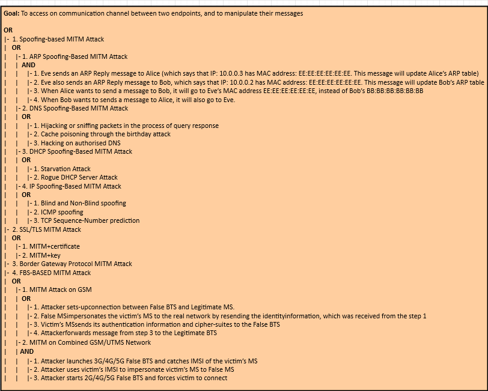

# Brute Force Attacks
This type of attack consists in trying to access a system using some mechanism or simply 
using trial-and-error, aiming to guess the password of a legitimate user of 
that system. The success of this attack depends largely on the cryptographic scheme used for authentication 
and access control to the system, as well as the nature of the password set by the legitimate user.
## Description
In this attack, some asset, namely, information, functionality, identity, etc., is protected 
by a finite secret value. The attacker attempts to gain access to this asset by using 
trial-and-error to exhaustively explore all the possible secret values in the hope of 
finding the secret (or a value that is functionally equivalent) that will unlock the asset. 
Examples of secrets can include, but are not limited to, passwords, encryption keys, database 
lookup keys, and initial values to one-way functions. The key factor in this attack is the attackers' 
ability to explore the possible secret space rapidly. This, in turn, is a function of the size of the 
secret space and the computational power the attacker is able to bring to bear on the problem. 
If the attacker has modest resources and the secret space is large, the challenge facing the 
attacker is intractable. Assuming a finite secret space, a brute force attack will eventually 
succeed. The defender must rely on making sure that the time and resources necessary to do so will 
exceed the value of the information.

This type of attack can be carried out in two different ways:
1. Encryption Brute Forcing;
2. Password Brute Forcing.

## Technical Impact
* Read Data:
* Gain Privileges.

## Likelihood Of Attack
* Medium

## Typical Severity
* High

## Risk Analysis
* Critical

## Likelihood of Exploit
* High 

## Recommendations
In order to mitigate the Brute Force type attacks it is convenient to follow the good practice guidelines, aiming at incorporating
the security mechanisms during the coding and implementation phase and carrying out the security tests suggested and present in 
the report during the verification phase, with the purpose of ensuring that the functional requirements linked to security and 
the non-functional requirements of the application to be developed or deployed are met.

## References
1. [https://capec.mitre.org/data/definitions/112.html];
2. [https://cwe.mitre.org/data/definitions/521.html]

## Brute Force Attack Tree Diagram

<<<<<<< HEAD
# Eavesdropping Attacks
Eavesdropping is a type of attack where the attacker tries to gain access to sensitive information 
of legitimate users from the messages (text, voice and video) exchanged between two or more users 
of Instant Messaging (IM) applications. The same applies to recorded calls, call logs and multimedia 
stored in clear text in memory cards.

## Description
An adversary intercepts a form of communication (e.g. text, audio, video) by way of software (e.g., microphone 
and audio recording application), hardware (e.g., recording equipment), or physical means (e.g., physical proximity). 
The goal of eavesdropping is typically to gain unauthorized access to sensitive information about the target for 
financial, personal, political, or other gains. It entails listening in on the raw 
audio source of a conversation between two or more parties. This type of attack can be carried out in two different ways:
1. Shoulder Surfing (Physical Eavesdropping);
2. Probe Audio and Video Peripheralsn (Software Eavesdropping).

## Technical Impact
* Read Data

## Likelihood Of Attack
* High

## Typical Severity
* High

## Risk Analysis
* High

## Likelihood of Exploit
* Medium

## Recommendations
In order to mitigate the espionage type attacks it is convenient to follow the good practice guidelines, aiming at incorporating
the security mechanisms during the coding and implementation phase and carrying out the security tests suggested and present in 
the report during the verification phase, with the purpose of ensuring that the functional requirements linked to security and 
the non-functional requirements of the application to be developed or deployed are met.

## References
1. [https://capec.mitre.org/data/definitions/651.html];
2. [https://cwe.mitre.org/data/definitions/200.html];
3. [https://www.first.org/cvss/calculator/3.1#CVSS:3.1/].

## Eavesdropping Attack Tree Diagram
=======
# Eavesdropping Attacks
Eavesdropping is a type of attack where the attacker tries to gain access to sensitive information 
of legitimate users from the messages (text, voice and video) exchanged between two or more users 
of Instant Messaging (IM) applications. The same applies to recorded calls, call logs and multimedia 
stored in clear text in memory cards.

## Description
An adversary intercepts a form of communication (e.g. text, audio, video) by way of software (e.g., microphone 
and audio recording application), hardware (e.g., recording equipment), or physical means (e.g., physical proximity). 
The goal of eavesdropping is typically to gain unauthorized access to sensitive information about the target for 
financial, personal, political, or other gains. It entails listening in on the raw 
audio source of a conversation between two or more parties. This type of attack can be carried out in two different ways:
1. Shoulder Surfing (Physical Eavesdropping);
2. Probe Audio and Video Peripheralsn (Software Eavesdropping).

## Technical Impact
* Read Data

## Likelihood Of Attack
* High

## Typical Severity
* High

## Risk Analysis
* High

## Likelihood of Exploit
* Medium

## Recommendations
In order to mitigate the espionage type attacks it is convenient to follow the good practice guidelines, aiming at incorporating
the security mechanisms during the coding and implementation phase and carrying out the security tests suggested and present in 
the report during the verification phase, with the purpose of ensuring that the functional requirements linked to security and 
the non-functional requirements of the application to be developed or deployed are met.

## References
1. [https://capec.mitre.org/data/definitions/651.html];
2. [https://cwe.mitre.org/data/definitions/200.html];
3. [https://www.first.org/cvss/calculator/3.1#CVSS:3.1/].

## Eavesdropping Attack Tree Diagram
>>>>>>> 756a6f658e94ba3c11c4cd25afbb448e80592558
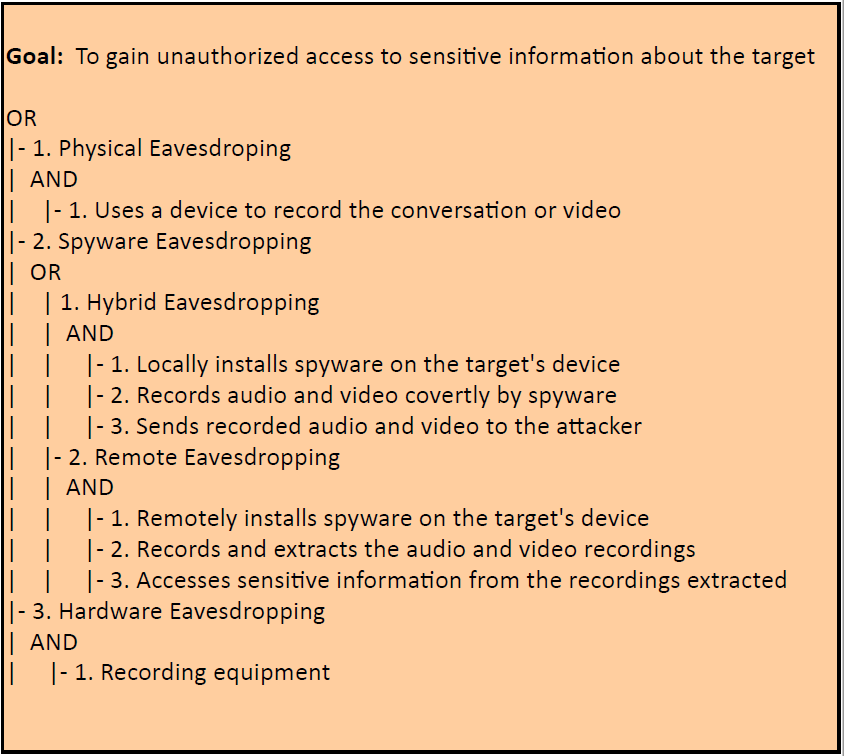

# Cross Site Scripting Attacks

In short, Cross Site Scripting (XSS) allows an attacker to execute a browser script bypassing access control mechanisms such as the same origin policy. During this attack a malicious script is injected into web content and user considering it to be authentic executes it over its own machine, thus giving either control of the machine or exposure of confidential information to the attacker.

## Definition

Being an attack that exploits vulnerabilities in web applications, the attacker in this type of attack executes malicious database claims, exploiting improper validation of data flowing from the user to the database. The attacker's goal is to access the intended party's confidential data by inserting malicious code into the user's web page in order to redirect them to their site. There are two ways to forge this type of attack:

 * Stored XSS (uninterruptedly stores malicious code in a resource managed by the web application);
 * Reflective XSS (promptly reflects malicious code against the user and therefore does not store it permanently;
 * XSS based on DOM (Document Object Model).
 
## Technical Impact
 * Gain Privileges or Assume Identity;
 * Bypass Protection Mechanism; 
 * Read Application Data; 
 * Modify Application Data; 
 * DoS: Crash, Exit, or Restart.
 
## Risk Analysis
 * Critical Risk.
 
## Likelihood of Exploit
 * Medium.
 
## Attacker Powers
 * Circumvent the policy of same origin;
 * Impersonate you to websites and/or web applications you regularly use by obtaining/altering/destroying various types of content.

## Recommendations

To ensure that the mobile application is resilient or immune to XSS attacks, it is recommended that the measures described in the good practice report and the security tests present in the full report are followed to ensure authenticity, integrity, privacy and authenticity of the data.

## References
1. [https://cwe.mitre.org/data/definitions/352.html];
2. [https://www.first.org/cvss/v3.1/examples]

## Cross Site Scripting Attacks Diagram

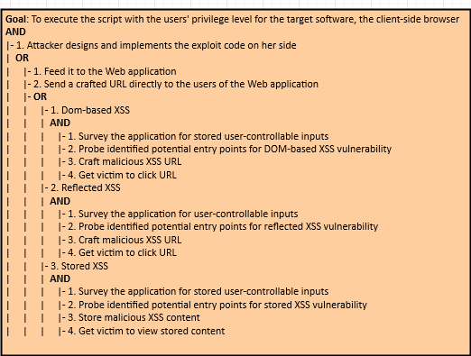

# Cross Site Request Forgery Attacks
O Cross Site Request Forgery (CSRF) é um ataque que força um utilizador final a executar acções indesejadas numa aplicação na qual está autenticado  naquele momento.

## Definition
Este tipo de ataque tem como finalidade a mudança de estado e não o roubo de dados, dado que o  invasor fica impedido de ver a resposta à solicitação falsificada. A condição
necessária para que este tipo de ataque tenha sucesso é a existência da permissão de alterações através de solicitações GET.

## Technical Impact
* Bypass Protection Mechanism;
* Gain Privileges;
* DoS: Crash, Exit, or Restart;
* Read and Modify Data.

## Risk Analysis
* High.

## Likelihood of Exploit
* High.

## Attacker's Powers
* Furtar valores monetários de forma simulada;
* Realização de outros tipos de ataques;
* Acesso a dados confidenciais (histórico da vítima) ou criticos (número de cartão de crédito) do utilizador.

## Recommendations
In order to ensure that the mobile application is resilient or immune to the CSRF attacks, it is recommended 
that the measures described in the good practice report and the security tests present in the full report are followed.

## References
1. [https://capec.mitre.org/data/definitions/62.html];
2. [https://cwe.mitre.org/data/definitions/352.html]
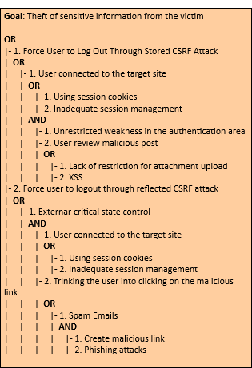

# Cache Poisoning Attacks

In this type of attack the attacker uses DNS to convert the domain name to an IP address for the purpose of accessing the user's confidential data. On the other hand, sender and a receiver get rerouted through some evil connection.

## Definition

Cache poisoning is the act of introducing false information into a Domain Name System (DNS) cache in order to cause DNS queries to return an incorrect response and, e.g., redirect users to malicious websites. This type of attack can target the cache of an application (e.g., a web browser cache) or a public cache (e.g. a DNS or Address Resolution Protocol (ARP) cache), exposing the application to a variety of attacks, such as redirection to malicious websites and malware injection.

## Technical Impact
  * Gain Privileges or Assume Identity; 
  * Bypass Protection Mechanism.

## Risk
  * Medium.

## Likelihood of Exploit
  * Low.
  
## Attacker Powers
  * Access confidential information from legitimate/authorized users;
  * Perpetrate other types of attacks like DDoS and Main-in-the-Middle.

## Recommendations

In order to ensure that the mobile application is resilient or immune to the DNS attacks, it is recommended that the measures described in the good practice report and the security tests present in the full report are followed.

## Reference
  1. [https://cwe.mitre.org/data/definitions/350.html];
  2. [https://capec.mitre.org/data/definitions/141.html].

## Cache Poisoning Attacks Diagram

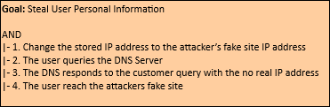

# Malicious QR Code Attacks

In this type of attack, one of the strategies used by the attackers, after coding the malicious links, is to take them to phishing sites or execute fraudulent codes. In addition, in order to end this type of attack, the attackers often print the malicious QR codes on small stickers that are pasted on pre-existing QR codes. On the other hand, attackers often change selected modules from white to black and vice versa in order to replace the original encoded content.

## Definition

QR code-based attack is defined as an attack that attempts to lure victims into scanning a QR code that directs them to malicious websites. The key idea behind QR code attacks is that victims might trust the web page or the printed material on which the QR code is displayed, and assume that the associated code is harmless. In addition, attackers use malicious QR codes to direct users to fraudulent web sites, which masquerade as legitimate web sites aiming to steal sensitive personal information such as usernames, passwords or credit card information. 

## Technical Impact
  * Execute Unauthorized Code or Commands.

## Risk Analysis
  * High Risk.

## Likelihood Exploits
  * Low.

## Attacker Powers

 * Direct the user to an exploit or phishing site;
 * Perform other attacks such as phishing, farming and botnet;
 * Distribute malware;
 * Extraction of personal and confidential data from smartphones and tablets via command injection or traditional buffer overflows by reader software;
 * Steal users' Money via fraud;
 * Social Engineering attacks via spear phishing e.g. leaving a poster of a QR Code on the parking lot of a company (instead of the traditional attack with an USB drive) offering discount in a nearby restaurant is a new attack vector which is likely to be successful.

## Recommendations

To ensure that the mobile application is resilient or immune to malicious QR Code attacks, it is recommended that the measures described in the good practice report and the security tests present in the full report are followed to ensure authenticity, integrity and authenticity of the data.

## Malicious QR Code Attacks Diagram

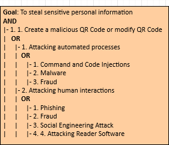

# CAPTCHA Breaking Attacks

CAPTCHAs were developed in order to prevent the usage of internet resources by bots or computers. They are used to prevent spam and overexploitation of network resources by bots. But recently, it has been found that the spammers (attackers) are able to break the CAPTCHA. In this case, we will be in the presence of an attack of this nature, Captcha Breaking.

## Definition

In this type of attacks, the attacker can break the CAPTCHAs by using an audio system, can read the CAPTCHAs by using speech to text conversion software and can also break image-based scheme and video-based scheme. 

## Technical Impact
* Bypass Protection Mechanism; 
* Alter Execution Logic.

## Risk Analysis
* High Risk.

## Likelihood of Exploit
* Low.

## Attacker Powers

 * Spamming;
 * Conducting DoS and DDoS attacks;
 * Excessive exploitation of network resources by bots.

## Recommendations

In order to ensure that the mobile application is resilient or immune to the CAPTCHA Breaking attacks, it is recommended that the measures described in the good practice report and the security tests present in the full report are followed.

## References
1. [https://cwe.mitre.org/data/definitions/804.html];
2. [https://www.first.org/cvss/calculator/3.1#CVSS:3.1/].

## CAPTCHA Breaking Attacks Diagram

# Flooding or Distributed Denial of Services (DDoS)  Attacks

Flooding is an enhanced Denial of Service (DoS) attack type, originating from multiple network attack surfaces that were previously compromised to disrupt the services or resources provided by the target server. It differs from DoS in that it generates more traffic, so that the targeted server cannot handle requests. This type of attack generally exposes a weakness in rate limiting or flow.

## Definition

The Flooding attack attempts to make a service unavailable to intended users by draining the system or network resource. Attackers can now launch various DDoS attacks, including resource-focused attacks (eg, network bandwidth, memory, and CPU) and app-focused attacks (e.g., mobile applications, database service) from almost every attack places. This type of attack can be executed as follows:

 * TCP Flood;
 * UDP Flood;
 * ICMP Flood;
 * HTTP Flood;
 * SSL Flood;
 * Amplification;
 * ML Flood;
 * BlueSmacking.

## Technical Impact

  * Crash, Exit, or Restart;
  * Bypass protection mechanism;
  * Other.

## Typical Severity

  * Medium.

## Risk

  * High.

## Likelihood of Exploit
  * High.
  
## Attacker's Powers

 * Make features and services unavailable to authorized users;
 * Perpetrate other types of attacks and even extract sensitive and critical data.

## Recommendations

In order to ensure that the mobile application is resilient or immune to the Flooding attacks, it is recommended that the measures described in the good practice report and the security tests present in the full report are followed.

## References
1. [[https://cwe.mitre.org/data/definitions/400.html]

 
## Flooding Attacks Diagram

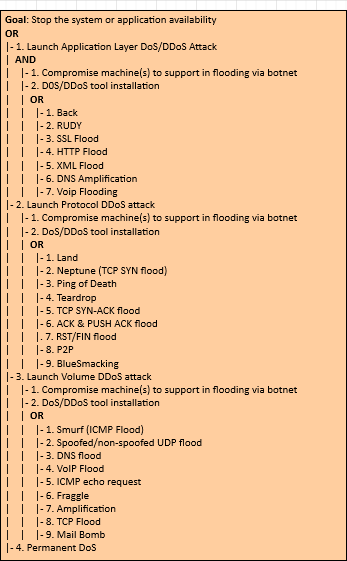

# Sniffing

This type of attack is carried out by attackers who use applications that can capture data packets in transit over a network, and if they are not heavily encrypted, can be read or interpreted. The goal of the attacker is to spy on all kinds of conversations and recordings and to listen to communication channels.

## Definition

This type of attack consists of implant eavesdropping tools in specific network for spying on communication channels, capturing the network traffic behavior and getting the network map. Eavesdropping is dangerous threat that leads to break down the integrity and confidentiality which causes financial and personal failures. There are several ways to get a sniffing attack on a smartphone, as there is a vulnerability in GSM's encryption function for call and SMS privacy, A5 / 1 (it can be stopped second). This vulnerability puts all GSM subscribers at risk of sniffing attacks. 

## Technical Impact
  * Read Application Data; 
  * Modify Files or Directories.

## Risk Analysis
  * Critical Risk.

## Likelihood of Exploit
  * High.
  
## Attacker Powers

 * Tracking, capture and theft of confidential information.

## References
 1. [https://cwe.mitre.org/data/definitions/319.html].

 
## Sniffing Attacks Diagram

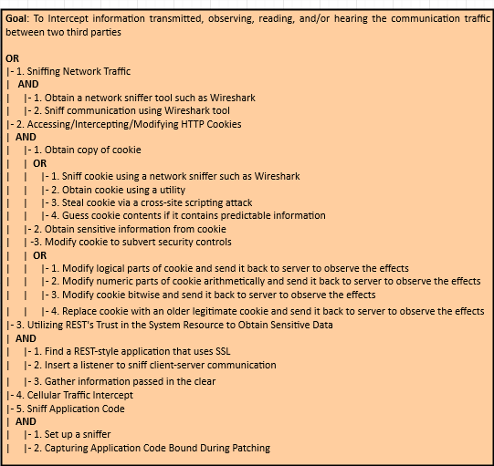

# Phishing Attack

In phishing attack, an adversary sets up a fake URL identical to real Web application fooling the users to enter a valid credentials and certificates.

## Definition

Phishing is the attempt to acquire sensitive information or to make somebody act in a desired way by masquerading as a trustworthy entity in an electronic communication medium. They are usually targeted at large groups of people. Phishing attacks can be performed over almost any channel, from physical presence of the attacker to websites, social networks or even cloud services. On the other hand, phishing attacks are typically fraudulent email messages which directs to spoofed website. In PaaS cloud environment, these attacks affect both enterprise and users. This is a type of social engineering attack. These attackers convince the customers to reveal their most important data like password or other sensitive information by using bogus web pages, emails, or bloggers.
  
## Attacker Powers

 * Access confidential information from legitimate users by collecting data through malware;
 * Perpetrate other types of attacks like Botnet.

## Recommendations

To ensure that the mobile application is resilient or immune to malicious Phishing attacks, it is recommended that the measures described in the good practice report and the security tests present in the full report are followed to ensure authenticity, integrity, privacy and authenticity of the data.

 
## Phishing Attack Diagram

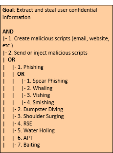

# Botnet Attacks

In a nutshell, in a botnet attack scenario the attacker hijacks a set of mobile devices, creating a network of remote controlled zombie devices. This network is called Botnet, from which various types of attacks can be carried out, such as denial of service attacks, malware distribution, phishing, etc.

## Definition

A botnet is a set of compromised mobile devices. A necessary condition for these devices to be compromised is their infection by malware. This allows attackers/hackers to remotely control this botnet and launch other types of attacks, such as DoS, Phishing, malware injection, etc.

## Technical Impact
 * Gain priviliegies or assume identity.

## Risk Analysis
 * Critical.

## Attacker's Powers
 * Sending spam;
 * Perform attacks like DoS;
 * Collecting information that can be used for illegal purposes;

 
## Botnet Attacks Diagram

# XML Injection Attacks

It is an attacking technique used against XML-based applications to modify or compromise their normal operation.

## Definition

XML Injection (XMLi) attacks are carried out by injecting pieces of XML code along with malicious content into user inputs in order to produce harmful XML messages. The aim of this type of attacks is to compromise the system or system component that receives user inputs, making it malfunction (e.g. crash), or to attack other systems or subsequent components that process those injected XML messages. This type of attack can be classified into 4 categories:
  
 * Deforming: Attack input values of Type 1 are XML meta-characters, such as <, >, ]] >, that are intro- duced to compromise the structure of generated XML messages;
 * Random closing tags: Attack input values of Type 2 are random XML closing tags (e.g., < /test>), aiming at deforming the generated XML messages to reveal their structure;
 * Replicating: Attack input values of Type 3 are strings of characters consisting of XML tag names and malicious content;
 * Replacing: Attack input values of Type 4 are similar to those of Type 3 but they involve multiple input fields in order to comment out some existing XML elements and inject new ones with malicious content.

## Attacker Powers

 * Obtain confidential information;
 * Change the underlying business logic of the destination.

## Recommendations

To ensure that the mobile application is resilient or immune to Spoofing attacks, it is recommended that the measures described in the good practice report and the security tests present in the full report are followed to ensure authenticity, integrity, privacy and authenticity of the data.
 
 
## XML Injection Attacks Diagram

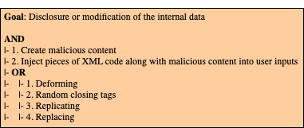

# Spoofing Attacks

In a nutshell, spoofing attacks consist of spoofing the caller ID in order to impersonate a trusted entity and thus obtain confidential information in a disguised manner.

## Definition

In this type of attack, the attacker can spoof the "Caller ID" and impersonate him as a legitimate user, i.e., an attacker could spoof the "Caller ID" and impersonate a trusted party. Recent studies have also shown how to spoof MMS messages that appeared to be messages from a number that operators use to send alerts or update notifications. In addition, base stations can also be counterfeited. On the other hand, there is also the mobile application spoofing attack, which consists of an attack where a malicious mobile application mimics the visual appearance of another one. The goal of the adversary is to trick the user into believing that she is interacting with a genuine application while she interacts with one controlled by the adversary. If such an attack is successful, the integrity of what the user sees as well as the confidentiality of what she inputs into the system can be violated by the adversary. 

## Technical Impact
  * Bypass Protection Mechanism; 
  * Gain Privileges or Assume Identity.

## Risk Analysis
  * Critical Risk.

## Likelihood of Exploit
  * High.
  
## Attacker Powers

 * Faker caller ID;
 * Monitoring of calls and access to the confidential information of legitimate users from voice or text messages.

## Recommendations

To ensure that the mobile application is resilient or immune to Spoofing attacks, it is recommended that the measures described in the good practice report and the security tests present in the full report are followed to ensure authenticity, integrity, privacy and authenticity of the data.

## References
  1. [https://cwe.mitre.org/data/definitions/290.html].
 
## Spoofing Attacks Diagram

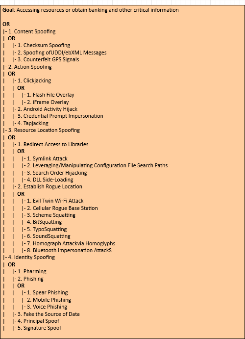

# VM Migration Attacks

A malicious user can start or redirect the migration process to a different network in which he has access or untrusted host, or it can just be copied and used elsewhere, which compromise the VM with the passwords, credentials on it and in case of coping it makes it difficult to trace the attacker.

## Definition

VMs roll back to their previous state if an error occurs. Unfortunately, this factor can re-expose them to security vulnerabilities, and attackers can gain benefit to attack on this compromised hypervisor. It is important to protect the data during migration. In fact, this is the defending of data privacy and integrity from various network attacks during migration. Live migration might be susceptible to many attacks like ”man-in-the-middle”, ”denial-of-service” and ”replay. The data during the migration can be sniffed or tampered easily as it is not encrypted.

## Technical Impact
  * Read Application Data (lack of confidentiality);
  * Modify Application Data (lack of integrity and confidentiality).
## Risk Analisys
  * High Risk.

## Likelihood of Exploit
  * High.
  
## Attacker Powers

 * Launch attacks such as man-in-the-middle, DoS and replay;
 * Detect or tamper with data during migration as it is not encrypted.

## Recommendations

To ensure that the mobile application is resilient or immune to VM Migration attacks, it is recommended that the measures described in the good practice report and the security tests present in the full report are followed to ensure authenticity, integrity, privacy, confinement, and authenticity of the data.

## References
  1. [https://cwe.mitre.org/data/definitions/311.html]. 

 
## VM Migration Attacks Diagram

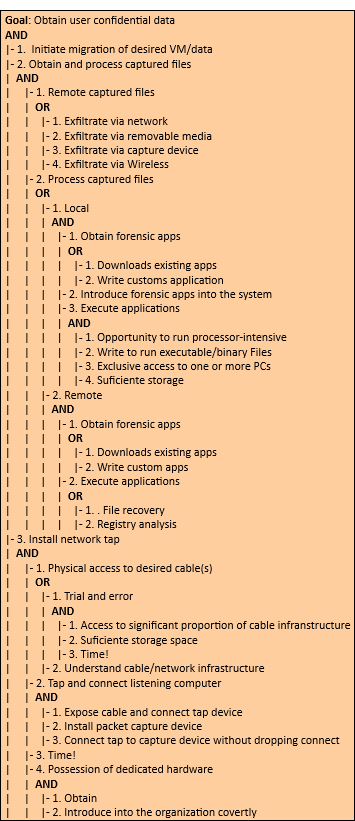

# Malicious Insiders Attacks

This type of attacks ocurre when there is a malicious entity (client, employee, Hypervisor, Cloud Provider/Broker, etc.) takes advantage of its privileges to covertly carry out any malicious activity such as information theft and data destruction or physical infrastructures.

## Definition

Malicious Hypervisor, Malicious Clients, Malicious Cloud Provider/Broker, etc. are all the other terms which can also be used as an alternative to malicious insiders. This kind of attack occurs from client to server when the person, employee or staffs who know how the system runs, can implant malicious codes to destroy everything in the cloud system.

## Technical Impact
* Read Application Data; 
* Read Files or Directories;
* Modify Application Data; 
* Modify Files or Directories;
* Gain Privileges or Assume Identity.

## Analysis of Risk
* High.

## Likelihood Of Exploit
* High.

## Attacker Powers

 * Implants malicious codes to destroy everything in the cloud system;
 * Steals confidential data.

## Recommendations

In order to ensure that the mobile application is resilient or immune to Malicious Insiders attacks, it is recommended that the measures described in the good practice report and the security tests present in the full report are followed.

## References
1. [https://cwe.mitre.org/data/definitions/285.html].

 
## Malicious Insiders Attacks Diagram

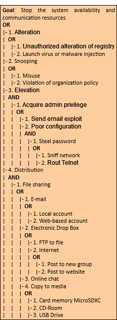

# VM Escape Attacks

This type of attack occurs when an application escapes from the VM and gains control of VMM, as it escapes the VM privilege and obtains the root privilege.

## Definition

VM escape is where an application running on a VM can directly have access to the host machine by bypassing the hypervisor, being the root of the system it makes this application escape the VM privilege and gain the root privilege. In this type of attack the attackers attempt to break down the guest OS in order to access the hypervisor or to penetrate the functionalities of other guest OS and underlying host OS. This breaking of the guest OS is called as escape. If the attackers escapes the guest OS it may compromise the hypervisor and as a result it may control over the entire guest OS. In this way the security breach in single point in hypervisor may break down all the hypervisor. If the attacker controls the hypervisor, it can do anything to the VM on the host system.

## Risk Analysis
  * Critical Risk.
  
## Attacker Powers

 * Shutdown and eliminate target or victim VMs, resulting in the loss and destruction of data or information;
 * Compromise the hypervisor and other resources.

## Recommendations

To ensure that the mobile application is resilient or immune to VM Escape attacks, it is recommended that the measures described in the good practice report and the security tests present in the full report are followed to ensure authenticity, integrity, privacy, authenticity and confinement of the data.

## VM Escape Attacks Diagram

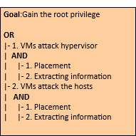

# Side-Channel Attacks

It is a type of attack enabled by leakage of information from a physical cryptosystem.

## Definition

Side-channel attacks use statistical models such as differential analysis and correlation analysis on the information leaked from the cryptographic device during runtime. While early attacks required attackers to be in physical possession of the device, newer side-channel attacks such as cache-timing attacks or DRAM row buffer attacks are conducted remotely by executing malicious software in the targeted cloud environment. Regarding smartphones/tablets, they have developed more sophisticated side-channel attacks that target the built-in sensors of these devices, allowing them to infer keyboard input on touchscreens through sensor readings of native applications and websites, infer a user's location by the power consumption available in the proc file system (procfs), and infer a user's identity, location and diseases through procfs.

 * Time-driven side-channel attack;
 * Trace-driven side-channel attacks;
 * Access-driven side-channel attacks.
 * Power Analysis;
 * Electromagnetic Analysis;
 * Laser/optical;
 * Clock/power Glitch;
 * Temperature Variation;
 * EMFI;
 * Differential Computation Analysis
 * Reflection/hands;
 * Smudges;
 * Network Traffic Analysis;
 * USB Power Analysis;
 * Wi-Fi Signal Monitoring;
 * Figerprinting Devices;
 * Data-usage Statistics;
 * Page Deduplication;
 * Procfs Leaks;
 * Microarchitectural Attacks;
 * Location Inference;
 * Speech Recognition;
 * Soundcomber;
 * Sensor-based Keyloggers;
 * Rowhammer.

## Technical Impact
* Modify and Read Memory; 
* Read Files or Directories; 
* Modify Files or Directories; 
* Execute Unauthorized Code or Commands; 
* Gain Privileges or Assume Identity; 
* Bypass Protection Mechanism; 
* Read Application Data; 
* Modify Application Data; 
* Hide Activities.

## Risk Analysis
  * High Risk.

## Likelihood of Exploit
  * Low.

## Attacker Powers

 * Steal cryptographic information;
 * Extract cryptographic key;
 * Obtains confidential data or sensitive information.

## Recommendations

In order to ensure that the mobile application is resilient or immune to the side-channel attacks, it is recommended that the measures described in the good practice report and the security testing present in the full report are followed.

## References
1. Grassi, P.A., et al., 2017. Digital identity guidelines. URL: https://nvlpubs.nist.gov/nistpubs/SpecialPublications/NIST.SP.
800-63-3.pdf, doi:https://doi.org/10.6028/NIST.SP.800-63-3.
2. Spreitzer, R., et al., 2018. Systematic classification of side-channel attacks: A case study for mobile devices. IEEE Communications Surveys Tutorials 20, 465–488. doi:10.1109/COMST.2017.2779824.

## Cross VM Attacks Diagram

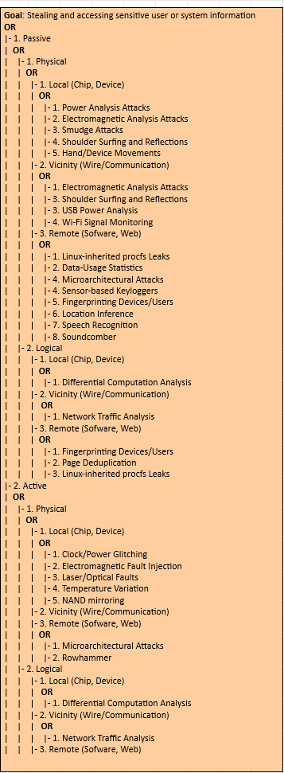

# Tampering Attacks

In this type of attack an attacker preforms physical modifications on the hardware where the software is implemented.  

## Definition

This type of attack occurs whenever an unauthorized user has physical access to the device. When this access is realized, it is possible to loss, leakage, access or unintentionally disclose of the data or applications to unauthorized users, if the mobile devices are misplaced, lost or theft.

## Technical Impact
* Read and Modify Application Data.
  
## Attacker Powers

 * Sending high malicious traffic stream;
 * Huge messages to targeting mobile devices to make unused or reducing the capability;
 * Access and steal users confidential data.

## Recommendations

To ensure that the mobile application is resilient or immune to malicious Tampering attack, it is recommended that the measures described in the good practice report and the security tests present in the full report are followed to ensure authenticity, integrity, privacy and authenticity of the data.
 
## Tampering Attacks Diagram

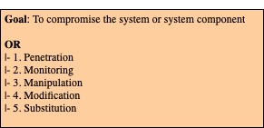

# Bluejacking, Bluesnarfing and BlueSmacking Attacks

These are DDoS-type attacks that target a Bluetooth wireless network in order to shut down activity on it. It usually occurs through an attack coming from a connection of malicious entities in a target network.

## Definition

 Bluejacking occurs by sending unsolicited messages between the mobile devices (host nodes) over the Bluetooth connection. The unauthorized information can be accessed from a mobile device through Bluesnarfing to Bluetooth enabled devices using  OBject EXchange (OBEX) protocol. Through the Bluejacking attack, attackers can send unwanted sounds, videos to other Bluetooth enabled devices. Bluesnarfing attack consists of using Bluetooth connection for the purpose of stealing sensitive information (contacts, emails, passwords, photos, and other useful data) from wireless devices such as smartphones, tablets and IoT. In a Bluesmacking cenario attack, an adversary uses Bluetooth flooding to transfer large packets to Bluetooth enabled devices over the L2CAP protocol with the goal of creating a DoS.
 
## Technical Impact

 * Resource Consumption;
 * Malware Injection;
 * Unreliable Execution;
 * Read Data.

## Typical Severity

 * Medium.

## Risk Analysis

 * High Risk.

## Likelihood of Exploit

 * Medium.

## Recommendations

In order to ensure that the mobile application is resilient or immune to the Bluejacking, Bluesnarfing and BlueSmacking attacks, it is recommended that the measures described in the good practice report and the security testing present in the full report are followed.

## References
1. atel, N., Wimmer, H., Rebman, C.M., 2021. Investigating bluetooth vulnerabilities to defend from attacks, in: 2021 5th International Symposium on Multidisciplinary Studies and Innovative Technologies (ISMSIT), IEEE, Ankara, Turkey. pp. 549–554. doi:10.1109/ISMSIT52890.2021.9604655.

## Bluejacking, Bluesnarfing and BlueSmacking Attacks Diagram
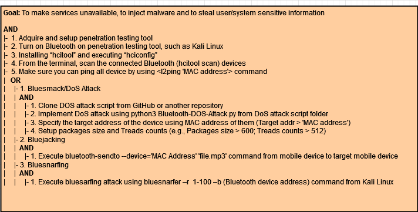

# GPS Jamming Attacks

This is a DoS attack that targets the GPS sensor, aiming to make this service (position, path, speed, direction, time, and distance) unavailable to users of the target mobile devices.

## Definition

 This attack aims to interrupt or obstruct the communication between the emitting satellite and the device (smartphone/tablet) receiving the GPS signal. Normally, the attack consists of blocking the signal from the receiver, since the receiving signal is weaker compared to the broadcasting signal, and can be carried out in two different ways:
 
  * Blanket Jamming;
  * Deception Jamming.  
 
## Technical Impact

 * Service unavailability.

## Typical Severity

 * High

## Risk Analysis

 * High Risk.

## Likelihood of Exploit

 * Low.

## Recommendations

In order to ensure that the mobile application is resilient or immune to the GPS Jamming attacks, it is recommended that the measures described in the good practice report and the security testing present in the full report are followed.

## References
1. [CAPEC-627: Counterfeit GPS Signals](https://capec.mitre.org/data/definitions/627.html).

## GPS Jamming Attacks Diagram

# DoS (Cellular) Jamming Attacks

This type of attack aims to dominate and disrupt communication between a user's mobile device and the cell tower by actively transmitting signals.

## Definition

 Interference attacks target radio communication technology (communication between smart devices and base stations). This attack can be caused by noise, interference, disruption or by sending corrupted data packets, with the purpose of causing DoS in the physical transmission of signals on certain routes. 
 
## Technical Impact

 * Resource Consumption.

## Typical Severity

 * Low.

## Risk Analysis

 * High Risk.

## Likelihood of Exploit

 * Low.

## Recommendations

In order to ensure that the mobile application is resilient or immune to the DoS Jamming attacks, it is recommended that the measures described in the good practice report and the security testing present in the full report are followed.

## References
1. [CAPEC-605: Cellular Jamming](https://capec.mitre.org/data/definitions/605.html).
2.Moorthy, V., Venkataraman, R., Rama Rao, T., 2020. Security and privacy attacks during data communication in software defined mobile clouds. Computer Communications 153, 515–526. URL: https://www.sciencedirect.com/science/article/pii/S0140366419317268, doi:https://doi.org/10.1016/j.comcom.2020.02.030.

## DoS Jamming Attacks Diagram
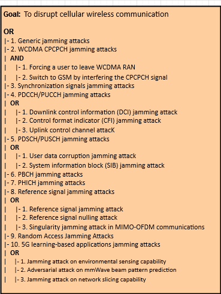

# Cryptanalysis Attacks

This attack consists in deciphering a ciphered message without knowing the decryption key by exploiting vulnerabilities in the cryptographic algorithm.

## Definition

 Cryptanalysis focuses on finding vulnerabilities in cryptographic algorithms and using these weaknesses to decrypt the ciphertext without knowing the secret key. In addition, this can have other purposes such as Total Breach, Global Deduction, Information Deduction, and Distinguishing Algorithm.
 
## Technical Impact

* Read Data.

## Typical Severity

* Very High.

## Risk Analysis

* Very High Risk.

## Likelihood of Exploit
  
* Low.

## Recommendations

In order to ensure that the mobile application is resilient or immune to the Cryptanalysis Attacks, it is recommended that the measures described in the good practice report and the security testing present in the full report are followed.

## References
1. [CAPEC-97: Cryptanalysis](https://capec.mitre.org/data/definitions/97.html).

## Cryptanalysis Attacks Diagram
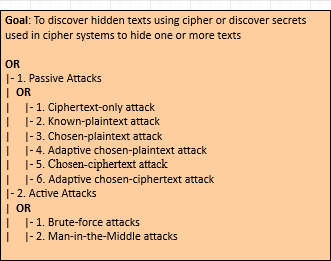

# Reverse Engineering Attacks

Typically, this attack consists of using specific tools to analyze the target application (feature or resources), within its own local environment, downloaded from a mobile application store, such as Apple's App Store and Google's Play Store, respectively.

## Definition

Reverse engineering attacks (REA) target the assets embedded in software. In such an attack scenario, the attacker by reverse engineering attempts to steal confidential information, such as embedded cryptographic keys or intellectual property in the form of algorithms. There are two ways of carrying out this type of attack:

 * White Box Reverse Engineering;
 * Black Box Reverse Engineering.
 
## Technical Impact
* Reveal information about back end servers;
* Reveal cryptographic constants and ciphers;
* Steal intellectual property;
* Perform attacks against back end systems;
* Gain intelligence needed to perform subsequent code modification.

## Risk Analysis
  * High Risk.

## Likelihood of Exploit
  * Low.

## Recommendations

In order to ensure that the mobile application is resilient or immune to the Reverse Engineering attacks, it is recommended that the measures described in the good practice report and the security testing present in the full report are followed.

## References
1. Basile, C., et al., 2019. A meta-model for software protections and reverse engineering attacks. Journal of Systems and Software 150, 3–21. URL: https://www.sciencedirect.com/science/article/pii/
S0164121218302838, doi:https://doi.org/10.1016/j.jss.2018.12.025.
2. [M9: Reverse Engineering](https://owasp.org/www-project-mobile-top-10/2016-risks/m9-reverse-engineering).

## Reverse Engineering Attacks Diagram

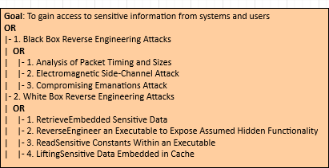

# Audit Log Manipulation Attacks

This type of attack targets log files for the purpose of manipulating (deleting, reading, and altering) them.

## Definition

In a log file audit manipulation attack scenario, an attacker injects, manipulates, deletes, or forges malicious entries in the log file in an attempt to deceive a log file audit or to cover impressions of an attack. The success of this type of attack depends on the insufficiency of log file access controls mechanisms.
 
## Technical Impact

* Modify Data.

## Typical Severity

* High.

## Risk Analysis

* High Risk.

## Likelihood of Exploit
  
* High.

## Recommendations

In order to ensure that the mobile application is resilient or immune to the Audit Log Manipulation Attacks, it is recommended that the measures described in the good practice report and the security testing present in the full report are followed.

## References

1. [CAPEC-268: Audit Log Manipulation](https://capec.mitre.org/data/definitions/268.html).

## Audit Log Manipulation Attacks Diagram
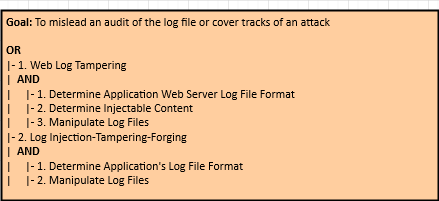

# Wi-Fi Jamming Attacks

In a scenario of this type of attack, the attacker targets the wireless network made available from the access point, with the aim of making it unavailable.

## Definition

 This is a denial-of-service attack that blocks the radio frequency, making access to the Wi-Fi network and consequently to the Internet unavailable. Generally, two techniques are used to carry out this type of attack, namely: 1) The attacker may flood the Wi-Fi access point (e.g. the retransmission device) with deauthentication frames; 2) Another method is to transmit high levels of noise on the RF band used by the Wi-Fi network.
 
## Technical Impact

* Resource Consumption.

## Typical Severity

* High.

## Risk Analysis

* High Risk.

## Likelihood of Exploit
  
* Medium.

## Recommendations

In order to ensure that the mobile application is resilient or immune to the Code Inclusion attacks, it is recommended that the measures described in the good practice report and the security testing present in the full report are followed.

## References
1. [CAPEC-175: Code Inclusion](https://capec.mitre.org/data/definitions/175.html).

## Code Inclusion Attacks Diagram
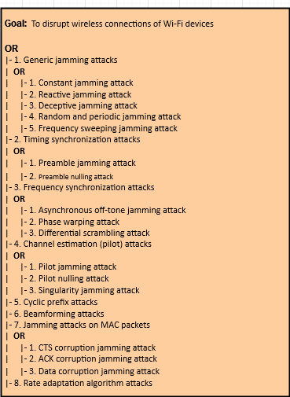

# Wi-Fi SSID Tracking Attacks

Unlike code injection, in this type of attack, an attacker exploits a weakness in the target in order to force arbitrary code to be retrieved locally or from a remote location and executed.

## Definition

This type of attack aims to obtain sensitive data (location, routine, trajectory, etc.) of users of mobile devices using Wi-Fi networks to access the Internet. Furthermore, it consists of using sophisticated sniffing devices to bypass authentication (for closed networks), extract and identify the MAC address of the mobile device and establish a match with its potential owner.
 
## Technical Impact

 * Read Data;
 * Bypass Protection Mechanism.

## Typical Severity

 * Low.

## Risk Analysis

 * Very High Risk.

## Likelihood of Exploit

 * Medium.

## Recommendations

In order to ensure that the mobile application is resilient or immune to the Wi-Fi SSID Tracking attacks, it is recommended that the measures described in the good practice report and the security testing present in the full report are followed.

## References

1. Matte, C., 2017. Wi-Fi tracking: Fingerprinting attacks and countermeasures. Ph.D. thesis. Université de Lyon.

## Wi-Fi SSID Tracking Attacks Diagram
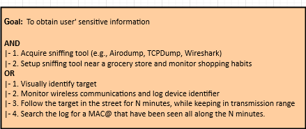

# Byzantine Attacks

In a Byzantine attack scenario, the attacker targets the routing protocols of an ad hoc wireless network, aiming to access and modify sensitive data exchanged between two or more entities on this network.

## Definition

 In a mobile ad hoc wireless network, Byzantine attacks are defined as attacks that target routing protocols, in which two or more routers collude to drop, fabricate, modify, or divert packets in an attempt to disrupt routing services.
 
## Technical Impact

* Read Data;
* Modify Data;
* Denial of service.

## Typical Severity

* High.

## Risk Analysis

* High Risk.

## Likelihood of Exploit
  
* Medium.

## Recommendations

In order to ensure that the mobile application is resilient or immune to the Byzantine Attacks, it is recommended that the measures described in the good practice report and the security testing present in the full report are followed.

## References

1. Yu, M., et al., 2009. A secure routing protocol against byzantine attacks for manets in adversarial environments. IEEE Transactions on Vehicular Technology 58, 449–460. doi:10.1109/TVT.2008.923683.

## Byzantine Attacks Diagram
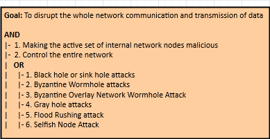

