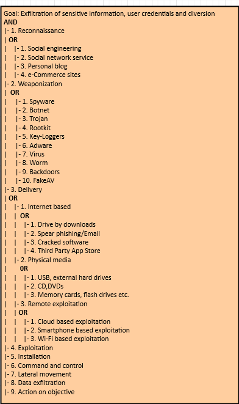

# Final Attack Models Report  

|                           |                                                              |  
|  :--------                |  :---------                                                  |  
|  Mobile Plataform         |  Android App ; IoT System                                    |  
|  Application domain type  |  Smart Home                                                  |  
|  Authentication           |  Yes                                                         |  
|  Authentication schemes   |  ID-based authentication                                     |  
|  Has DB                   |  Yes                                                         |  
|  Type of data storage     |  Distributed Storage                                         |  
|  Which DB                 |                                                              |  
|  Type of data stored      |  Personal Information ; Confidential Data                    |  
|  User Registration        |  Yes                                                         |  
|  Type of Registration     |  The users will register themselves                          |  
|  Programming Languages    |  C/C++ ; Java                                                |  
|  Input Forms              |  Yes                                                         |  
|  Upload Files             |  No                                                          |  
|  The system has logs      |  Yes                                                         |  
|  The system has regular updates|  Yes                                                         |  
|  The system has third-party|  Yes                                                         |  
|  System Cloud Environments|  Hybrid Cloud                                                |  
|  Hardware Specification   |  Yes                                                         |  
|  HW Authentication        |  Basic Authentication (user/pass)                            |  
|  HW Wireless Tech         |  3G ; 4G/LTE ; 5G ; Bluetooth  ; Wi-Fi                       |  
|  Data Center Phisical Access|  Yes                                                         |  

# Man-in-the-Middle Attack

In this type of attack an active man listen and change communications between Mobile Device and Cloud. In other hand, in this attack an intruder enters in the ongoing conversation between sender and the receiver and makes them believe that conversation is taking place between them only.

## Definition

This type of attack occurs whenever an attacker intends to intercept communications in order to interpret or alter the original data in transit between the sender and the receiver establishing a conversation.

## Technical Impact
 * An attacker is able to decrypt and read all SSL/TLS traffic between the client and server;
 * Gain Privileges or Assume Identity.
## Risk Analysis
* Critical Risk.

## Likelihood of Exploit
 * Medium.

## Attacker Powers

The attacker generally and depending on whether the communication situation is encrypted or not, is able to modify the cryptographically unprotected communication or modify the cryptographically protected communication. More specifically, it will have the following powers:

 * Steal encryption key;
 * Discover cryptographic key using cryptanalysis;
 * Exploit vulnerabilities in cryptographic algorithm;
 * Exploit vulnerabilities in cryptographic protocol.

## Recommendations
To ensure that the mobile application is resilient or immune to malicious MitM attacks, it is recommended that the measures described in the good practice report and the security tests present in the full report are followed to ensure authenticity, integrity, privacy and authenticity of the data.

## Reference
 1. [https://cwe.mitre.org/data/definitions/300.html];
 2. [https://www.first.org/cvss/v3.1/examples].
 
## Man-in-the-Middle Attack Diagram

# Brute Force Attacks
This type of attack consists in trying to access a system using some mechanism or simply 
using trial-and-error, aiming to guess the password of a legitimate user of 
that system. The success of this attack depends largely on the cryptographic scheme used for authentication 
and access control to the system, as well as the nature of the password set by the legitimate user.
## Description
In this attack, some asset, namely, information, functionality, identity, etc., is protected 
by a finite secret value. The attacker attempts to gain access to this asset by using 
trial-and-error to exhaustively explore all the possible secret values in the hope of 
finding the secret (or a value that is functionally equivalent) that will unlock the asset. 
Examples of secrets can include, but are not limited to, passwords, encryption keys, database 
lookup keys, and initial values to one-way functions. The key factor in this attack is the attackers' 
ability to explore the possible secret space rapidly. This, in turn, is a function of the size of the 
secret space and the computational power the attacker is able to bring to bear on the problem. 
If the attacker has modest resources and the secret space is large, the challenge facing the 
attacker is intractable. Assuming a finite secret space, a brute force attack will eventually 
succeed. The defender must rely on making sure that the time and resources necessary to do so will 
exceed the value of the information.

This type of attack can be carried out in two different ways:
1. Encryption Brute Forcing;
2. Password Brute Forcing.

## Technical Impact
* Read Data:
* Gain Privileges.

## Likelihood Of Attack
* Medium

## Typical Severity
* High

## Risk Analysis
* Critical

## Likelihood of Exploit
* High 

## Recommendations
In order to mitigate the Brute Force type attacks it is convenient to follow the good practice guidelines, aiming at incorporating
the security mechanisms during the coding and implementation phase and carrying out the security tests suggested and present in 
the report during the verification phase, with the purpose of ensuring that the functional requirements linked to security and 
the non-functional requirements of the application to be developed or deployed are met.

## References
1. [https://capec.mitre.org/data/definitions/112.html];
2. [https://cwe.mitre.org/data/definitions/521.html]

## Brute Force Attack Tree Diagram

# Eavesdropping Attacks
Eavesdropping is a type of attack where the attacker tries to gain access to sensitive information 
of legitimate users from the messages (text, voice and video) exchanged between two or more users 
of Instant Messaging (IM) applications. The same applies to recorded calls, call logs and multimedia 
stored in clear text on memory cards.

## Description
An adversary intercepts a form of communication (e.g. text, audio, video) by way of software (e.g., microphone 
and audio recording application), hardware (e.g., recording equipment), or physical means (e.g., physical proximity). 
The goal of eavesdropping is typically to gain unauthorized access to sensitive information about the target for 
financial, personal, political, or other gains. It entails listening in on the raw 
audio source of a conversation between two or more parties. This type of attack can be carried out in two different ways:
1. Shoulder Surfing (Physical Eavesdropping);
2. Probe Audio and Video Peripheralsn (Software Eavesdropping).

## Technical Impact
* Read Data

## Likelihood Of Attack
* High

## Typical Severity
* High

## Risk Analysis
* High

## Likelihood of Exploit
* Medium

## Recommendations
In order to mitigate the espionage type attacks it is convenient to follow the good practice guidelines, aiming at incorporating
the security mechanisms during the coding and implementation phase and carrying out the security tests suggested and present in 
the report during the verification phase, with the purpose of ensuring that the functional requirements linked to security and 
the non-functional requirements of the application to be developed or deployed are met.

## References
1. [https://capec.mitre.org/data/definitions/651.html];
2. [https://cwe.mitre.org/data/definitions/200.html];
3. [https://www.first.org/cvss/calculator/3.1#CVSS:3.1/].

## Eavesdropping Attack Tree Diagram

# Denial of Services

In a DoS attack scenario, the attacker attempts to disrupt the network or disable services provisioned by a server by sending uninterrupted data packets to the target server and without changing nodes, data packets, or decrypting encrypted data. Typically, these data packets take up bandwidth and consume server resources.

## Definition

In such attacks, the attacker attempts to prevent a service or feature that is signed by authorized users from being released by launching various types of floods - SYN flooding, User Datagram Protocol (UDP) flooding, Internet Control Message Protocol (ICMP) attacks ) flooding, etc - on the server.

## Technical Impact
  * Crash, Exit, or Restart;
  * Bypass protection mechanism;
  * Other.

## Risk
  * High.

## Likelihood of Exploit
  * High.

## Attacker's Powers

 * Prevent the availability of a service or resource to authorized users;
 * Perpetrating other types of attacks while services or features are unavailable, such as Spoofing.

## Recommendations

In order to ensure that the mobile application is resilient or immune to the DoS attacks, it is recommended that the measures described in the good practice report and the security tests present in the full report are followed.

## References
1. [https://cwe.mitre.org/data/definitions/400.html]

## Denial of Services Attacks Diagram

# Distributed Denial of Services Attacks

Distributed Denial of Services (DDoS) is an enhanced DoS attack type, originating from multiple network attack surfaces that were previously compromised to disrupt the services or resources provided by the target server. It differs from DoS in that it generates more traffic, so that the targeted server cannot handle requests.

## Definition

The DDoS attack attempts to make a service unavailable to intended users by draining the system or network resource. Attackers can now launch various DDoS attacks, including resource-focused attacks (eg, network bandwidth, memory, and CPU) and app-focused attacks (eg, mobile applications, database service) from almost every attack. places.

## Technical Impact
  * Crash, Exit, or Restart;
  * Bypass protection mechanism;
  * Other.

## Risk
  * High.

## Likelihood of Exploit
  * High.
  
## Attacker's Powers
 * Make features and services unavailable to authorized users;
 * Perpetrate other types of attacks and even extract sensitive and critical data.

## Recommendations

In order to ensure that the mobile application is resilient or immune to the DDoS attacks, it is recommended that the measures described in the good practice report and the security tests present in the full report are followed.

## References
1. [[https://cwe.mitre.org/data/definitions/400.html]

 
## Distributed Denial of Services Attacks Diagram

# Eavesdropping or Sniffing

This type of attack is carried out by attackers who use applications that can capture data packets in transit over a network, and if they are not heavily encrypted, can be read or interpreted. The goal of the attacker is to spy on all kinds of conversations and recordings and to listen to communication channels.

## Definition

This type of attack consists of implant eavesdropping tools in specific network for spying on communication channels, capturing the network traffic behavior and getting the network map. Eavesdropping is dangerous threat that leads to break down the integrity and confidentiality which causes financial and personal failures. There are several ways to get a sniffing attack on a smartphone, as there is a vulnerability in GSM's encryption function for call and SMS privacy, A5 / 1 (it can be stopped second). This vulnerability puts all GSM subscribers at risk of sniffing attacks. 

## Technical Impact
  * Read Application Data; 
  * Modify Files or Directories.

## Risk Analysis
  * Critical Risk.

## Likelihood of Exploit
  * High.
  
## Attacker Powers

 * Tracking, capture and theft of confidential information.

## References
 1. [https://cwe.mitre.org/data/definitions/319.html].

 
## Sniffing Attacks Diagram

# Phishing Attack

In phishing attack, an adversary sets up a fake URL identical to real Web application fooling the users to enter a valid credentials and certificates.

## Definition

Phishing is the attempt to acquire sensitive information or to make somebody act in a desired way by masquerading as a trustworthy entity in an electronic communication medium. They are usually targeted at large groups of people. Phishing attacks can be performed over almost any channel, from physical presence of the attacker to websites, social networks or even cloud services. On the other hand, phishing attacks are typically fraudulent email messages which directs to spoofed website. In PaaS cloud environment, these attacks affect both enterprise and users. This is a type of social engineering attack. These attackers convince the customers to reveal their most important data like password or other sensitive information by using bogus web pages, emails, or bloggers.
  
## Attacker Powers

 * Access confidential information from legitimate users by collecting data through malware;
 * Perpetrate other types of attacks like Botnet.

## Recommendations

To ensure that the mobile application is resilient or immune to malicious Phishing attacks, it is recommended that the measures described in the good practice report and the security tests present in the full report are followed to ensure authenticity, integrity, privacy and authenticity of the data.

 
## Phishing Attack Diagram

# Botnet Attacks

In a nutshell, in a botnet attack scenario the attacker hijacks a set of mobile devices, creating a network of remote controlled zombie devices. This network is called Botnet, from which various types of attacks can be carried out, such as denial of service attacks, malware distribution, phishing, etc.

## Definition

A botnet is a set of compromised mobile devices. A necessary condition for these devices to be compromised is their infection by malware. This allows attackers/hackers to remotely control this botnet and launch other types of attacks, such as DoS, Phishing, malware injection, etc.

## Technical Impact
 * Gain priviliegies or assume identity.

## Risk Analysis
 * Critical.

## Attacker's Powers
 * Sending spam;
 * Perform attacks like DoS;
 * Collecting information that can be used for illegal purposes;

 
## Botnet Attacks Diagram

# Buffer Overflows Attack

As its name implies, buffer overflows occur when data exceeding its capacity is placed in a buffer. This occurs in programs implemented in C or C++, as these programming languages do not check if buffer limits are violated.

## Definition

Buffer overflows is an anomaly where a program, while writing data to a buffer, overruns the buffer's boundary and overwrites adjacent memory. It can be triggered by non-validated inputs that are designed to execute code. Buffer overflow may result in erratic program behavior, including memory access errors, incorrect results, a crash, or a breach of system security.

## Technical Impact
 * Modify Memory; 
 * Execute Unauthorized Code or Commands.

## Risk Analysis
 * High Risk

## Likelihood of Exploit
 * High.
 
## Attacker Powers

 * Overwrite the return address of a procedure call;
 * Obtain control of a system;
 * Launch more virulent attacks, such DoS or DDoS.

## Recommendations

In order to ensure that the mobile application is resilient or immune to the buffer overflows attack, it is recommended that the measures described in the good practice report and the security tests present in the full report are followed.

## References
 1. [https://cwe.mitre.org/data/definitions/120.html];
 2. [https://www.first.org/cvss/calculator/3.1#CVSS:3.1/];
 3. [https://www.first.org/cvss/v3.1/examples].
 
 
## Buffer Overflows Attack Diagram

# Spoofing Attacks

In a nutshell, spoofing attacks consist of spoofing the caller ID in order to impersonate a trusted entity and thus obtain confidential information in a disguised manner.

## Definition

In this type of attack, the attacker can spoof the "Caller ID" and impersonate him as a legitimate user, i.e., an attacker could spoof the "Caller ID" and impersonate a trusted party. Recent studies have also shown how to spoof MMS messages that appeared to be messages from a number that operators use to send alerts or update notifications. In addition, base stations can also be counterfeited. On the other hand, there is also the mobile application spoofing attack, which consists of an attack where a malicious mobile application mimics the visual appearance of another one. The goal of the adversary is to trick the user into believing that she is interacting with a genuine application while she interacts with one controlled by the adversary. If such an attack is successful, the integrity of what the user sees as well as the confidentiality of what she inputs into the system can be violated by the adversary. 

## Technical Impact
  * Bypass Protection Mechanism; 
  * Gain Privileges or Assume Identity.

## Risk Analysis
  * Critical Risk.

## Likelihood of Exploit
  * High.
  
## Attacker Powers

 * Faker caller ID;
 * Monitoring of calls and access to the confidential information of legitimate users from voice or text messages.

## Recommendations

To ensure that the mobile application is resilient or immune to Spoofing attacks, it is recommended that the measures described in the good practice report and the security tests present in the full report are followed to ensure authenticity, integrity, privacy and authenticity of the data.

## References
  1. [https://cwe.mitre.org/data/definitions/290.html].
 
## Spoofing Attacks Diagram

# VM Migration Attacks

A malicious user can start or redirect the migration process to a different network in which he has access or untrusted host, or it can just be copied and used elsewhere, which compromise the VM with the passwords, credentials on it and in case of coping it makes it difficult to trace the attacker.

## Definition

VMs roll back to their previous state if an error occurs. Unfortunately, this factor can re-expose them to security vulnerabilities, and attackers can gain benefit to attack on this compromised hypervisor. It is important to protect the data during migration. In fact, this is the defending of data privacy and integrity from various network attacks during migration. Live migration might be susceptible to many attacks like ”man-in-the-middle”, ”denial-of-service” and ”replay. The data during the migration can be sniffed or tampered easily as it is not encrypted.

## Technical Impact
  * Read Application Data (lack of confidentiality);
  * Modify Application Data (lack of integrity and confidentiality).
## Risk Analisys
  * High Risk.

## Likelihood of Exploit
  * High.
  
## Attacker Powers

 * Launch attacks such as man-in-the-middle, DoS and replay;
 * Detect or tamper with data during migration as it is not encrypted.

## Recommendations

To ensure that the mobile application is resilient or immune to VM Migration attacks, it is recommended that the measures described in the good practice report and the security tests present in the full report are followed to ensure authenticity, integrity, privacy, confinement, and authenticity of the data.

## References
  1. [https://cwe.mitre.org/data/definitions/311.html]. 

 
## VM Migration Attacks Diagram

# Malicious Insiders Attacks

This type of attacks ocurre when there is a malicious entity (client, employee, Hypervisor, Cloud Provider/Broker, etc.) takes advantage of its privileges to covertly carry out any malicious activity such as information theft and data destruction or physical infrastructures.

## Definition

Malicious Hypervisor, Malicious Clients, Malicious Cloud Provider/Broker, etc. are all the other terms which can also be used as an alternative to malicious insiders. This kind of attack occurs from client to server when the person, employee or staffs who know how the system runs, can implant malicious codes to destroy everything in the cloud system.

## Technical Impact
* Read Application Data; 
* Read Files or Directories;
* Modify Application Data; 
* Modify Files or Directories;
* Gain Privileges or Assume Identity.

## Analysis of Risk
* High.

## Likelihood Of Exploit
* High.

## Attacker Powers

 * Implants malicious codes to destroy everything in the cloud system;
 * Steals confidential data.

## Recommendations

In order to ensure that the mobile application is resilient or immune to Malicious Insiders attacks, it is recommended that the measures described in the good practice report and the security tests present in the full report are followed.

## References
1. [https://cwe.mitre.org/data/definitions/285.html].

 
## Malicious Insiders Attacks Diagram

# VM Escape Attacks

This type of attack occurs when an application escapes from the VM and gains control of VMM, as it escapes the VM privilege and obtains the root privilege.

## Definition

VM escape is where an application running on a VM can directly have access to the host machine by bypassing the hypervisor, being the root of the system it makes this application escape the VM privilege and gain the root privilege. In this type of attack the attackers attempt to break down the guest OS in order to access the hypervisor or to penetrate the functionalities of other guest OS and underlying host OS. This breaking of the guest OS is called as escape. If the attackers escapes the guest OS it may compromise the hypervisor and as a result it may control over the entire guest OS. In this way the security breach in single point in hypervisor may break down all the hypervisor. If the attacker controls the hypervisor, it can do anything to the VM on the host system.

## Risk Analysis
  * Critical Risk.
  
## Attacker Powers

 * Shutdown and eliminate target or victim VMs, resulting in the loss and destruction of data or information;
 * Compromise the hypervisor and other resources.

## Recommendations

To ensure that the mobile application is resilient or immune to VM Escape attacks, it is recommended that the measures described in the good practice report and the security tests present in the full report are followed to ensure authenticity, integrity, privacy, authenticity and confinement of the data.

## VM Escape Attacks Diagram

# Cross VM Attacks (Sid-Channel attacks)

Side-channel attacks are used to extract cryptographic keys from a victim device or process in a virtualized layer of the cloud ecosystem where a Cross-VM attack exploits the nature of multi-tenancy, which enables that VMs belonging to different customers may co-reside on the same physical machine.

## Definition

The side-channel attack takes advantage of low-bandwidth message channels in a system to leak sensitive security information. There is no doubt that this type of attack exists and is real for today's computer systems, including modern smartphones and tablets. Here we highlight the cache-based side-channel attacks that have been used to steal cryptographic information from a single OS. Furthermore, the weak link is in the fact that cryptographic algorithms usually have data-dependent memory access patterns, giving the possibility of being revealed by the observation and statistical analysis of hits / errors from the associated cache. Recent research has shown attackers can build up cross-VM side channels to obtain sensitive information. However, currently these channels are mostly based on shared CPU cache, networks, CPU loads and so on. These attacks are generally categorized into one of three classes:

 * Time-driven side-channel attack;
 * Trace-driven side-channel attacks;
 * Access-driven side-channel attacks.

## Technical Impact
* Modify and Read Memory; 
* Read Files or Directories; 
* Modify Files or Directories; 
* Execute Unauthorized Code or Commands; 
* Gain Privileges or Assume Identity; 
* Bypass Protection Mechanism; 
* Read Application Data; 
* Modify Application Data; 
* Hide Activities.

## Risk Analysis
  * High Risk.

## Likelihood of Exploit
  * Low.

## Attacker Powers

 * Steal cryptographic information;
 * Extract cryptographic key;
 * Obtains confidential data or sensitive information.

## Recommendations

In order to ensure that the mobile application is resilient or immune to the side-channel attacks, it is recommended that the measures described in the good practice report and the security testing present in the full report are followed.

## Cross VM Attacks Diagram

# Malware Injection Attacks

This type of attack occurs whenever a user can install malware on a mobile device. In addition, this type of attack can be carried out remotely or locally.

## Definition

Attacks on the cloud and mobile application-level ecosystem can affect the integrity and confidentiality of data and applications through different strategies. E.g., by injecting malware. Malware can be  virus, worm, trojan, rootkit and botnet.

## Technical Impact
* Execute Unauthorized Code or Commands;
* Read Application Data.

## Risk Analysis
* Critical Risk.

## Likelihood of Exploit
* Medium.
  
## Attacker Powers

 * Access and steal users confidential data;
 * Obtain root permissions on mobile devices and control the mobile device;
 * Directly affect the computational integrity of mobile platforms along with the application.

## Recommendations

To ensure that the mobile application is resilient or immune to malicious Malware Injection attacks, it is recommended that the measures described in the good practice report and the security tests present in the full report are followed to ensure authenticity, integrity and authenticity of the data.
 
## Malware Injection Attacks Diagram

# Tampering Attacks

In this type of attack an attacker preforms physical modifications on the hardware where the software is implemented.  

## Definition

This type of attack occurs whenever an unauthorized user has physical access to the device. When this access is realized, it is possible to loss, leakage, access or unintentionally disclose of the data or applications to unauthorized users, if the mobile devices are misplaced, lost or theft.

## Technical Impact
* Read and Modify Application Data.
  
## Attacker Powers

 * Sending high malicious traffic stream;
 * Huge messages to targeting mobile devices to make unused or reducing the capability;
 * Access and steal users confidential data.

## Recommendations

To ensure that the mobile application is resilient or immune to malicious Tampering attack, it is recommended that the measures described in the good practice report and the security tests present in the full report are followed to ensure authenticity, integrity, privacy and authenticity of the data.
 
## Tampering Attacks Diagram

