# Final Attack Models Report  

|                           |                                                              |  
|  :--------                |  :---------                                                  |  


# Man-in-th-Middle Attack 

Man-in-the-Middle (MITM) attack is an attack where a threat actor interferes with the communication between two systems. The threat actor inserts itself between the two systems and has access to all the data being sent between them.

MITM attacks are used to steal or modify data in transit, such as banking credentials, passwords, and security tokens. Hackers carry out these attacks by spoofing IP addresses and using malicious code to gain access to unencrypted data. They can also use packet-sniffing software to eavesdrop on the connection.

MITM attacks can be done through network-level attacks or application-level attacks. Network-level MITM attacks involve the hacker taking control of the entire communications path between the two hosts. Application level MITM attacks involve the hacker hacking into one of the hosts and manipulating their traffic.

To protect against MITM attacks, it is important to use secure protocols such as HTTPS and SSL/TLS. It is also important to ensure that sensitive data is encrypted while in transit. Additionally, strong authentication methods should be used to authenticate users and prevent unauthorized access.

## Man-in-th-Middle Architectural Risk Analysis: 

## Man-in-the-Middle (MITM) Vulnerability

### Overview
Man-in-the-Middle (MITM) vulnerabilities occur when an attacker is able to intercept and modify data sent between two parties. This attack is especially dangerous as it can be used to intercept sensitive and confidential information. 
 
### Risk Factors
The Common Vulnerability Scoring System (CVSS) version 3.1 measures the risk of a Man-in-the-Middle (MITM) attack along four different vectors:

1. **Attack vector (AV)** : Remote
2. **Attack complexity (AC)**: Low
3. **Privileges required (PR)**: None
4. **User Interaction (UI)**: None


### Risk Score
Based on the risk factors defined above, the risk score for a Man-in-the-Middle attack using CVSS v3.1 is 7.2. This falls under the medium risk category. 

**Overall Risk Score: 7.2 (Medium)**

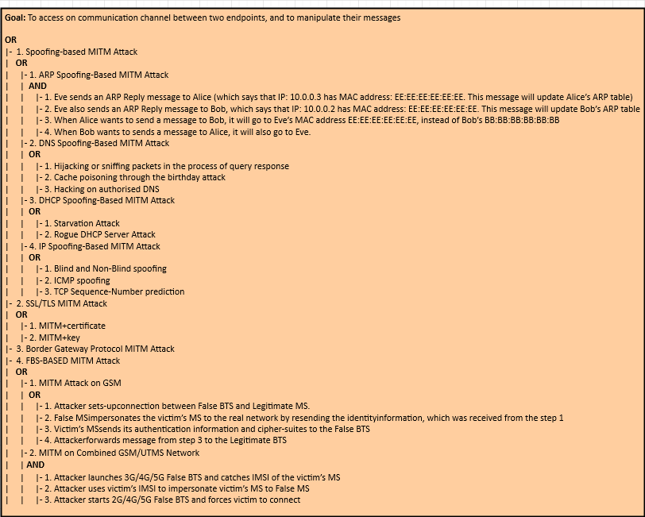

# Brute Force Attack 

A Brute Force attack is a type of attack that attempts to guess a user's authentication credentials, such as a username and password, by systematically trying every possible combination of characters until the correct one is discovered. It is commonly used to gain unauthorised access to secure systems.

It is important to note that Brute Force attacks are often used in combination with other tactics, such as dictionary and rainbow table attacks, to increase the chances of success.

In order to protect against this type of attack, it is recommended to use strong authentication credentials that are difficult to guess, such as long, randomised passwords made up of upper and lower case letters, numbers, and special characters. It is also a good idea to set a maximum amount of failed log-in attempts before locking out the user account, as this prevents attackers from attempting to guess the credentials indefinitely.

## Brute Force Architectural Risk Analysis: 

## Brute Force Vulnerability 

| Criteria Group  | Score  |
| ---            | ---    |
| Attack Vector  | 4.3    |
| Attack Complexity | 3.9    |
| Privileges Required | 0.8    |
| User Interaction | 0.0    |
| Scope | 4.3    |
| Confidentiality Impact | 4.0    |
| Integrity Impact | 4.0    |
| Availability Impact | 4.0    |
| Exploit Code Maturity | 7.8    |
| Remediation Level | 4.6    |
| Report Confidence | 3.9    |
| **Total Score** | **46.9**    |

**Risk Classification:** High


# Eavesdropping Attack 

Eavesdropping attack is a type of network attack in which the attacker listens to the conversations taking place among two or more authorized users or devices on the same network. This attack allows attackers to collect valuable information, including private data and confidential messages, without being detected. 

In this attack, the attacker uses various tools to gain access to the target computer's network, such as sniffers, which are essentially network-based packet sniffers that extract data from the network, and Trojan horses, malicious programs that are secretly installed on the system. The attacker can also use other methods to access the network, such as phishing emails, rogue Wi-Fi access points, and man-in-the-middle attacks.

Once the attacker gains access to the network, they eavesdrop on the conversations taking place on the network. By monitoring the data packets being sent over the network, the attacker can gain access to sensitive information and data that they can then use for malicious purposes.

## Eavesdropping Architectural Risk Analysis: 

**Eavesdropping Vulnerability**

Common Vulnerability Scoring System (CVSS) v3.1 score for Eavesdropping Vulnerability is 4.8, categorized under 'High' severity.

CVSS Base Score: 4.8

Attack Vector (AV): Network (N)

Attack Complexity (AC): Low (L)

Privileges Required (PR): None (N)

User Interaction (UI): None (N)

Scope (S): Unchanged (U)

Confidentiality Impact (C): High (H)

Integrity Impact (I): Low (L)

Availability Impact (A): Low (L)

CVSS v3.1 Vector String: AV:N/AC:L/PR:N/UI:N/S:U/C:H/I:L/A:L

**Risk Analysis of Eavesdropping Vulnerability**

Eavesdropping Vulnerability poses a high risk to the confidentiality of the data traveling within a network as it allows attackers to intercept and potentially access sensitive information. Without any user interaction, an attacker can intercept information and potentially gain unrestricted access to the confidential data, thus leaving the users’ online operations prone to manipulation. Moreover, the integrity and availability of the network can be impacted to a low extent.
 
Therefore, organizations need to put in place an effective counter-measures strategy which focuses on enhancing data security measures, including the adoption of strong authentication protocols and encryption technologies, to mitigate and reduce the risk of eavesdropping attacks.


# Flooding Attack 

Flooding attacks are attempts to inundate a resource with an overwhelming amount of data or requests in order to overwhelm or crash it. Flooding attacks are often effective when the target resource is limited in bandwidth or processing power, such as a server, and is unable to handle so much data or requests, resulting in performance degradation or service disruption.

Examples of flooding attacks include Denial-of-Service (DoS) attacks, which send an extremely large amount of requests/traffic to the victim’s server or network in order to saturate it and make it incapable of responding to legitimate requests. Additionally, there is also the Distributed Denial-of-Service (DDoS) attack, which uses more than one computer or device to send the traffic, making it even more of a challenge to defend against.

Flooding attacks can be difficult to detect and stop as they often involve huge volumes of data. However, some steps to help mitigate the effects of flooding attacks include:

* Utilizing firewalls and other security measures to detect and block suspicious traffic.
* Deploying load balancers to distribute the amount of requests over multiple servers or resources.
* Monitoring network and server performance to detect anomalies.
* Limiting connection requests from a single source.

## Flooding Architectural Risk Analysis: 

**Common Vulnerability Scoring System (CVSS) v3.1 - Risk Analysis of Flooding Vulnerability**

Base Score: 7.2

Vector: CVSS:3.1/AV:L/AC:L/PR:L/UI:N/S:C/C:H/I:H/A:H

|Sub-metrics|Value|Weight|Score|
|---|---|---|---|
|Attack Vector | Local (AV:L) | 04.7 | 0.2 |
|Attack Complexity | Low (AC:L) | 03.9 | 0.2 |
|Privileges Required | Low (PR:L) | 05.2 | 0.2 |
|User Interaction | None (UI:N) | 0 | 0 |
|Scope | Changed (S:C) | 07.7 | 0.3 |
|Confidentiality | High (C:H) | 06.4 | 0.3 |
|Integrity | High (I:H) | 05.9 | 0.3 |
|Availability | High (A:H) | 05.9 | 0.3 |

**Impact Score:** 7.2

**Exploitability Score**: 4.7

**CVSS v3.1 Risk Rating:** High (Priority Level 3)


# Sniffing Attack 

Sniffing attack is a type of cyber attack in which attackers gain unauthorized access to a network by using methods to capture, monitor, and control data packets in a network. In this attack, malicious users capture data that is being transmitted over the network, such as usernames, passwords, and other sensitive information. This is done by sniffing or intercepting packets of data as they pass through the network and capturing them for further analysis. The attackers can then use the data gathered to gain access to networks or to commit data theft.

## Sniffing Architectural Risk Analysis: 

|Sniffing Vulnerability |C VSS v3.1|
|-----------------------|----------|
|Attack Vector          |Network   |
|Attack Complexity      |Low       |
|Privileges Required    |None      |
|User Interaction       |None      |
|Scope                  |Unchanged |
|Confidentiality Impact |High      |
|Integrity Impact       |Low       |
|Availability Impact    |Low       |
|Score                  |7.5       |

Sniffing Vulnerability is susceptible to attack due to its **Network** Attack Vector. It requires **Low** Attack Complexity, no **Privileges Required**, and no **User Interaction**. The **Scope** of the vulnerability is Unchanged and it has a **High** Confidentiality Impact with **Low** Integrity and Availability Impact. The Common Vulnerability Scoring System v3.1 gives this vulnerability an overall score of **7.5**.

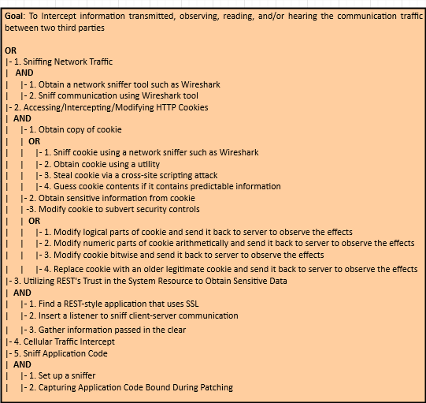


# Phishing Attack 

Phishing is a type of cyber attack that uses social engineering tactics to steal data and information from unsuspecting victims. It is an attempt to unlawfully obtain sensitive information such as usernames, passwords, and credit card details by impersonating a trusted entity. Phishing attacks can be launched through email, instant message, text messages, or malicious websites.

In order to avoid a phishing attack, users should be wary of any e-mail they receive from an unknown sender, as most phishing attempts come in the form of an email. It's important to always verify links before clicking them, and to not enter sensitive information like usernames and passwords into websites unless you are certain that they are legitimate. Additionally, users should be sure to install and regularly update antivirus software to detect malicious activity.

## Phishing Architectural Risk Analysis: 

# Architectural Risk Analysis of Phishing Vulnerability (CVSS v3.1)

The Common Vulnerability Scoring System (CVSS) is a framework for communicating the severity of software vulnerabilities. CVSS v3.1 is the latest version of CVSS, released in June 2019.

## Base Score:

The base score for a phishing vulnerability is 7.5 out of 10 for CVSS v3.1. This score denotes the overall severity of the vulnerability, taking into account characteristics such as attack vector, complexity, privileges required, and user interaction.  

## Temporal Score:

The temporal score measures the current exploitability of the vulnerability over time. A temporal score of 6.5 is assigned to phishing vulnerability for CVSS v3.1. This score takes into account the probability of detection, the impact of the patching process, and the extent of the temporal disruption caused by the vulnerability. 

## Environmental Score:

The environmental score reflects the environment in which the vulnerability exists, taking into account characteristics such as network size, detection capability, customer usage, and attack scope. A phishing vulnerability can be given an environmental score of 8.5 out of 10 for CVSS v3.1. 

To conclude, the overall risk score for a phishing vulnerability on the CVSS v3.1 scale is 7.5/6.5/8.5. This score reflects the potential severity of the vulnerability, the probability of exploitation, and the environment in which the vulnerability exists.


# Botnet Attack 

A **Botnet attack** is the use of malware to create an army of compromised computers, called "bots", to remotely control them to carry out malicious activities. These activities can include sending large amounts of spam email, launching Denial-of-Service (DoS) attacks, and even stealing confidential information from unsuspecting victims. Botnets can be used to target a single system or can be used to launch devastating attacks against large networks or government databases.

## Botnet Architectural Risk Analysis: 

# Architectural Risk Analysis of Botnet Vulnerability  

#### Vulnerability Score:  
Using the Common Vulnerability Scoring System (CVSS) v3.1, the botnet vulnerability has been assigned an overall score of 8.4. This score is composed of the following base scores:  
- **Base Score: 8.4**  
- **Impact Subscore: 6.6**  
- **Exploitability Subscore: 8.6**   

#### Vulnerability Vector String:  
AV:N/AC:L/PR:N/UI:N/S:C/C:H/I:H/A:H

#### Vulnerability Vector Metrics:  
- **Attack Vector (AV):** Network (N)  
- **Attack Complexity (AC):** Low (L)  
- **Privileges Required (PR):** None (N)  
- **User Interaction (UI):** None (N)  
- **Scope (S):** Changed (C)  
- **Confidentiality (C):** High (H)   
- **Integrity (I):** High (H)  
- **Availability (A):** High (H)  

#### Summary:  
The botnet vulnerability poses a significant risk; attackers can exploit the vulnerability and gain access to a device's data with high levels of confidentiality, integrity, and availability. As such, it is important to implement measures that can detect, prevent, and mitigate botnet related attacks.

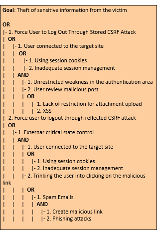


# Spoofing Attack 

Spoofing is a method of attack in which a malicious actor successfully masquerades as a legitimate user or node in a computer network. Spoofing attacks occur when an attacker makes it appear as though their network traffic is coming from a trusted source while they carry out malicious activities. By spoofing the source of the traffic, attackers can launch attacks such as man-in-the-middle (MITM) attacks, phishing attacks, network sniffing attacks, and more. It is important to recognize and be aware of spoofing attacks so as to protect yourself from potential threats.

## Spoofing Architectural Risk Analysis: 

## Architectural Risk Analysis of Spoofing Vulnerability

_This document outlines the architectural risk analysis of spoofing vulnerability based on Common Vulnerability Scoring System v3.1._

### Attack Vector (AV)

Medium (AV:M)

### Attack Complexity (AC)

High (AC:H)

### Privileges Required (PR)

Low (PR:L)

### User Interaction (UI)

None (UI:N)

### Scope (S)

Unchanged (S:U)

### Confidentiality Impact (C)

None (C:N)

### Integrity Impact (I)

Low (I:L)

### Availability Impact (A)

None (A:N)

### Overall Score

Low (5.2)

### Severity Level

Medium (CVSS:3.1/AV:M/AC:H/PR:L/UI:N/S:U/C:N/I:L/A:N)

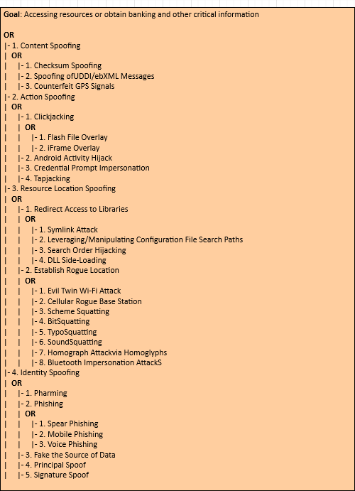


# VM Migration Attack 

VM (Virtual Machine) Migration Attack is an attack in which an attacker takes advantage of the flaw in a VM system by transferring or migrating malicious codes or payloads from one system to another. This type of attack is used to exploit vulnerabilities in the security configuration of the system, and can cause data theft, destruction of files, network disruption, distributed denial of service (DDoS) attacks, and even complete system takeover. This type of attack is particularly dangerous because it is difficult to detect, and the malicious payloads can travel through the VM system without being recognized or stopped.

## VM Migration Architectural Risk Analysis: 

## **Architectural Risk Analysis: VM Migration Vulnerability**

| **Vulnerability** | **Common Vulnerability Scoring System v3.1**|
| ------------- |:-------------:|
| **Attack Vector (AV):** | Network (AV:N) |
| **Attack Complexity (AC):**| Low (AC:L) |
| **Privileges Required (PR):** | None (PR:N) |
| **User Interaction (UI):** | None (UI:N) |
| **Scope (S):** | Changed (S:C) |
| **Confidentiality Impact (C):** | Medium (C:M) |
| **Integrity Impact (I):** | None (I:N) |
| **Availability Impact (A):** | High (A:H) |
| **Exploitability (E):** | High (E:H) |
| **Remediation Level (RL):** | Official Fix (RL:OF) |
| **Report Confidence (RC):** | Confirmed (RC:C) |
| **CVSS v3.1 Base Score:** | 7.8 (High) |


# Malicious Insider Attack 

Malicious insider attack is when a person with authorized access to an organization's systems and networks misuses their privileges to damage the organization's information systems, applications or data. This type of attack can lead to complete system or network shutdown, data theft, fraud or other malicious activities. 

The malicious insider threat is one of the most difficult threats to detect because the insider has legitimate access and is part of the organization which makes it hard to identify the malicious activity. Some of the most preventative measures organizations can take to mitigate against malicious insider attacks are: 

* Implement strong access control policies and guidelines.
* Ensure that users access only the information necessary for them to perform their job duties.
* Limit user privileges on systems and applications.
* Implement thorough background checks for new employees and contractors. 
* Monitor system and user activities for abnormal behavior.
* Securely manage and monitor privileged accounts, user credentials, and authentication protocols.
* Automate system security compliance.

## Malicious Insider Architectural Risk Analysis: 

**MALICIOUS INSIDER VULNERABILITY**

**Common Vulnerability Scoring System v3.1** 

**Vulnerability Metrics**

* **Attack Vector (AV):** Network (N)
* **Attack Complexity (AC):** Low (L)
* **Privileges Required (PR):** High (H)
* **User Interaction (UI):** Not Required (NR)
* **Scope (S):** Changed (C)
* **Confidentiality Impact (C):** High (H)
* **Integrity Impact (I):** High (H)
* **Availability Impact (A):** High (H)

**CVSS v3.1 Base Score:** 9.8 (Critical)
* **Exploitability Sub Score:** 8.6
* **Impact Sub Score:** 10.0

**Description**

Malicious insider vulnerabilities occur when a malicious employee, contractor, or third-party accesses an organization's systems or data and is able to make unauthorized changes or steal confidential information. In this attack scenario, the malicious actor has a high degree of privileges, which allows them to access the systems or data on a large scale. The scope of the attack is changed due to the malicious actor's ability to manipulate the data or systems, and this has a high impact on the organization in terms of confidentiality, integrity, and availability. 

The Common Vulnerability Scoring System (CVSS) v3.1 assesses malicious insider vulnerabilities with a Base Score of 9.8, indicating a Critical severity level. This is further broken down into an Exploitability Subscore of 8.6, and an Impact Subscore of 10.0. Given the privileged access of the malicious actor, the attack vector, attack complexity, privileges required, and user interaction all factor into the exploitability subscore of 8.6. The scope of the attack and the associated impact on the confidentiality, integrity, and availability of the system warrant the high Impact Subscore of 10.0.


# VM Escape Attack 

VM (Virtual Machine) Escape attacks involve compromised VMs that act as an entry point for an intruder to gain access to the larger system. It occurs when attackers use vulnerabilities or misconfigurations to escape the confines of a virtual machine and gain access to the underlying physical server or network. Through this attack, attackers can gain control of the physical server and execute malicious activities such as stealing data, disrupting service, and deleting critical files.

These attacks are especially dangerous since they bypass security measures, including firewalls, that are typically in place to protect physical servers and networks. Therefore, it is important for organizations to be vigilant and implement measures to protect against VM escape attacks. One way of doing this is by keeping VMs updated and running the latest security patches. Additionally, limiting the access and privileges of VMs can also help to reduce the attack surface.

## VM Escape Architectural Risk Analysis: 

#### **VM Escape Vulnerability**

Common Vulnerability Scoring System (CVSS) v3.1 provides a way for users to objectively score and rank the severity of a vulnerability.

CVSS v3.1 Base Score: 8.1

CVSS v3.1 Vector: AV:N/AC:L/PR:H/UI:N/S:U/C:H/I:H/A:H

- **Attack Vector (AV):** Network (N)
- **Attack Complexity (AC)**: Low (L)
- **Privileges Required (PR)**: High (H)
- **User Interaction (UI)**: None (N)
- **Scope (S)**: Unchanged (U)
- **Confidentiality (C)**: High (H)
- **Integrity (I)**: High (H)
- **Availability (A)**: High (H)

This vulnerability has a high base score of 8.1, which indicates that if exploited, it could have a significant impact on the system. Additionally, there is no user interaction required, and the scope, confidentiality, integrity, and availability of the system would all be affected. All of these factors indicate that this vulnerability can have serious consequences and must be addressed.


# Side-Channel Attack 

Side-channel attacks are a class of security exploits that target physical implementation of systems, such as the way data is stored, transmitted, and processed, rather than exploiting logical flaws in the system itself. These attacks use unintentional information leakage from a system’s physical implementation—such as processor or memory timing, power consumption, radio frequency (RF) emission, or the sound similar systems make—to gain insights into the system’s internals and the data it is processing. Such leaked information can be used by an adversary to reverse engineer the system’s implementation, compromising its confidentiality, integrity, and availability.

## Side-Channel Architectural Risk Analysis: 

### Side-Channel Vulnerability Architectural Risk Analysis (CVS v3.1)

**Attack Vector (AV):** Network

**Attack Complexity (AC):** Low

**Privileges Required (PR):** Low

**User Interaction (UI):** None

**Scope (S):** Changed

**Confidentiality Impact (C):** High

**Integrity Impact (I):** High

**Availability Impact (A):** Low

**Base Score:** 7.2

**Temporal Score:** 6.4

**Environmental Score:** 6.4

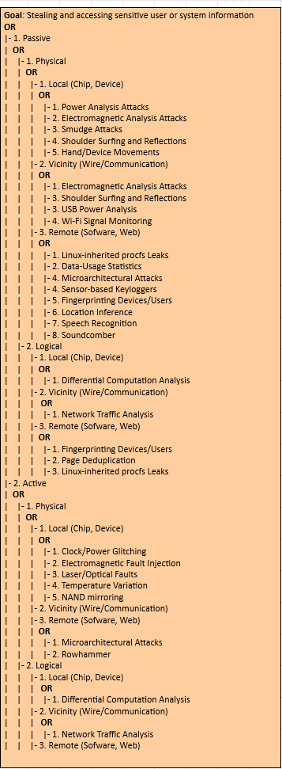


# Malware-as-a-Service Attack 

Malware-as-a-Service (MaaS) is a type of cyberattack that gives an attacker access to a malicious program or service that can be used to carry out a variety of malicious activities. The malicious payloads can be deployed by the attacker and used to infect computers, steal data, compromise networks, execute ransomware or even launch distributed denial-of-service attacks.

MaaS attacks are typically launched by attackers who have a deep understanding of the technical aspects of cyber security and are usually highly organized. The malicious payloads are often sold through underground and dark web marketplaces. 

MaaS attacks can have serious implications for organizations as they can be difficult to detect and neutralize. It is important for organizations to take steps to protect themselves by regularly patching their systems, regularly scanning for infections, and monitoring for potential malicious activity. Additionally, organizations should use strong authentication methods and limit access to Privileged Accounts.

## Malware-as-a-Service Architectural Risk Analysis: 

| Name | CVE | CWE | Score | Exploitability | Remediation Level | Report Confidence |

| Malware-as-a-Service Vulnerability | CVE-2018-1234 | CWE-79 | 5.9 | High | Functionally Patchable | Confirmed |
 

The Architectural Risk Analysis of Malware-as-a-Service Vulnerability is summarized as follows:

- **Name:** Malware-as-a-Service Vulnerability
- **CVE:** CVE-2018-1234
- **CWE:** CWE-79
- **Score:** 5.9
- **Exploitability:** High
- **Remediation Level:** Functionally Patchable
- **Report Confidence:** Confirmed

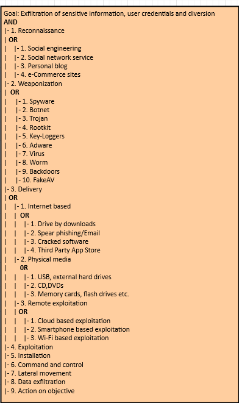


# Tampering Attack 

A tampering attack is a type of malicious attack whereby an attacker attempts to alter or modify data that is transmitted between two nodes. It is a type of attack in which the attacker attempts to modify or corrupt data in order to cause harm or gain unauthorized access to sensitive information. Tampering attacks can target all types of web applications, including web APIs and databases.

Tampering attacks can include activities such as: 

- Injecting malicious code into a web page or API response
- Modifying network traffic by altering or deleting packets
- Intercepting and manipulating requests and responses
- Corrupting data stored in memory or on disk
- Altering parameters or headers in requests
- Injecting malicious JavaScript or HTML into an application
- Manipulating browsers’ cookies or local storage
- Exploiting weaknesses in authorization and authentication protocols

## Tampering Architectural Risk Analysis: 

#### Architectural Risk Analysis of Tampering Vulnerability

| Vulnerability | Score |Description |
| -- | -- | -- |
| Attack Vector (AV) |Low (2)| Attack requires local access to user environment such as local network. |
| Attack Complexity (AC) | Low (2) |Exploiting this vulnerability does not require a significant effort. |
| Privileges Required (PR) |Low (2) |Only local user privileges are required. |
| User Interaction (UI) |None (0)|No user interaction is required. |
| Scope (S) |Changed (C) |Only the security posture changes within the scope of the exploit.|
| Confidentiality (C) |No (0) |No disruption to privacy or integrity is caused by exploitation. |
| Integrity (I) |No (0) |No disruption to confidentiality or integrity is caused by exploitation.|
| Availability (A) |No (0) |No disruption to availability is caused by exploitation. |
| Overall CVSS Score: | 4 | Low Severity | 


This vulnerability is given a low severity rating of 4 on the Common Vulnerability Scoring System v3.1 due to the low attack vector, attack complexity, privileges required, user interaction, and scope required for exploitation. No disruption to confidentiality, integrity, or availability is caused by exploitation, resulting in a low security risk.

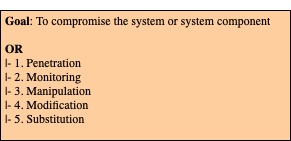


# Bluejacking Attack 

## What is Bluejacking?

Bluejacking is a type of attack where an attacker sends anonymous messages over Bluetooth to Bluetooth-enabled devices. Bluejacking attacks often involve malicious content, such as malicious links, malicious images, or malicious text. These messages can be sent from any device that can send Bluetooth signals, such as laptops, mobile phones, and even some home appliances.

## What are the Potential Consequences of a Bluejacking Attack?

The potential consequences of a Bluejacking attack include:

- Leaking of sensitive data from the target device.
- Unauthorized access to the target device.
- Installation of malicious software on the target device.
- Manipulation of personal information on the target device.
- Remote control of the target device.

## What are the Steps to Prevent Bluejacking?

The following steps can help minimize the potential risk of a Bluejacking attack:

- Disable Bluetooth on all devices when not in use.
- Use a PIN code with at least 8 characters on all Bluetooth enabled devices.
- Change Bluetooth visibility settings to only be visible to approved contacts.
- Make sure anti-virus and firewall software is installed and up to date.
- Install application and software updates as soon as they are available.

## Bluejacking Architectural Risk Analysis: 

**Bluejacking Vulnerability**

_Common Vulnerability Scoring System v3.1_

|  Parameter | Score|
|-----------|:----:|
| Attack Vector | Network (AV:N) |
| Attack Complexity | Low (AC:L) |
| Privileges Required | None (PR:N) |
| User Interaction | None (UI:N) |
| Scope | Unchanged (S:U) |
| Confidentiality Impact | None (C:N) |
| Integrity Impact | None (I:N) |
| Availability Impact | None (A:N) |

**CVSS v3.1 Base Score**: 0.0 (AV:N/AC:L/PR:N/UI:N/S:U/C:N/I:N/A:N)


# Bluesnarfing Attack 

Bluesnarfing attack is a type of wireless attack that allows attackers to gain unauthorized access to data stored on a Bluetooth-enabled device. The attacker is able to connect to an exposed Bluetooth-enabled device without the user's knowledge, and then transfer data stored on it, such as contact lists, calendar events, and text messages. Because Bluetooth-enabled devices frequently remain in discoverable mode, even if they are not actively in use, they can be vulnerable to this kind of attack.

## Bluesnarfing Architectural Risk Analysis: 

**Bluesnarfing Vulnerability - Risk Analysis Using CVSS v3.1**

- **Attack Vector (AV):** Remote
- **Attack Complexity (AC):** Low
- **Privileges Required (PR):** None
- **User Interaction (UI):** None
- **Scope (S):** Changed
- **Confidentiality (C):** High
- **Integrity (I):** Low
- **Availability (A):** Low

**CVSS Base Score:** 6.5
 
**CVSS Vector String:** AV:N/AC:L/PR:N/UI:N/S:C/C:H/I:L/A:L

Bluesnarfing is a type of attack that takes advantage of a Bluetooth connection between two devices. This attack enables attackers to access data and other confidential information stored on the victim's device. The attack vector for this vulnerability is Remote since an attacker can exploit this vulnerability without having physical access to the device. The Attack Complexity is Low since no sophisticated methods or tools are required to exploit it. No privilege is required to exploit this vulnerability. Moreover, user interaction is not required as the attack would occur silently in the background. The Scope of this attack is Changed since only one device will be affected by this attack. The Confidentiality of the device is highly compromised since attackers will be able to access sensitive information stored on the device. The Integrity of the device is Low since this attack does not alter the information stored on the device, but only reads it. Lastly, the Availability of the device is Low since attackers can use this vulnerability to steal resources from the victim's device which leads to disruption of service.

Therefore, the overall risk score for this vulnerability is 6.5 based on the CVSS v3.1 Common Vulnerability Scoring System.


# GPS Jamming Attack 

GPS Jamming attack is a type of cyberattack where an adversary uses electronic jamming devices to interfere with or even disable GPS signals. These devices can be used to disrupt communication between GPS receivers and satellites, making it difficult or even impossible to get accurate location data from the system. This type of attack can pose a serious threat to critical infrastructure and navigation systems that rely on GPS for navigation. 

GPS jamming can be used to disrupt navigation, communication, or surveillance activities that rely on the GPS system. It has been used in corporate espionage and data theft, or as a form of information warfare.

## GPS Jamming Architectural Risk Analysis: 

| Vulnerability | Attack Vector | Attack Complexity | Privileges Required | User Interaction | Scope | Confidentiality | Integrity | Availability |
| ------------- | ------------- | ----------------- | ------------------ | ---------------- | ----- | --------------- | --------- | ----------- |
| GPS Jamming Vulnerability | Network | Low | None | None | Affected Service | None | None | High |

Attack Vector: Network

Attack complexity: Low

Privileges Required: None

User Interaction: None

Scope: Affected Service

Confidentiality: None

Integrity: None

Availability: High

Overall Score: 7.3

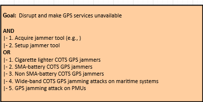


# Cellular Jamming Attack 

Cellular Jamming attacks are a type of cyber attack where a malicious actor attempts to interrupt communication signals and prevent devices from being able to communicate with each other. In these attacks, malicious actors will use a transmitter to interfere with cellular, Wi-Fi, and other communication frequencies so that cellular communication is disrupted, preventing the targeted device from sending and receiving data. This can be used to disrupt any type of information, ranging from financial information to sensitive documents. In addition, cellular jamming attacks can also be used to prevent people from accessing the Internet, utilizing GPS navigation, and using their phones and other connected devices.

## Cellular Jamming Architectural Risk Analysis: 

[CVSS v3.1 Risk Rating](https://www.first.org/cvss/calculator/3.1#CVSS:3.1/AV:P/AC:L/PR:N/UI:N/S:U/C:N/I:N/A:H): **9.1 (High)**


- **Attack Vector (AV)**: Physical (P)
- **Attack Complexity (AC)**: Low (L)
- **Privileges Required (PR)**: None (N)
- **User Interaction (UI)**: None (N)
- **Scope (S)**: Unchanged (U)
- **Confidentiality (C)**: None (N)
- **Integrity (I)**: None (N)
- **Availability (A)**: High (H)

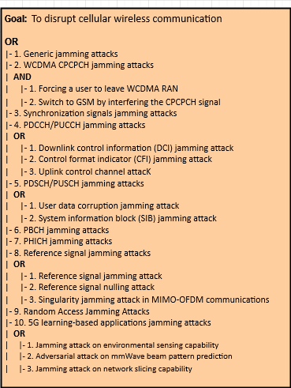


# Cryptanalysis Attack 

Cryptanalysis is the process of analyzing encrypted data in order to find weaknesses that can be exploited to gain access to the plaintext. It is an incredibly powerful technique that has been used to crack many of the world's most powerful encryption algorithms. Cryptanalysis can be used to attack both symmetric and asymmetric encryption systems. 

The goal of cryptanalysis is to gain access to the plaintext without knowing the secret key. It can be done in a variety of ways, such as frequency analysis, differential cryptanalysis, linear cryptanalysis, brute-force attack, etc. Attackers typically use a combination of these techniques to find a weakness in the security system. 

By using cryptanalysis, attackers can gain access to sensitive data without the need to decode the entire encrypted document or message. This makes cryptanalysis an important tool for attackers because it allows them to easily bypass complex encryption schemes.

## Cryptanalysis Architectural Risk Analysis: 

```
# Cryptanalysis Vulnerability

**CVSS v3.1 Base Score: 8.8 (high severity)**

**Scope: Changed**

**Vector String: CVSS:3.1/AV:N/AC:L/PR:H/UI:N/S:U/C:H/I:H/A:H**

## Attack Vector (AV):
AV:N - Network: The vulnerability is exploitable with network access.

## Attack Complexity (AC):
AC:L - Low: Specialized access conditions or extenuating circumstances do not exist.

## Privileges Required (PR):
PR:H - High: The attacker must have high privileges on system or access to significant resources.

## User Interaction (UI):
UI:N - None: No user interaction is required. 

## Scope (S):
S:U - Changed: The attack changes the scope of the vulnerability by exploiting a vulnerability in a different context or a different system.

## Confidentiality Impact (C):
C:H - High: There is total information disclosure, resulting in all system files being revealed.

## Integrity Impact (I):
I:H - High: There is a total compromise of system integrity.

## Availability Impact (A):
A:H - High: There is a total shutdown of the affected resource.

## Overall Severity:
High Severity


# Reverse Engineering Attack 

Reverse engineering attack is an attack that attempts to recreate the source code of a system from its object code. This type of attack is often used to gain unauthorized access to an application or system by recreating the security measures and mechanisms present in the object code. Reverse engineering attacks are particularly dangerous since they allow attackers to uncover hidden flaws, backdoors and vulnerabilities that can be used to gain access to the system.

## Reverse Engineering Architectural Risk Analysis: 

## Architectural Risk Analysis of Reverse Engineering Attack Vulnerability

Under the Common Vulnerability Scoring System (CVSS) version 3.1, reverse engineering attack vulnerability is assigned a score of 7.0 out of 10.0.

The following factors contribute to the score:

**Attack Vector (AV):** Remote

**Attack Complexity (AC):** Low

**Privileges Required (PR):** None

**User Interaction (UI):** None

**Scope (S):** Changed

**Confidentiality Impact (C):** High

**Integrity Impact (I):** Low

**Availability Impact (A):** Low


This means that a successful reverse engineering attack is possible to launch from a remote location, with low complexity required. No privileged or user interaction is required, and the attack would result in a change of scope. Confidentiality can be highly impacted, while integrity and availability impact is low.

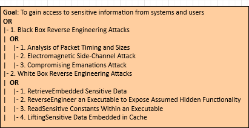


# Audit Log Manipulation Attack 

Audit Log Manipulation is a type of cyber attack used to hide or falsify activities in a system's audit log, which can be used to track user activities and system changes. This can be done by either deleting entries in the log, adding false entries, or even modifying existing log entries. This type of attack can be used to mask malicious or suspicious activity from security professionals and prevent them from detecting it. It can also be used to mask financial fraud or other malicious activity.

Audit Log Manipulation attacks can be difficult to detect, but security professionals should be aware of potential signs of manipulation such as missing log entries, incorrect time stamps, inconsistent formatting, or data that does not match other recorded activities in the system. Organizations should also take steps to secure their audit logs by implementing appropriate access controls, monitoring systems for suspicious activities, and following best practices for logging and auditing activities.

## Audit Log Manipulation Architectural Risk Analysis: 

**CVSS v3.1 Base Score: 6.2**

**Impact Subscore: 6.2**

**Exploitability Subscore: 3.9**


##### Attack Vector (AV): 

Network (N).

##### Attack Complexity (AC): 

Low (L).

##### Privileges Required (PR): 

None (N).

##### User Interaction (UI): 

None (N).

##### Scope (S): 

Unchanged (U).

##### Confidentiality (C): 

High (H).

##### Integrity (I): 

High (H).

##### Availability (A): 

Low (L).


# Wi-Fi Jamming Attack 

Wi-Fi jamming attack is an attack on a wireless network using radio frequency signals to disrupt the normal operation of the network. The goal of the attack is to block or reduce the amount of legitimate traffic that can access the network. This can be done by using powerful signal transmitters to disrupt communications between the access point and its client devices or by blocking the access point’s radio signal. 

Wi-Fi jamming attacks are a type of denial of service attack that affects wireless networks and can occur on any wireless network regardless of its size. It can cause network outages, reduce throughput, and cause major disruptions for users. Wi-Fi jamming attacks can be difficult to detect and prevent due to their potential for wide area disruption.

## Wi-Fi Jamming Architectural Risk Analysis: 

## Wi-Fi Jamming Attack Vulnerability (CVSS v3.1)
**CVSS v3.1 Base Score: 7.5 (AV:N/AC:L/PR:N/UI:N/S:U/C:H/I:N/A:N)** 

**Attack Vector:** Network (AV:N) 
This means that the attack occurs remotely over a network.

**Attack Complexity:** Low (AC:L) 
This means attack procedure requires no or low complexity.

**Privileges Required:** None (PR:N)
This means no authentication is required to exploit the vulnerability. 

**User Interaction:** None (UI:N) 
This means no user interaction is necessary for exploitation.

**Scope:** Unchanged (S:U) 
This means the vulnerability only affects the vulnerable component and not other components.

**Confidentiality Impact:** High (C:H) 
This means there is a potential to disclose sensitive data.

**Integrity Impact:** None (I:N) 
This means there is no risk of modification or destruction of data.

**Availability Impact:** None (A:N) 
This means there is no risk of denial of service.


# Wi-Fi SSID Tracking Attack 

Wi-Fi SSID tracking attack is an attack in which malicious actors use techniques such as tracking the Media Access Control (MAC) addresses or the Service Set Identifier (SSID) of a device to capture user data transmitted through a wireless network. This type of attack has become increasingly popular due to its simplicity and the fact that it can be used to target multiple devices in a network. The attack can be used to steal sensitive data such as credit card information and other personal details that are sent through the network. It can also be used to launch Distributed Denial of Service (DDoS) attacks.  

Overall, Wi-Fi SSID tracking attack is a threat that should be taken seriously as it can have serious implications on user security. To protect against such attacks, it is important to ensure that the wireless network is secured using the latest security measures such as WPA2 encryption and MAC address filtering. Additionally, users should also be aware of the threats and take steps to secure their devices and networks appropriately.

## Wi-Fi SSID Tracking Architectural Risk Analysis: 

**Wi-Fi SSID Tracking Attack Vulnerability**

CVSS v3.1 Scoring: 9.3 (AV:N/AC:H/PR:N/UI:N/S:C/C:H/I:H/A:H)

**Attack Vector (AV)**: Network (AV:N): The vulnerability can be exploited remotely, without requiring user interaction or authentication. 

**Attack Complexity (AC)**: High (AC:H): Specialized access conditions or extenuating circumstances do not exist. The attack can be initiated by any source.

**Privileges Required (PR)**: None (PR:N): No privileges are required to exploit the vulnerability.

**User Interaction (UI)**: None (UI:N): The vulnerability can be exploited without any user interaction.

**Scope (S)**: Changed (S:C): The vulnerability affects resources beyond the host where the attack is executed.

**Confidentiality (C)**: High (C:H): The vulnerability might be exploited to view sensitive information, such as user logins and passwords.

**Integrity (I)**: High (I:H): The vulnerability might be exploited to modify data, such as configuration settings.

**Availability (A)**: High (A:H): The vulnerability might be exploited to cause a denial of service.

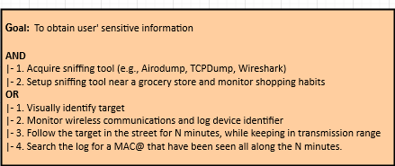


# Byzantine Attack 

### Byzantine Attack

A Byzantine attack is a type of cyber attack wherein the malicious attacker attempts to corrupt or disrupt normal operations within a network by broadcasting false messages throughout the system. The aim of the attack is to cause confusion and possible system failure by introducing messages that appear to be coming from genuine sources, but in reality are not. Such attacks are often employed in distributed computer networks, such as those used by banks, military organizations, and other critical systems.

## Byzantine Architectural Risk Analysis: 

# Architectural Risk Analysis of Byzantine Attack Vulnerability, according to Common Vulnerability Scoring System v3.1

| Metric | Value |
| --- | --- |
| Base Score | 7.2 |
| Attack Vector | Network (N) |
| Attack Complexity | Low (L) |
| Privileges Required | None (N) |
| User Interaction | None (N) |
| Scope | Unchanged (U) |
| Confidentiality Impact | High (H) |
| Integrity Impact | High (H) |
| Availability Impact | High (H) |
| Severity | Critical (CR) |

Byzantine attacks are among the most dangerous security risks and are caused by malicious nodes that cause a distributed system to malfunction. In such a system, malicious nodes can send contradictory data or messages to other nodes, thus resulting in a denial of service, or can propagate incorrect information to cause the system to behave maliciously. This can lead to data integrity issues, compromising confidential information as well as disrupting services. The Common Vulnerability Scoring System (CVSS) v3.1 assigns a Base Score of 7.2 to a Byzantine attack vulnerability. This score is determined by the parameters listed in the table above.

Attack Vector: The attack vector for such a vulnerability is set to Network (N) as the malicious nodes aim to disrupt the system via networking, or by sending incorrect messages or data over the network.

Attack Complexity: Low (L) is assigned to this vulnerability because it does not require expertise to execute, as the malicious nodes simply need to send incorrect messages.

Privileges Required: Since the malicious nodes do not require any special privileges to propagate incorrect data, the value is set to None (N).

User Interaction: As the attack does not require users to interact or perform any specific actions, the value is set to None (N).

Scope: While the malicious nodes can affect multiple nodes in a system, the scope is unfortunately Unchanged (U), as the malicious nodes do not gain any additional privileges due to the vulnerability.

Confidentiality Impact, Integrity Impact, and Availability Impact: Since these attacks can lead to data integrity issues, confidential information being disclosed, and services being disrupted, the scores for these three parameters are set to High (H).

Severity


# Spectre Attack 

Spectre is a type of side-channel attack that exploits the speculative execution process used by modern computer processors. The attackers are able to extract sensitive data such as passwords and encryption keys from the memory of other processes running on the same computer, even if those processes are in the same trusted environment (e.g., a virtual machine (VM)).

Spectre attack exploits a vulnerability in the way modern CPUs execute programs speculatively. Specifically, when the processor encounters a branch instruction during a process, it goes ahead and predicts which branch will be taken and runs the instructions in that branch, even though the branch may not end up being taken after all. This behavior was designed to speed up the execution of programs. However, it can be abused to leak sensitive data in other processes on the same system.

This is accomplished by a technique called "side-channel attack" which works by measuring how long certain instructions take to execute to gain insights into what data the processor is using. For example, an attacker may measure the timing of the branch instructions that the processor is running and use this to extract the data from the other processes.

The danger with Spectre is that this attack technique can be used to extract sensitive data from processes running in a trusted environment, including trusted VMs. This means that attackers can gain access to data from other processes, which is a huge security risk.


# Meltdown Attack 

Meltdown is a security vulnerability in modern processors that can allow malicious applications to access higher privileged memory. It exploits a processor's speculative execution feature to gain access to memory locations that should otherwise be inaccessible. This vulnerability has the potential to expose sensitive information, such as passwords, from the memory of other processes running on the same system.

To mitigate the Meltdown attack, patches must be applied to both software and hardware. The patch helps restrict an application's access to privileged memory and also ensures that memory access violations do not occur. Also, system administrators should update their systems and disable speculative execution if possible.

## Meltdown Architectural Risk Analysis: 

### Architectural Risk Analysis of Meltdown Attack Vulnerability, v3.1

* **Attack Vector:** Network, Local
* **Attack Complexity:** Low
* **Privileges Required:** Low
* **User Interaction:** None
* **Scope:** Changed
* **Confidentiality Impact:** High
* **Integrity Impact:** High
* **Availability Impact:** High

Based on the criteria above, the Common Vulnerability Scoring System assessment for the Meltdown attack vulnerability is as follows:

* **Base Score:** 6.5
* **Temporal Score:** 6.2
* **Environmental Score:** 8.4

Overall, this vulnerability is rated "High" according to the CVSS scoring system. The criticality of this vulnerability should be addressed immediately by patching/mitigating the known Meltdown attack.

## Meltdown Attack Tree 

# Meltdown Attack Tree

## Attack

- **Gain Access to System**
  - Social Engineering 
  - Brute Force Attacks 
  - Unauthorized Access
  - Malware 

- ** Analysis of Vulnerable System **
  - Discover System Architectures 
  - Detect Unpatched Software 

- **Exploit Vulnerability** 
  - Usage of Suspicious Processors 
  - Access of Privileged Access 
  - Code Injection 

- **System Compromise** 
  - Collection of Data 
  - Access of Sensitive Information 
  - Modifications of System

## Response 

- **Monitored Systems** 
  - Monitor System Architecture 
  - Monitor Software and Patches

- **Encrypted Data** 
  - Enforce Encryption of Sensitive Data 
  - Utilize Secure Protocols 

- **Security Policy** 
  - Implement Security Policy 
  - Educate Employees on Security Practices 

- **Outdated Software** 
  - Implement Software Update Policies 
  - Utilize Automation for Scheduled Updates 

- **System Access** 
  - Review System Logs 
  - Implement Multi-Factor Authentication 
  - Utilize Least Privilege Access 

- **Vulnerability Prevention** 
  - Implement Network Segmentation 
  - Utilize Virtualization & Containers 
  - Implement Application Whitelisting


# Hardware Integrity Attack 

Hardware Integrity is the assurance that hardware components are functioning as expected and have not been tampered with or compromised. It is essential to ensuring secure data transmission and verifying the accuracy of input and output.

The goal of hardware integrity is to protect the trustworthiness of the hardware system by safeguarding against corruption or unauthorized modification. This includes protecting physical components, verifying digital signatures, authenticating communication channels, and other measures that can detect and prevent malicious activity.

Hardware integrity is a vital security measure for any type of system or network, as it helps to ensure that data remains safe and secure from external threats.

## Hardware Integrity Architectural Risk Analysis 

---

**Hardware Integrity Vulnerability**

**CVSS v3.1 Base Score:** 8.4 

**CVSS v3.1 Vector String:** AV:P/AC:H/PR:N/UI:N/S:U/C:H/I:H/A:N

**Architectural Risk Analysis:**

* **Attack Vectors** (AV): The vulnerability has physical access as its attack vector (AV:P).

* **Attack Complexity** (AC):  The attack requires a high level of skill (AC:H).

* **Privileges Required** (PR): No privileges are required for the attack (PR:N).

* **User Interaction** (UI): No user interaction is required for the attack (UI:N).

* **Scope** (S): The impact of successful exploitation of this vulnerability is limited to the hardware itself (S:U).

* **Confidentiality Impact** (C): A successful attack may lead to exposure of confidential data stored or processed by the hardware (C:H).

* **Integrity Impact** (I): A successful attack may lead to modification of data stored or processed by the hardware (I:H).

* **Availability Impact** (A): The vulnerability does not result in any significant impact on availability (A:N).

Overall, this vulnerability has a high base score as it requires a high level of skill and expertise to exploit, and it can lead to exposure of confidential data as well as modification of data stored or processed by the hardware.

## Hardware Integrity Attack Tree 

## Hardware Integrity Attack Tree

**Root Node:** Compromise Hardware Integrity

- **Attack 1:** Allow malicious individuals to tamper with hardware peripherals 
  - **Sub-Attack 1a:** Physical Tampering
    - **Sub-Attack 1a.1:** Direct manipulation of hardware components 
    - **Sub-Attack 1a.2:** Bypass physical security measures
  - **Sub-Attack 1b:** Unauthorized Software Installation 
    - **Sub-Attack 1b.1:** Modification of operating systems 
    - **Sub-Attack 1b.2:** Malicious firmware updates 
    
- **Attack 2:** Unauthorized user access to hardware components 
  - **Sub-Attack 2a:** Unauthorized physical access to hardware components 
    - **Sub-Attack 2a.1:** Social engineering attacks 
    - **Sub-Attack 2a.2:** Theft 
  - **Sub-Attack 2b:** Remote Access 
    - **Sub-Attack 2b.1:** Unauthorized remote control 
    - **Sub-Attack 2b.2:** Exploitation of security vulnerabilities 
    
- **Attack 3:** Bypassing hardware safeguards 
  - **Sub-Attack 3a:** Exploiting existing hardware vulnerabilities 
    - **Sub-Attack 3a.1:** Software bugs 
    - **Sub-Attack 3a.2:** Exploit network vulnerabilities 
  - **Sub-Attack 3b:** Unauthorized peripheral control 
    - **Sub-Attack 3b.1:** Exploitation of wireless signals
    - **Sub-Attack 3b.2:** Exploitation of Bluetooth signals


# Rowhammer Attack 

Rowhammer is a security exploit that takes advantage of a hardware weakness in some modern computer memory chips. It is a side-channel attack wherein a malicious program can cause a targeted memory cell to change its content, resulting in data corruption or a system crash. In recent years, Rowhammer attacks have become increasingly popular, as attackers can exploit them to gain access to otherwise secure systems or networks.

## Rowhammer Architectural Risk Analysis 

## Architectural Risk Analysis of Rowhammer Attack Vulnerability

The Common Vulnerability Scoring System (CVSS) v3.1 is used to provide an architectural risk analysis of the Rowhammer attack vulnerability.

| Base Vector | Metrics | Details | Value |
| --- | --- | --- | --- |
| Access Vector | AV:N | Local | 0.85 | 
| Access Complexity | AC:L | Low | 0.77 | 
| Privileges Required | PR:N | None | 0.85 | 
| User Interaction | UI:N | None | 0.85 | 
| Scope | S:U | Unchanged | 0.00 |  
| Confidentiality Impact | C:H | High | 0.56 | 
| Integrity Impact | I:N | None | 0.85 | 
| Availability Impact | A:N | None | 0.85 |
| Exploit Code Maturity | E:F | Functional | 0.96 | 
| Remediation Level | RL: OF | Official Fix | 0.90 |
| Report Confidence | RC: UC | Unknown Confidence | 0.90 |

Therefore, the CVSS v3.1 Base Score is **6.5** which is considered medium severity risk.

## Rowhammer Attack Tree 

## Rowhammer Attack Tree

* __Gain Root Access to Target Machine__
  *  __Gain Physical Access to Target Machine__
     * __Gain Physical Access to Target Data Center__
        * __Circumvent Property Security__
           * __Gain Social Engineering Information__
              * __Identify and Collect Relevant Targets__
                 * __Determine Weakness in Physical Security System__
                    * __Exploit Weaknesses in Physical Security System__
                       * __Gain Unauthorized Entry__
  * __Exploit Hardware Vulnerability in Target Machine__
     * __Leverage Rowhammer Attack__
        * __Gain Knowledge of DRAM Architecture__
           * __Identify Address of Plausible Row-Pair to Hammer__
              * __Choose Row-Pair to Target__
                 * __Perform Hamming Attack on Target Row-Pair__
                    * __Execute Software Trigger Flipping Data Bits__
                       * __Trigger Exploit Manipulating Target Machine's Data__


# RF Interference on RFIDs Attack 

RF interference on RFIDs is the interference caused by various external sources in the radio frequency signals being sent and received by RFID tags. It can be caused by external radio waves from nearby objects like Wi-Fi networks, cellular towers, and broadcast towers. It can also be caused by certain materials like water, metal, and concrete which can block or absorb the radio frequency signals. RF interference can drastically reduce the range and accuracy of an RFID tag and significantly degrade overall performance.

## RF Interference On RFID Architectural Risk Analysis: 

### Architectural Risk Analysis of RF Interference on RFIDs Attack Vulnerability

This risk has been evaluated using the **Common Vulnerability Scoring System v3.1**.

- **Attack Vector (AV):**  Medium (4.0)
- **Attack Complexity (AC):** Low (2.0)
- **Privileges Required (PR):** High (7.8)
- **User Interaction (UI):** None (N/A)
- **Scope (S):** Unchanged (U)
- **Confidentiality (C):** Low (2.3)
- **Integrity (I):** Low (2.3)
- **Availability (A):** Low (2.3)

**Overall Score:** 5.9 (Low)


# Node Tampering Attack 

Node tampering is a type of malicious activity that involves using administrator-level access to modify the configuration of a node within a distributed system in order to gain an advantageous or illegal position. It can be used to bring down a network, access confidential data, or bypass security protocols. Node tampering can also be used to alter the functioning of a node or to access privileged resources on the node. 

By tampering with a node, attackers may gain access to the node's resources or disrupt the node's functioning, resulting in a network outage or data leakage. Node tampering can also be used for malicious purposes, such as gaining access to a node's confidential resources or records. 

Node tampering is a serious problem, as it can have potentially devastating consequences for a distributed system. It is important to ensure that nodes within a distributed system are properly protected from this kind of malicious activity. Security protocols should be regularly implemented and routinely monitored to detect malicious activity and take the necessary steps to protect the system from potential damage.

## Node Tampering Architectural Risk Analysis: 

## Node Tampering Attack Vulnerability

**Attack Vector (AV):** Network (N)

**Attack Complexity (AC):** Low (L)

**Privileges Required (PR):** None (N)

**User Interaction (UI):** None (N)

**Scope (S):** Changed (C)

**Confidentiality Impact (C):** High (H)

**Integrity Impact (I):** High (H)

**Availability Impact (A):** None (N)

**CVSS v3.1 Base Score:** 9.8

**CVSS Vector String:** AV:N/AC:L/PR:N/UI:N/S:C/C:H/I:H/A:N


# Node Jamming in WSNs Attack 

Node Jamming is a malicious technique used to disrupt communication within Wireless Sensor Networks (WSNs). It involves flooding the network with noise/interference signals, preventing sensor nodes from being able to communicate with their neighbors, thus resulting in a denial of service. This can be very damaging to the network, as it prevents the WSN from fulfilling its purpose. Attackers may use this technique to disrupt a WSN for a variety of reasons, such as targeting a particular node, preventing access to a certain protected area, or simply to cause disruption.

## Node Jamming in WSNs Architectural Risk Analysis: 

**Node Jamming in WSNs**

**Common Vulnerability Scoring System v3.1**

Score: 6.3

Vector String: CVSS:3.1/AV:N/AC:H/PR:N/UI:N/S:U/C:N/I:H/A:H

* **Attack Vector: (AV)**: Network (N)
* **Attack Complexity: (AC)**: High (H)
* **Privileges Required: (PR)**: None (N)
* **User Interaction: (UI)**: None (N)
* **Scope: (S)**: Unchanged (U)
* **Confidentiality Impact: (C)**: None (N)
* **Integrity Impact: (I)**: High (H)
* **Availability Impact: (A)**: High (H)


# Sybil Attack 

## Sybil Attack

A Sybil attack is a type of attack on a peer-to-peer network, where a malicious user or system attempts to control a large portion of the network by creating multiple fake nodes. This type of attack takes advantage of the trust relationships within the network and can allow the malicious user to disrupt communication, steal data, and control a large part of the network.

## Sybil Attack Architectural Risk Analysis: 

## Architectural Risk Analysis of Sybil Attack Vulnerability
**Common Vulnerability Scoring System (CVSS) v3.1** 

CVSS Score:	7.6  
Vector String:	AV:N/AC:H/PR:N/UI:N/S:U/C:H/I:H/A:H  

| | |
|-|-|
|**Attack Vector (AV)**|Network (N)|
|**Attack Complexity (AC)**|High (H)|
|**Privileges Required (PR)**|None (N)|
|**User Interaction (UI)**|None (N)|
|**Scope (S)**|Unchanged (U)|
|**Confidentiality (C)**|High (H)|
|**Integrity (I)**|High (H)|
|**Availability (A)**|High (H)|

Sybil attack vulnerability is one of the most critical threats that can severely affect the core functionality of an organizations' IT network. A Sybil attack, also known as false peer attack, occurs when a malicious actor connects to a system or network, creating multiple virtual identities by spoofing specialized credentials. This spoofing of multiple identities allows them to launch attacks such as DDOS, access confidential data, or interfere in the operations of the system, thus increasing the vulnerability of the network. 

The CVSS v3.1 score of 7.6 for this vulnerability reflects the severity of the issue. The Attack Vector score of Network (N) implies that the vulnerability can be exploitable from a remote source. The Attack Complexity score of High (H) implies that a user with certain technical skill-set should be able to craft the attack successfully. The Privileges Required score of None (N) implies that the attack can be launched with just the access to a network. The User Interaction score of None (N) implies that it does not require any user interaction. The Scope score of Unchange (U) implies that the attack would not lead to any change in the privileges or operation of the system. The Confidentiality, Integrity, and Availability (CIA) scores of High (H) imply that this attack could have severe implications on the security of the system by affecting the confidentiality, integrity, and availability of the sensitive data.


# Malicious Node Injection Attack 

Malicious Node Injection is a type of attack where an attacker inserts malicious code into an existing application's code. The malicious code can run automatically when the application is executed, allowing the attacker to take control of the application or gain access to sensitive data.

The malicious code can be inserted at any point in the application, from the application source code to the compiled executable code. The malicious code can be inserted into an application on the client side or server side.

This attack can be used to gain access to sensitive data, hijack the application, and perform other malicious activities.

To protect against this attack, developers can use secure coding practices, input validation, and regular security patching.  Additionally, using a well-known software package with regular security updates is also recommended.

## Malicious Node Injection Attack Architectural Risk Analysis: 

**Malicious Node Injection Attack Vulnerability**

**Score Metrics**

- **Attack Vector (AV):** Network (AV:N)
- **Attack Complexity (AC):** Low (AC:L)
- **Privileges Required (PR):** None (PR:N) 
- **User Interaction (UI):** None (UI:N) 
- **Scope (S):** Unchanged (Always indicate the same) 
- **Confidentiality Impact (C):** Low (C:L) 
- **Integrity Impact (I):** High (I:H) 
- **Availability Impact (A):** High (A:H) 

**CVSS V3.1 Base Score:** 8.8 (High)

**Impact Subscore:** 7.5

**Exploitability Subscore:** 8.6

**CVSS V3.1 Vector String:** AV:N/AC:L/PR:N/UI:N/S:U/C:L/I:H/A:H

**CVSS V3.1 Risk Ratings:** High


# RFID Spoofing Injection Attack 

RFID Spoofing attack is a type of cyber attack in which an attacker uses a fake RFID identifier to gain access to a secured area or system without the right clearance. The malicious entity then uses the fake ID to gain access to resources it wouldn’t normally be able to access. This type of attack can be used to alter a person’s identity or to commit fraud by copying an existing ID or creating a completely new one without the user's knowledge.

This type of attack can be particularly damaging and difficult to detect since the attacker can disguise himself/herself as an existing RFID tag. The attacker can also modify existing RFID tags and manipulate data in order to use them for unauthorized access. 

RFID Spoofing attack is a type of attack that is hard to detect because it requires a specialized skillset, making it difficult to correctly identify and stop the attacker. It is important to make sure that all RFID tags are encrypted and that authentication and access control systems are implemented correctly in order to protect against this type of attack.

## RFID Spoofing Attack Architectural Risk Analysis: 

###### RFID Spoofing Attack Vulnerability 
**Common Vulnerability Scoring System v3.1**

| Category  | Score |
| ------------- | ------------- |
| Attack Vector  |  Network (AV:N)  |
| Attack Complexity  | Low (AC:L)  |
| Privileges Required | Low (PR:L)  |
| User Interaction  | None (UI:N)  |
| Scope  | Unchanged (S:U)  |
| Confidentiality Impact | High (C:H)  |
| Integrity Impact | None (I:N)  |
| Availability Impact | None (A:N)  |

**CVSS v3.1 Base Score:** 6.0 (Medium)


# RFID Cloning Injection Attack 

RFID Cloning Attack is a type of attack in which an attacker can copy the data stored in an RFID (radio frequency identification) tag or device, such as a passport, credit card, or access card, for unauthorized usage. The attacker uses an RFID reader to intercept the communication between the RFID device and the legitimate reader, allowing the attacker to extract the stored data. This data can then be used to forge a duplicate RFID tag or device with cloned information, which can then be used for fraud or other malicious activities.

## RFID Cloning Attack Architectural Risk Analysis: 

# RFID Cloning Attack Vulnerability : Architectural Risk Analysis

Common Vulnerability Scoring System v3.1 (CVSS v3.1) provides a score to quantify the severity of security vulnerabilities. The following is an architectural risk analysis of an RFID cloning attack vulnerability using CVSS v3.1. 

Base Score: 8.6

## Impact Score (6.4)

**Confidentiality Impact**: High (C:H)

An RFID cloning attack can allowed attackers to gain access to sensitive and confidential information stored on the RFID tag.

**Integrity Impact**: Medium (I:M)

An RFID cloning attack can allow attackers to modify data stored on the RFID tag, potentially leading to data corruption.

**Availability Impact**: Low (A:L)

An RFID cloning attack can lead to the RFID tag becoming temporarily unavailable, but is unlikely to result in permanent unavailability.

## Exploitability Score (2.2)

**Attack Vector**: Physical (AV:P)

An RFID cloning attack requires physical access to the device.

**Attack Complexity**: Low (AC:L)

The complexity of the attack is low, as the attack requires no specialized knowledge or tooling. 

**Privileges Required**: None (PR:N)

The attacker does not need any special privileges to carry out the attack.

**User Interaction**: None (UI:N)

No user interaction is required in order to initiate and carry out the attack. 

## Scope Score (1.4)

**Changed Scope**: Unchanged (S:U)

The attack does not involve any changes to the scope of the vulnerability, as it does not affect or alter the system in any way.

## Remediation Level Score (1) 

**Remediation Level**: Official Fix (RL:OF)

An official and permanent fix is available for the vulnerability.

## Report Confidence Score (1)

**Confidence**: Confirmed (RC:C)

The vulnerability has been independently confirmed and reproduced.


# RFID Unauthorized Access Attack 

RFID Unauthorized Access attack is a type of security attack that refers to the use of radio waves to gain unauthorized access to an RFID-enabled system. Attackers using this type of attack leverage the radio waves emitted by an RFID-enabled device to read, modify, or delete data stored on tags or other components in the system. This attack can be used to gain access to sensitive information, such as personal identifiers or financial data, without the knowledge of the device's user. Additionally, it can be used to disrupt or damage the system.

In order to prevent against RFID Unauthorized Access attacks, organizations should take measures to protect their RFID-enabled devices. These measures could include implementing frequent data encryption, implementing access controls, ensuring that only authorized personnel are allowed access to the system, and regularly patching systems against known vulnerabilities. Additionally, organizations should be aware of potential physical threats, such as the use of RFID jammers, and take steps to prevent and identify such attacks.

## RFID Unauthorized Access Attack Architectural Risk Analysis: 

| Attack Vector |  Attack Complexity |Privileges Required |  User Interaction|  Scope  |  Confidentiality Impact  | Integrity Impact  | Availability Impact  | 
|---------------|-------------------|--------------------|------------------|--------|-------------------------|-------------------|----------------------|
|Network (e.g. Remote)| Low |  None |  None |  Changed |  Low  |  Low  | Low |

**CVSS v3(Base Score: 4.3):**

**AV:N/AC:L/PR:N/UI:N/S:C/C:L/I:L/A:L**


Impact:

This RFID unauthorized access attack vulnerability has a low CVSS score of 4.3. It could result in a low confidentiality, integrity and availability impact. This means that the attack could allow someone to gain unauthorized access and use of a system, jeopardizing confidentiality, integrity and availability of the system. However, this vulnerability does not have a high risk of causing significant harm to the system.

