# Final Attack Models Report  

|                           |                                                              |  
|  :--------                |  :---------                                                  |  
|  Mobile Platform          |  Android App                                                 |  
|  Application domain type  |  m-Health                                                    |  
|  Authentication           |  Yes                                                         |  
|  Authentication schemes   |  Biometric-based authentication ; Channel-based authentication ; ID-based authentication|  
|  Has DB                   |  Yes                                                         |  
|  Type of database         |  SQL (Relational Database)                                   |  
|  Which DB                 |  MySQL                                                       |  
|  Type of information handled|  Personal Information ; Confidential Data ; Critical Data    |  
|  Storage Location         |  Both                                                        |  
|  User Registration        |  Yes                                                         |  
|  Type of Registration     |  The users will register themselves                          |  
|  Programming Languages    |  Java                                                        |  
|  Input Forms              |  Yes                                                         |  
|  Upload Files             |  Yes                                                         |  
|  The system has logs      |  Yes                                                         |  
|  The system has regular updates|  Yes                                                         |  
|  The system has third-party|  Yes                                                         |  
|  System Cloud Environments|  Public Cloud                                                |  
|  Hardware Specification   |  Yes                                                         |  
|  HW Authentication        |  Basic Authentication (user/pass)                            |  
|  HW Wireless Tech         |  3G ; 4G/LTE ; 5G ; Bluetooth  ; Wi-Fi  ; GPS                |  
|  Device or Data Center Physical Access|  Yes                                                         |  


# Man-in-th-Middle Attack 

Man-in-the-Middle (MITM) attack is an attack where a threat actor interferes with the communication between two systems. The threat actor inserts itself between the two systems and has access to all the data being sent between them.

MITM attacks are used to steal or modify data in transit, such as banking credentials, passwords, and security tokens. Hackers carry out these attacks by spoofing IP addresses and using malicious code to gain access to unencrypted data. They can also use packet-sniffing software to eavesdrop on the connection.

MITM attacks can be done through network-level attacks or application-level attacks. Network-level MITM attacks involve the hacker taking control of the entire communications path between the two hosts. Application level MITM attacks involve the hacker hacking into one of the hosts and manipulating their traffic.

## Mitigation

1. **Use of HTTPS:** Always use HTTPS for all communications. HTTPS encrypts the data between the client and the server, making it difficult for a MitM attacker to read or modify the data.
2. **Certificate Pinning:** Implement certificate pinning in your mobile applications. This involves hard coding the server’s certificate or public key within the application. The app can then verify the server’s identity by comparing the server’s certificate with the pinned certificate.
3. **VPN:** Encourage users to use a Virtual Private Network (VPN) when connecting to your services, especially when they are using public Wi-Fi networks.
4. **Two-Factor Authentication (2FA):** Implement 2FA to add an extra layer of security. Even if an attacker manages to intercept the user’s credentials, they would still need the second factor to gain access.
5. **Regular Updates and Patches:** Keep your systems and software up-to-date. Regular updates and patches can fix known vulnerabilities that could be exploited by MitM attacks.
6. **User Awareness:** Educate users about the risks of MitM attacks and how to identify potential threats. This includes training on how to recognize phishing attempts, unsafe websites, and malicious email attachments.

## Man-in-th-Middle Architectural Risk Analysis

| **Factor**                                    | **Description**                                                                                                 | **Value**                                     |
|-----------------------------------------------|-----------------------------------------------------------------------------------------------------------------|-----------------------------------------------|
| Attack   Vector (AV):                         | Network   (Exploiting unencrypted communication)                                                                | Network   (N)                                 |
| Attack   Complexity (AC):                     | Medium   (Requires setting up a MitM attack)                                                                    | Medium   (M)                                  |
| Privileges   Required (PR):                   | None   (Attacker needs to intercept communication)                                                              | None   (N)                                    |
| User   Interaction (UI):                      | None   (User doesn't need to interact with the attack)                                                          | None   (N)                                    |
| Scope   (S):                                  | Varies   (Depends on intercepted data)                                                                          | Intercept   (I)                               |
| Confidentiality   Impact (C):                 | High   (attacker can steal confidential data)                                                                   | High   (H)                                    |
| Integrity   Impact (I):                       | High   (attacker can modify data in transit)                                                                    | High   (H)                                    |
| Availability   Impact (A):                    | Medium   (attacker can potentially disrupt communication)                                                       | Medium   (M)                                  |
| Base   Score (assuming High for all impacts): | 0.85   * (AV:N/AC:M/PR:N/UI:N) * (S:I/C:H/I:H/A:M)                                                              | 8.5   (High)                                  |
| Temporal   Score (TS):                        | Public   exploit tools available for MitM attacks?                                                              |         Depends on exploit availability       |
| Environmental   Score (ES):                   | Depends   on application's security practices (encryption), network security measures   (HTTPS), user awareness | Varies                                        |

**Overall, a Man-in-the-Middle attack poses a significant risk to mobile cloud-based applications that hold user confidential data. Implementing strong encryption (HTTPS) for communication and educating users about secure network practices can mitigate this risk.**

## MiTM Attack Tree Diagram

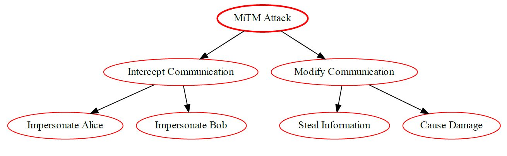

# Brute Force Attack 

A Brute Force attack is a type of attack that attempts to guess a user's authentication credentials, such as a username and password, by systematically trying every possible combination of characters until the correct one is discovered. It is commonly used to gain unauthorised access to secure systems.

It is important to note that Brute Force attacks are often used in combination with other tactics, such as dictionary and rainbow table attacks, to increase the chances of success.


## Mitigation

1. **Strong Password Policies**: Enforce the use of strong passwords. Passwords should be long, complex, and unique.

2. **Account Lockout Policies**: After a certain number of failed login attempts, the account should be temporarily locked out.

3. **Two-Factor Authentication (2FA)**: Implementing 2FA can significantly reduce the risk of successful brute force attacks.

4. **Captcha**: Use a CAPTCHA system to prevent automated scripts from performing brute force attacks.

5. **Delay Between Login Attempts**: Introduce a delay between login attempts. This slows down an attacker and makes brute force attacks less feasible.

6. **Blacklist/Whitelist IP Addresses**: Blacklist IP addresses that are clearly engaging in malicious activities, and whitelist known good IP addresses.

7. **Use a Web Application Firewall (WAF)**: A WAF can help detect and block brute force attacks.

8. **Limit Login Attempts**: Limit the number of login attempts from a single IP address within a certain time period.

9. **Monitor and Log Failed Logins**: Keep an eye on failed login attempts and set up alerts for suspicious activities.

10. **Use of AI and Machine Learning**: These technologies can learn and adapt to new threats and unusual login patterns, offering another layer of security.

Remember, these are general strategies and may need to be adapted based on the specific use case and environment. It's also important to note that security is a multi-layered approach where one method's weakness is covered by the strength of another. Therefore, a combination of these strategies will provide more robust protection against brute force attacks.

## Brute Force Risk Analysis

| **Factor**                  | **Description**                                                                                                              | **Value**                                                 |
|-----------------------------|------------------------------------------------------------------------------------------------------------------------------|-----------------------------------------------------------|
| Vulnerability               | Weak authentication mechanisms (e.g., short passwords, lack of multi-factor authentication) in the mobile app or cloud login | -                                                         |
| Attack Vector (AV):         | Network (Exploiting login functionality)                                                                                     | Network (N)                                               |
| Attack Complexity (AC):     | Low (Automated tools can be used for brute-forcing)                                                                          | Low (L)                                                   |
| Privileges Required (PR):   | None (Attack doesn't require any privileges on the application or cloud)                                                     | None (N)                                                  |
| User Interaction (UI):      | None (Attack can be automated)                                                                                               | None (N)                                                  |
| Scope (S):                  | Account Compromise (AC) (Attacker gains unauthorized access to user accounts)                                                | Data Breach (DB) (if attacker accesses confidential data) |
| Confidentiality Impact (C): | High (Attacker might access confidential user data)                                                                          | High (H)                                                  |
| Integrity Impact (I):       | High (Attacker might modify user data)                                                                                       | High (H)                                                  |
| Availability Impact (A):    | Medium (Denial-of-Service attacks with many login attempts can impact availability)                                          | Medium (M)                                                |
|Base Score (assuming successful exploitation) | 0.85 * (AV:N/AC:L/PR:N/UI:N) * (S:AC/C:H/I:H/A:M) * 0.06 | 0.3 (Low)
|Temporal Score (TS) | Depends on the processing power available to the attacker and effectiveness of rate limiting | Varies |
|Environmental Score (ES) | Depends on the strength of password policies (length, complexity), account lockout after failed attempts, and multi-factor authentication (MFA) | Varies |
|Overall CVSS Score | Base Score + TS + ES | Varies (Depends on TS, ES, and effectiveness of countermeasures) | Low to Medium |
Risk Rating: | Low to Medium (Depends on TS, ES, and attacker capabilities) | Low to Medium |

## Brute Force Attack Tree Diagram

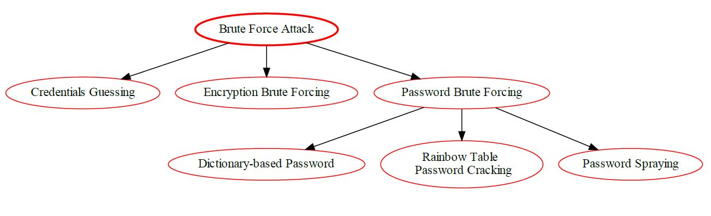

# Eavesdropping Attack 

Eavesdropping attack is a type of network attack in which the attacker listens to the conversations taking place among two or more authorized users or devices on the same network. This attack allows attackers to collect valuable information, including private data and confidential messages, without being detected. 

In this attack, the attacker uses various tools to gain access to the target computer's network, such as sniffers, which are essentially network-based packet sniffers that extract data from the network, and Trojan horses, malicious programs that are secretly installed on the system. The attacker can also use other methods to access the network, such as phishing emails, rogue Wi-Fi access points, and man-in-the-middle attacks.

Once the attacker gains access to the network, they eavesdrop on the conversations taking place on the network. By monitoring the data packets being sent over the network, the attacker can gain access to sensitive information and data that they can then use for malicious purposes.

## Mitigation

1. **Use Secure Communication Protocols:** Always use secure communication protocols such as HTTPS (Hypertext Transfer Protocol Secure) for data in transit. This ensures that the data is encrypted and cannot be easily intercepted by eavesdroppers.
2. **Data Encryption:** Encrypt sensitive data at rest and in transit. Use strong encryption algorithms and manage encryption keys securely;
3. **Secure Wi-Fi Networks:** Encourage users to only use secure and trusted Wi-Fi networks. Public Wi-Fi networks can be a hotbed for eavesdropping attacks;
4. **VPN:** Use a Virtual Private Network (VPN) for a more secure connection. A VPN can provide a secure tunnel for all data being sent and received;
5. **Regularly Update and Patch:** Ensure that the cloud and mobile applications are regularly updated and patched. This helps to fix any known vulnerabilities that could be exploited by attackers;
5. **Access Controls:** Implement strict access controls. Only authorized users should have access to sensitive data;
6. **Security Headers:** Implement security headers like HTTP Strict Transport Security (HSTS), Content Security Policy (CSP), etc. These headers add an extra layer of protection against eavesdropping attacks;
7. **Security Testing:** Regularly conduct security testing such as penetration testing and vulnerability assessments to identify and fix any security loopholes;
8. **User Awareness:** Educate users about the risks of eavesdropping attacks and how they can protect themselves. This includes not opening suspicious emails or clicking on unknown links, and only downloading apps from trusted sources;
9. **Incident Response Plan:** Have an incident response plan in place. This will ensure that you are prepared to respond effectively in case an eavesdropping attack does occur.

## Eavesdropping Architectural Risk Analysis: 

Common Vulnerability Scoring System (CVSS) v3.1 score for Eavesdropping Vulnerability is 4.8, categorized under 'High' severity.

| **Factor**                                    | **Description**                                                          | **Value**                                                       |
|-----------------------------------------------|--------------------------------------------------------------------------|-----------------------------------------------------------------|
| Attack   Vector (AV):                         | Network                                                                  | Network   (N)                                                   |
| Attack   Complexity (AC):                     | Low                                                                      | Low   (L)                                                       |
| Privileges   Required (PR):                   | None                                                                     | None   (N)                                                      |
| User   Interaction (UI):                      | None                                                                     | None   (N)                                                      |
| Scope   (S):                                  | Confidentiality   Impact (attacker can intercept communication)          |         Confidentiality (C)                                     |
| Confidentiality   Impact (C):                 | High   (if unencrypted data is transmitted)                              | High   (H)                                                      |
| Confidentiality   Impact (C):                 | Low   (if data is strongly encrypted in transit)                         | Low   (L)                                                       |
| Integrity   Impact (I):                       | Low   (unless eavesdropping allows data manipulation)                    | Low   (L)                                                       |
| Availability   Impact (A):                    | None                                                                     | None   (N)                                                      |
| Base   Score (assuming High Confidentiality): | High   (if unencrypted data is transmitted)                              |         3.5 (Medium) or 1.0 (Low) depending on Encryption       |
| Temporal   Score (TS):                        | Not   applicable                                                         | N/A                                                             |
| Environmental   Score (ES):                   | Depends   on network security measures, data sensitivity, user awareness | Varies                                                          |
| Overall   CVSS Score                          | Base   Score + TS + ES                                                   |         High (H)                                                |
| Risk   Rating                                 | Based   on Overall CVSS Score                                            |         High (H)                                                |


Eavesdropping Vulnerability poses a high risk to the confidentiality of the data traveling within a network as it allows attackers to intercept and potentially access sensitive information. Without any user interaction, an attacker can intercept information and potentially gain unrestricted access to the confidential data, thus leaving the users’ online operations prone to manipulation. Moreover, the integrity and availability of the network can be impacted to a low extent.
 
Therefore, organizations need to put in place an effective counter-measures strategy which focuses on enhancing data security measures, including the adoption of strong authentication protocols and encryption technologies, to mitigate and reduce the risk of eavesdropping attacks.

## Eavesdropping Attack Tree Diagram

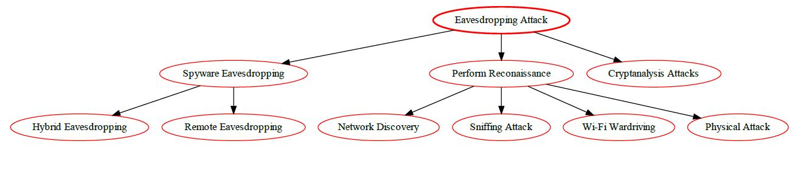

# Flooding Attack 

Flooding attacks are attempts to inundate a resource with an overwhelming amount of data or requests in order to overwhelm or crash it. Flooding attacks are often effective when the target resource is limited in bandwidth or processing power, such as a server, and is unable to handle so much data or requests, resulting in performance degradation or service disruption.

Examples of flooding attacks include Denial-of-Service (DoS) attacks, which send an extremely large amount of requests/traffic to the victim’s server or network in order to saturate it and make it incapable of responding to legitimate requests. Additionally, there is also the Distributed Denial-of-Service (DDoS) attack, which uses more than one computer or device to send the traffic, making it even more of a challenge to defend against.

## Mitigation

Flooding attacks can be difficult to detect and stop as they often involve huge volumes of data. However, some steps to help mitigate the effects of flooding attacks include:

1. Rate Limiting: Implement rate limiting on your servers to prevent any single IP address from sending too many requests in a short period of time;
2. Traffic Shaping: Use traffic shaping techniques to control the amount and speed of traffic sent or received on a network.
3. Intrusion Detection Systems (IDS): Use IDS to monitor network traffic for suspicious activity and known threats;
4. Firewalls: Use firewalls to block unwanted traffic and prevent flooding attacks;
5. Load Balancing: Distribute network traffic across multiple servers to ensure no single server is overwhelmed with too much traffic;
6. DDoS Protection Services: Consider using a DDoS protection service that can detect and block flooding attacks;
7. Redundancy: Design your system to be redundant so that if one part of the system becomes overwhelmed with traffic, the system as a whole can still function;
8. Regular Monitoring and Logging: Regularly monitor and log traffic to identify patterns and detect potential flooding attacks;
9. Incident Response Plan: Have an incident response plan in place to quickly and effectively handle flooding attacks when they occur;
10. User Awareness and Training: Educate users about the risks of flooding attacks and how to report suspicious activity.

## Flooding Architectural Risk Analysis 

| **Factor**                    | **Description**                                                                                                 | **Value**                                         |
|-------------------------------|-----------------------------------------------------------------------------------------------------------------|---------------------------------------------------|
| Attack   Vector (AV):         | Network   (Exploiting application logic)                                                                        | Network   (N)                                     |
| Attack   Complexity (AC):     | Low   (Requires crafting malicious requests)                                                                    | Low   (L)                                         |
| Privileges   Required (PR):   | None                                                                                                            | None   (N)                                        |
| User   Interaction (UI):      | None   (after initial attack setup)                                                                             | None   (N)                                        |
| Scope   (S):                  | Denial   of Service (attacker disrupts application functionality for legitimate users)                          |         Denial of service (DoS)                   |
| Confidentiality   Impact (C): | Low                                                                                                            | None   (N)                                        |
| Integrity   Impact (I):       | Low   (unless flooding crashes the app and corrupts data)                                                       | Low   (L)                                         |
| Availability   Impact (A):    | High   (attacker can disrupt app functionality for legitimate users)                                            | High   (H)                                        |
| Base   Score:                 | 0.85   * (AV:N/AC:L/PR:N/UI:N) * (S:DoS/C:N/I:L/A:H)                                                            | 9.9   (Critical)                                    |
| Overall   CVSS Score          | Base   Score + TS + ES                                                                                          |         Varies (Depends on TS & ES)               |
| Risk   Rating                 | Based   on Overall CVSS Score                                                                                   |         High to Critical (Depends on TS & ES)       |

**CVSS v3.1 Risk Rating:** Critical (Official Fix)

## Flooding Attack Tree Diagram

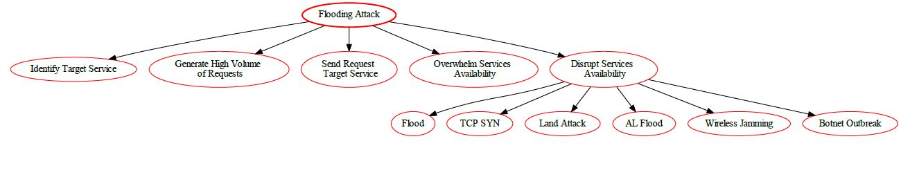

# Sniffing Attack 

Sniffing attack is a type of cyber attack in which attackers gain unauthorized access to a network by using methods to capture, monitor, and control data packets in a network. In this attack, malicious users capture data that is being transmitted over the network, such as usernames, passwords, and other sensitive information. This is done by sniffing or intercepting packets of data as they pass through the network and capturing them for further analysis. The attackers can then use the data gathered to gain access to networks or to commit data theft.

## Mitigation

1. **Encryption**: Use encryption for all data in transit. Protocols such as HTTPS, SSL, and TLS can provide secure communication channels and prevent sniffing;

2. **Virtual Private Networks (VPNs)**: Use VPNs for secure communication over the internet. VPNs create an encrypted tunnel for data transmission, which is difficult for sniffers to penetrate;

3. **Secure Wi-Fi**: Use secure Wi-Fi protocols such as WPA2 or WPA3. Avoid using WEP as it is outdated and vulnerable to sniffing attacks;

4. **Firewalls**: Implement firewalls to block unauthorized access to your network. Firewalls can also be used to block ports that are commonly used for sniffing;

5. **Intrusion Detection Systems (IDS)**: Use IDS to detect unusual network traffic patterns. IDS can help in identifying potential sniffing attacks;

6. **Regular Software Updates**: Keep all software, including operating systems and applications, up to date. This helps to patch any known vulnerabilities that could be exploited by attackers;

7. **User Education**: Educate users about the risks of connecting to unsecured networks where sniffing attacks are more likely to occur;

8. **Secure Cloud Configurations**: Ensure that your cloud configurations are secure and that all data is encrypted during transmission;

9. **IoT Security Measures**: Implement IoT-specific security measures such as device authentication, secure booting, and hardware-based security solutions.

Remember, security is a continuous process and it's important to stay updated with the latest threats and mitigation strategies.


## Sniffing Architectural Risk Analysis: 

| **Factor**                                                      | **Description**                                                                                                 | **Value**                            |
|-----------------------------------------------------------------|-----------------------------------------------------------------------------------------------------------------|--------------------------------------|
| Attack   Vector (AV):                                           | Network   (Exploiting weaknesses in network security)                                                           | Network   (N)                        |
| Attack   Complexity (AC):                                       | Low   (Relatively simple tools can be used to sniff unencrypted traffic)                                        | Low   (L)                            |
| Privileges   Required (PR):                                     | Varies   (Physical proximity for some networks, but could be remote for misconfigured   cloud environments)     |         None (N) to Low (L)          |
| User   Interaction (UI):                                        | None   (Attack might not require user interaction)                                                              | None   (N)                           |
| Scope   (S):                                                    | Varies   (Depends on the data being sniffed)                                                                    |         Confidentiality (C)          |
| Confidentiality   Impact (C):                                   | High   (Sniffed data might contain confidential information like login credentials)                             | High   (H)                           |
| Integrity   Impact (I):                                         | High   (Intercepted data could be modified during sniffing)                                                     | High   (H)                           |
| Availability   Impact (A):                                      | Low   (Doesn't affect overall system functionality)                                                             | Low   (L)                            |
| Base   Score (assuming High for Confidentiality and Integrity): | 0.85   * (AV:N/AC:L/PR:N/UI:N) * (S:C/C:H/I:H/A:L)                                                              | 8.5   (High)                         |
| Temporal   Score (TS):                                          | Not   Applicable (N/A)                                                                                          | N/A                                  |
| Environmental   Score (ES):                                     | Depends   on security measures across Mobile App, Cloud, and IoT (encryption protocols,   network segmentation) | Varies                               |
| Overall   CVSS Score                                            | Base   Score + TS + ES                                                                                          |         Varies (Depends on ES)       |
| Risk   Rating                                                   | High   to Critical (Depends on ES)                                                                              | High   to Critical                   |

**Overall, sniffing vulnerabilities pose a high to critical risk in a mobile-cloud-IoT ecosystem. Encrypting communication channels across all components and implementing network security best practices are essential to reduce the risk of data breaches and unauthorized data access.**

## Sniffing Attack Tree Diagram


# Phishing Attack 

Phishing is a type of cyber attack that uses social engineering tactics to steal data and information from unsuspecting victims. It is an attempt to unlawfully obtain sensitive information such as usernames, passwords, and credit card details by impersonating a trusted entity. Phishing attacks can be launched through email, instant message, text messages, or malicious websites.

## Mitigation

1. **Education and Awareness**: Conduct regular training and awareness programs to educate users about phishing attacks and how to identify them;

2. **Email Filters**: Use email filters to scan for phishing emails and block them;

3. **Firewalls**: Deploy firewalls to block malicious IP addresses and protect the network from phishing attacks;

4. **Anti-Phishing Toolbars**: Use anti-phishing toolbars that can run quick checks on the sites that you are visiting and compare them to lists of known phishing sites;

5. **Regular Updates**: Keep all systems and software updated with the latest security patches;

6. **Two-Factor Authentication (2FA)**: Implement two-factor authentication to add an extra layer of security;

7. **Regular Backups**: Regularly backup data to reduce the impact in case a phishing attack leads to data loss.

Please note that the effectiveness of these strategies may vary depending on the specific circumstances and the capabilities of the attacker. It's always a good idea to consult with a cybersecurity expert when dealing with these types of threats.

## Phishing Architectural Risk Analysis: 

The Common Vulnerability Scoring System (CVSS) is a framework for communicating the severity of software vulnerabilities. CVSS v3.1 is the latest version of CVSS, released in June 2019.
| **Factor**                                                      | **Description**                                                                                                                   | **Value**                             |
|-----------------------------------------------------------------|-----------------------------------------------------------------------------------------------------------------------------------|---------------------------------------|
| Attack   Vector (AV):                                           | Social   (Exploits user trust to reveal credentials)                                                                              | Social   (S)                          |
| Attack   Complexity (AC):                                       | Low   (Crafting phishing messages can be relatively easy)                                                                         | Low   (L)                             |
| Privileges   Required (PR):                                     | None   (User reveals credentials)                                                                                                 | None   (N)                            |
| User   Interaction (UI):                                        | Required   (User clicks the link or enters credentials)                                                                           | Required   (R)                        |
| Scope   (S):                                                    | Account   Compromise (attacker gains access to user's account)                                                                    |         Unauthorized Access (U)       |
| Confidentiality   Impact (C):                                   | High   (attacker can steal confidential data)                                                                                     | High   (H)                            |
| Integrity   Impact (I):                                         | High   (attacker can tamper with data within the account)                                                                         | High   (H)                            |
| Availability   Impact (A):                                      | Low   (Doesn't affect application functionality)                                                                                  | Low   (L)                             |
| Base   Score (assuming High for Confidentiality and Integrity): | 0.85   * (AV:S/AC:L/PR:N/UI:R) * (S:U/C:H/I:H/A:L)                                                                                | 8.5   (High)                          |
| Temporal   Score (TS):                                          | Not   Applicable (N/A)                                                                                                            | N/A                                   |
| Environmental   Score (ES):                                     | Depends   on user awareness training, application security measures (e.g., multi-factor   authentication), anti-phishing features | Varies                                |
| Overall   CVSS Score                                            | Base   Score + TS + ES                                                                                                            |         Varies (Depends on ES)        |
| Risk   Rating                                                   | High   to Critical (Depends on ES)                                                                                                | High   to Critical                    |

**Overall, Phishing poses a high to critical risk for mobile cloud-based applications that hold user's confidential data. Implementing a layered approach with user education, application security measures (like MFA), and potential anti-phishing features can significantly reduce the risk.**

## Phishing Attack Tree Diagram

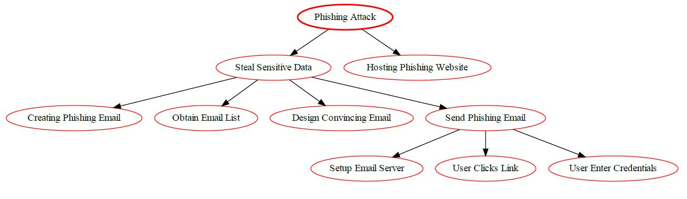


# Pharming Attacks

A pharming attack is a form of cyberattack that redirects victims to fake websites, often without their knowledge. Let’s explore the details:

## Overview

* **Objective**: Trick users into visiting malicious websites that resemble legitimate ones.
* **Method**: Exploits the Domain Name System (DNS) to redirect users to spoofed sites.
* **Impact**: Can lead to data theft, credential harvesting, and financial fraud.

## How Pharming Works
1. **Malware-Based Pharming**:
* Users unknowingly acquire malware (e.g., Trojan horse or virus) via malicious emails or software downloads.
* The malware modifies locally hosted files and changes stored IP addresses.
* Victims are automatically redirected to the attacker’s fraudulent website when accessing the legitimate site.
2. DNS Server Poisoning:
* Corrupts DNS servers to direct website requests to alternate or fake IP addresses.
* Exploits vulnerabilities at the DNS server level.
* Users visit spoofed sites, believing they are legitimate.

## Consequences

1. Communication Disruption:
* Interrupts access to legitimate websites.
* Impacts online services, including banking and e-commerce.
1. Data Theft and Credential Harvesting:
* Attackers collect personal data, login credentials, and financial information.
* Victims unwittingly provide sensitive details on fake sites.

## Mitigation Strategies

1. **Secure DNS Practices**: Use DNSSEC (Domain Name System Security Extensions) to ensure that the DNS responses are not tampered with. This can prevent attackers from redirecting users to malicious sites.

2. **SSL Certificates**: Use SSL (Secure Sockets Layer) certificates for websites. This ensures that the connection between the user's browser and the server is encrypted and secure.

3. **Regular Software Updates**: Keep all software, including operating systems and applications, up to date. This helps to patch any known vulnerabilities that could be exploited by attackers.

4. **Firewalls and Intrusion Detection Systems (IDS)**: Use firewalls and IDS to monitor and control incoming and outgoing network traffic based on predetermined security rules.

5. **User Education**: Educate users about the risks of clicking on suspicious links and the importance of checking the URL in the address bar before entering any sensitive information.

6. **Two-Factor Authentication (2FA)**: Implement 2FA to add an extra layer of security. This requires users to provide two different authentication factors to verify themselves.

7. **Regular Audits and Penetration Testing**: Regularly conduct security audits and penetration testing to identify and fix any security vulnerabilities.

8. **Use of Secure Mobile Applications**: Encourage users to only download apps from trusted sources like official app stores, and to regularly update them.

Remember, security is a continuous process and it's important to stay updated with the latest threats and mitigation strategies.

## Architectural Risk Analysis of Pharming Vulnerability

The pharming attack targets users by redirecting them to fraudulent websites, often without their knowledge. Let’s assess the risk using the Common Vulnerability Scoring System (CVSS) v3.1:

### CVSS Metrics

| **Factor**                                                      | **Description**                                                                                                                  | **Value**                             |
|-----------------------------------------------------------------|----------------------------------------------------------------------------------------------------------------------------------|---------------------------------------|
| Attack   Vector (AV):                                           | Social   (Exploits user trust and redirects to a phishing site)                                                                  | Social   (S)                          |
| Attack   Complexity (AC):                                       | Low   (Pharming websites can be relatively easy to set up)                                                                       | Low   (L)                             |
| Privileges   Required (PR):                                     | None   (User clicks the malicious link)                                                                                          | None   (N)                            |
| User   Interaction (UI):                                        | Required   (User clicks the malicious link)                                                                                      | Required   (R)                        |
| Scope   (S):                                                    | Account   Compromise (attacker gains access to user's account)                                                                   |         Unauthorized Access (U)       |
| Confidentiality   Impact (C):                                   | High   (attacker can steal confidential data)                                                                                    | High   (H)                            |
| Integrity   Impact (I):                                         | High   (attacker can tamper with data on the fake site)                                                                          | High   (H)                            |
| Availability   Impact (A):                                      | Low   (Doesn't affect application functionality)                                                                                 | Low   (L)                             |
| Base   Score (assuming High for Confidentiality and Integrity): | 0.85   * (AV:S/AC:L/PR:N/UI:R) * (S:U/C:H/I:H/A:L)                                                                               | 8.5   (High)                          |
| Temporal   Score (TS):                                          | Not   Applicable (N/A)                                                                                                           | N/A                                   |
| Environmental   Score (ES):                                     | Depends   on user awareness training, application security measures (e.g., SSL   certificate validation), anti-phishing features | Varies                                |
| Overall   CVSS Score                                            | Base   Score + TS + ES                                                                                                           |         Varies (Depends on ES)        |
| Risk   Rating                                                   | High   to Critical (Depends on ES)                                                                                               | High   to Critical                    |

Overall, Pharming poses a high to critical risk for mobile cloud-based applications that hold user's confidential data. Implementing a layered approach with user education, application security measures, and potential anti-phishing features can significantly reduce the risk.

*Remember, vigilance and proactive measures are essential to protect against pharming attacks.*
 
## Pharming Attack Tree Diagram

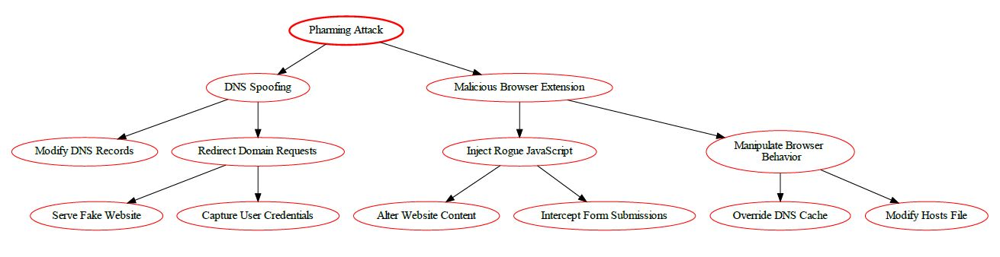


# Botnet Attack 

A **Botnet attack** is the use of malware to create an army of compromised computers, called "bots", to remotely control them to carry out malicious activities. These activities can include sending large amounts of spam email, launching Denial-of-Service (DoS) attacks, and even stealing confidential information from unsuspecting victims. Botnets can be used to target a single system or can be used to launch devastating attacks against large networks or government databases.

## Mitigation

1. **Intrusion Detection Systems (IDS) and Intrusion Prevention Systems (IPS)**: These systems can detect unusual network patterns or system activities. An IPS can also block malicious activities.

2. **Firewalls**: Use firewalls to block unauthorized access to your network. Firewalls can be particularly effective against botnets because they block unauthorized incoming and outgoing traffic.

3. **Antivirus Software**: Keep your antivirus software up to date. Antivirus software can often detect and remove botnet malware.

4. **Regular Patching and Updates**: Regularly update and patch all systems. Botnets often exploit vulnerabilities that have already been patched.

5. **Network Segmentation**: By segmenting the network, you can prevent botnets from spreading to other parts of the network.

6. **User Awareness and Training**: Users should be made aware of the threats posed by botnets. They should be trained to avoid suspicious emails, links, and websites.

7. **Traffic Filtering**: Use traffic filtering to block known malicious IP addresses and to prevent the command and control servers from communicating with the bots.

8. **Use of Threat Intelligence**: Threat intelligence can provide information about the latest threats and can be used to protect against them.

9. **Device Hardening**: Default configurations of devices can often be insecure. Therefore, devices should be hardened to make them more secure.

10. **Regular Audits**: Regular audits can help detect the presence of a botnet and can also ensure that the above measures are being properly implemented.

Remember, these are general strategies and may need to be adapted based on the specific use case and environment. It's also important to note that security is a multi-layered approach where one method's weakness is covered by the strength of another. Therefore, a combination of these strategies will provide more robust protection against botnet attacks.

## Botnet Risk Analysis: 

| **Factor**                  | **Description**                                                                                        | **Value**                                                                   |
|-----------------------------|--------------------------------------------------------------------------------------------------------|-----------------------------------------------------------------------------|
| Vulnerability               | Not Applicable (Botnet is malware, not a vulnerability in the application)                             | -                                                                           |
| Attack Vector (AV):         | Varies (Social engineering, Malicious App Downloads, Phishing)                                         | Varies (Phishing: N, Downloaded Malware: L)                                 |
| Attack Complexity (AC):     | Varies (Depends on user interaction and malware sophistication)                                        | Varies (L to M)                                                             |
| Privileges Required (PR):   | Varies (Depends on the malware's capabilities)                                                         | Varies (L to H)                                                             |
| User Interaction (UI):      | Likely (Social engineering or tricking users into downloading malware)                                 | Likely (L)                                                                  |
| Scope (S):                  | Device Compromise (DC) (Attacker gains control of the infected device)                                 | Data Breach (DB) (if malware steals confidential data from the application) |
| Confidentiality Impact (C): | High (Attacker might steal confidential user data stored on the device or accessed by the application) | High (H)                                                                    |
| Integrity Impact (I):       | High (Attacker might tamper with data on the device or application)                                    | High (H)                                                                    |
| Availability Impact (A):    | High (Device compromise can impact application functionality and availability)                         | High (H)                                                                    |
|Base Score (assuming successful exploitation) | 0.85 * (AV:Varies/AC:Varies/PR:Varies/UI:L) * (S:DC/C:H/I:H/A:H) * 1.0 | 8.5 (High) |
|Temporal Score (TS) | Depends on the prevalence of specific botnet malware targeting the mobile platform and application | Varies |
| Environmental Score (ES) | Depends on user awareness training, mobile security solutions, and application sandboxing mechanisms | Varies |
|Overall CVSS Score: | Base Score + TS + ES | Varies (Depends on TS, ES, specific attack method, and malware capabilities) | High to Critical |
|Risk Rating: | High to Critical (Depends on TS, ES, and attacker capabilities) | High to Critical |

## Botnet Attack Tree Diagram

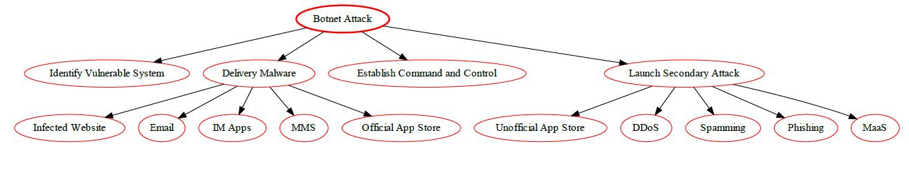


# Spoofing Attack 

Spoofing is a method of attack in which a malicious actor successfully masquerades as a legitimate user or node in a computer network. Spoofing attacks occur when an attacker makes it appear as though their network traffic is coming from a trusted source while they carry out malicious activities. By spoofing the source of the traffic, attackers can launch attacks such as man-in-the-middle (MITM) attacks, phishing attacks, network sniffing attacks, and more. It is important to recognize and be aware of spoofing attacks so as to protect yourself from potential threats.

## Mitigation

Sure, here are some mitigation strategies against Spoofing attacks in a cloud, mobile, and IoT ecosystem:

1. **Authentication**: Implement strong authentication mechanisms such as two-factor authentication (2FA) or multi-factor authentication (MFA). This can help ensure that the user or device is who they claim to be;

2. **Encryption**: Use encryption for all data in transit. Protocols such as HTTPS, SSL, and TLS can provide secure communication channels and prevent spoofing;

3. **IP Filtering**: Use IP filtering to block traffic from known malicious IP addresses. This can prevent attackers from spoofing these IP addresses;

4. **Regular Software Updates**: Keep all software, including operating systems and applications, up to date. This helps to patch any known vulnerabilities that could be exploited by attackers;

5. **Firewalls and Intrusion Detection Systems (IDS)**: Use firewalls and IDS to monitor and control incoming and outgoing network traffic based on predetermined security rules;

6. **User Education**: Educate users about the risks of spoofing attacks and how to recognize them. This includes checking the URL in the address bar and not clicking on suspicious links;

7. **Secure Cloud Configurations**: Ensure that your cloud configurations are secure and that all data is encrypted during transmission;

8. **IoT Security Measures**: Implement IoT-specific security measures such as device authentication, secure booting, and hardware-based security solutions.

Remember, security is a continuous process and it's important to stay updated with the latest threats and mitigation strategies.

## Spoofing Architectural Risk Analysis: 

| **Factor**                                   | **Description**                                                                                                                               | **Value**                                     |
|----------------------------------------------|-----------------------------------------------------------------------------------------------------------------------------------------------|-----------------------------------------------|
| Attack   Vector (AV):                        | Varies   (Network for some attacks, Physical for others)                                                                                      |         Network (N) & Physical (L)            |
| Attack   Complexity (AC):                    | Varies   (Depends on the complexity of spoofing technique and vulnerability)                                                                  |         Low (L) to High (H)                   |
| Privileges   Required (PR):                  | Varies   (Depends on the type of spoofing. May not require any privileges)                                                                    |         None (N) to High (H)                  |
| User   Interaction (UI):                     | None   (Attack might not require user interaction)                                                                                            | None   (N)                                    |
| Scope   (S):                                 | Varies   (Depends on the attacker's goal with spoofing)                                                                                       |         Unauthorized Access (UA)              |
| Confidentiality   Impact (C):                | High   (Spoofed user might access confidential data)                                                                                          | High   (H)                                    |
| Integrity   Impact (I):                      | High   (Spoofed user might manipulate data)                                                                                                   | High   (H)                                    |
| Availability   Impact (A):                   | High   (Denial-of-service attacks possible through spoofing)                                                                                  | High   (H)                                    |
| Base   Score (assuming High impact for all): | 0.85   * (AV:N & L/AC:V/PR:N/UI:N) * (S:UA/C:H/I:H/A:H)                                                                                       | 9.0   (Critical)                              |
| Temporal   Score (TS):                       | Public   exploit tools available for specific vulnerabilities?                                                                                |         Depends on exploit availability       |
| Environmental   Score (ES):                  | Depends   on security measures across Mobile App, Cloud, and IoT (strong authentication   protocols, access controls, device identity checks) | Varies                                        |
| Overall   CVSS Score                         | Base   Score + TS + ES                                                                                                                        |         Varies (Depends on TS & ES)           |
| Risk   Rating                                | High   to Critical (Depends on TS & ES)                                                                                                       | High   to Critical                            |

**Overall, spoofing vulnerabilities pose a high to critical risk in a mobile-cloud-IoT ecosystem. A multi-layered approach with robust authentication, access controls, and device validation measures is essential to reduce the risk of unauthorized access, data breaches, and system disruptions.**

## Spoofing Attack Tree Diagram


# VM Migration Attack 

VM Migration Attack is an attack in which an attacker takes advantage of the flaw in a VM system by transferring or migrating malicious codes or payloads from one system to another. This type of attack is used to exploit vulnerabilities in the security configuration of the system, and can cause data theft, destruction of files, network disruption, distributed denial of service (DDoS) attacks, and even complete system takeover. This type of attack is particularly dangerous because it is difficult to detect, and the malicious payloads can travel through the VM system without being recognized or stopped.

## Mitigation

1. **Authentication and Authorization**: Implement strong authentication and authorization mechanisms to ensure that only authorized personnel can initiate VM migration;

2. **Secure Communication Channels**: Use secure communication channels such as SSL/TLS for all communications involved in the VM migration process. This can prevent an attacker from intercepting the data during transmission;

3. **Encryption**: Encrypt the data at rest and in transit. This can prevent an attacker from understanding or modifying the data even if they manage to access it;

4. **Monitoring and Auditing**: Monitor and audit all VM migration activities. This can help detect any unauthorized or suspicious activities;

5. **Regular Software Updates**: Keep all software, including hypervisors and operating systems, up to date. This helps to patch any known vulnerabilities that could be exploited by attackers;

6. **Firewalls and Intrusion Detection Systems (IDS)**: Use firewalls and IDS to monitor and control incoming and outgoing network traffic based on predetermined security rules;

7. **Secure Cloud Configurations**: Ensure that your cloud configurations are secure and that all data is encrypted during transmission;

8. **IoT Security Measures**: Implement IoT-specific security measures such as device authentication, secure booting, and hardware-based security solutions.

Remember, security is a continuous process and it's important to stay updated with the latest threats and mitigation strategies.

## VM Migration Architectural Risk Analysis: 

| **Factor**                                   | **Description**                                                                                                   | **Value**                                                                               |
|----------------------------------------------|-------------------------------------------------------------------------------------------------------------------|-----------------------------------------------------------------------------------------|
| Attack   Vector (AV):                        | Network   (Exploiting the cloud environment)                                                                      | Network   (N)                                                                           |
| Attack   Complexity (AC):                    | High   (Requires specialized knowledge and potentially complex attack techniques)                                 | High   (H)                                                                              |
| Privileges   Required (PR):                  | High   (Requires privileged access within the cloud environment)                                                  | High   (H)                                                                              |
| User   Interaction (UI):                     | None   (Attack might not require user interaction)                                                                | None   (N)                                                                              |
| Scope   (S):                                 | Varies   (Depends on attacker's capability and migration process)                                                 |         Information Disclosure (attacker gains access to data   during migration)       |
| Confidentiality   Impact (C):                | High   (Attacker might access confidential data during migration)                                                 | High   (H)                                                                              |
| Integrity   Impact (I):                      | High   (Data might be manipulated during migration)                                                               | High   (H)                                                                              |
| Availability   Impact (A):                   | High   (Disrupted migration might impact VM availability)                                                         | High   (H)                                                                              |
| Base   Score (assuming High impact for all): | 0.85   * (AV:N/AC:H/PR:H/UI:N) * (S:ID/C:H/I:H/A:H)                                                               | 9.0   (Critical)                                                                        |
| Temporal   Score (TS):                       | Public   exploit code available for specific vulnerabilities?                                                     |         Depends on exploit availability                                                 |
| Environmental   Score (ES):                  | Depends   on cloud provider's security practices (secure migration protocols,   encryption), network segmentation | Varies                                                                                  |
| Overall   CVSS Score                         | Base   Score + TS + ES                                                                                            |         Varies (Depends on TS & ES)                                                     |
| Risk   Rating                                | High   to Critical (Depends on TS & ES)                                                                           | High   to Critical                                                                      |

**Overall, VM Migration vulnerabilities are critical for cloud-based deployments with mobile applications relying on cloud storage. Cloud providers need robust security practices for VM migration, and mobile applications should prioritize secure communication with reputable cloud providers.**

## VM Migration Attack Tree Diagram


# Malicious Insider Attack 

Malicious insider attack is when a person with authorized access to an organization's systems and networks misuses their privileges to damage the organization's information systems, applications or data. This type of attack can lead to complete system or network shutdown, data theft, fraud or other malicious activities. 

## Mitigation
The malicious insider threat is one of the most difficult threats to detect because the insider has legitimate access and is part of the organization which makes it hard to identify the malicious activity. Some of the most preventative measures organizations can take to mitigate against malicious insider attacks are: 

1. **Least Privilege Principle:** Implement the principle of least privilege. Each user should have the minimum levels of access necessary to perform their job functions;
2. **User Access Reviews:** Regularly review user access rights and privileges. This can help identify any inappropriate access rights that could be exploited by a malicious insider;
3. **Separation of Duties:** Implement separation of duties. This can prevent any single user from having control over an entire process, making it harder for a malicious insider to cause significant damage;
4. **Monitoring and Auditing:** Implement monitoring and auditing of user activities. This can help detect any unusual or suspicious behavior that could indicate a malicious insider;
5. **Security Training and Awareness:** Provide regular security training and awareness programs. This can help employees understand the risks associated with their actions and encourage them to report any suspicious activities;
6. **Incident Response Plan:** Have an incident response plan in place. This can help your organization respond quickly and effectively if a malicious insider is detected.

## Malicious Insider Architectural Risk Analysis


| **Factor**                                  | **Description**                                                                                 | **Value**                        |
|---------------------------------------------|-------------------------------------------------------------------------------------------------|----------------------------------|
| Attack Vector (AV):                         | Internal (Exploiting authorized access)                                                         | Internal (I)                     |
| Attack Complexity (AC):                     | Low (Insider already has access)                                                                | Low (L)                          |
| Privileges Required (PR):                   | Varies (Depends on insider's privileges)                                                        | Low (L), Medium (M), or High (H) |
| User Interaction (UI):                      | May be required (Depends on insider's actions)                                                  | Required (R) or None (N)         |
| Scope (S):                                  | Unauthorized Access (insider gains unauthorized access to data or modifies it)                  | Unauthorized Access (U)          |
| Confidentiality Impact (C):                 | High (insider can access confidential data)                                                     | High (H)                         |
| Integrity Impact (I):                       | High (insider can modify data)                                                                  | High (H)                         |
| Availability Impact (A):                    | High (insider can disrupt application or data access)                                           | High (H)                         |
| Base Score (assuming High for all impacts): | 0.85 * (AV:I/AC:L/PR:V/UI:R) * (S:U/C:H/I:H/A:H)                                                | 9.0 (Critical)                   |
| Temporal Score (TS):                        | Not applicable (N/A)                                                                            | N/A                              |
| Environmental Score (ES):                   | Depends on access controls, data encryption, monitoring and detection practices                 | Varies                           |
| Overall CVSS Score                          | Base Score + TS + ES                                                                            | Varies (Depends on ES)           |
| Risk Rating                                 | High to Critical (Depends on ES)                                                                | High to Critical                 |

## Malicious Insider Attack Tree Diagram

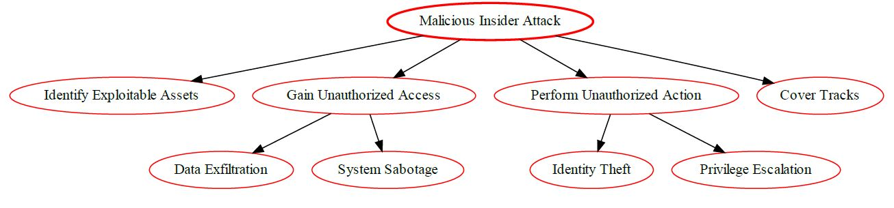


# VM Escape Attack 

VM Escape attacks involve compromised VMs that act as an entry point for an intruder to gain access to the larger system. It occurs when attackers use vulnerabilities or misconfigurations to escape the confines of a virtual machine and gain access to the underlying physical server or network. Through this attack, attackers can gain control of the physical server and execute malicious activities such as stealing data, disrupting service, and deleting critical files.

## Mitigation

1. **Regular Software Updates**: Keep all software, including hypervisors and operating systems, up to date. This helps to patch any known vulnerabilities that could be exploited by attackers.

2. **Least Privilege Principle**: Limit the privileges of virtual machines. Don't grant more privileges than necessary to a virtual machine.

3. **Isolation**: Isolate virtual machines from each other and from the host system. This can prevent an attacker from gaining access to other systems if they manage to escape from a virtual machine.

4. **Intrusion Detection Systems (IDS)**: Use IDS to monitor and detect unusual activity. IDS can help in identifying potential VM escape attacks.

5. **Firewalls**: Implement firewalls to block unauthorized access to your network. Firewalls can also be used to block ports that are commonly used for VM escape attacks.

6. **Secure Configurations**: Ensure that your cloud and virtual machine configurations are secure. This includes disabling unnecessary services and closing unused network ports.

7. **IoT Security Measures**: Implement IoT-specific security measures such as device authentication, secure booting, and hardware-based security solutions.

Remember, security is a continuous process and it's important to stay updated with the latest threats and mitigation strategies.

## VM Escape Risk Analysis

| **Factor**                                   | **Description**                                                                                                | **Value**                                     |
|----------------------------------------------|----------------------------------------------------------------------------------------------------------------|-----------------------------------------------|
| Attack   Vector (AV):                        | Network   (Exploiting the cloud environment)                                                                   | Network   (N)                                 |
| Attack   Complexity (AC):                    | High   (Requires specialized knowledge and potentially complex exploit development)                            | High   (H)                                    |
| Privileges   Required (PR):                  | High   (Requires privileges within the virtual machine)                                                        | High   (H)                                    |
| User   Interaction (UI):                     | None   (Attack might not require user interaction)                                                             | None   (N)                                    |
| Scope   (S):                                 | Account   Compromise (attacker gains access to other VMs on the same host)                                     |         Data Breach (DB)                      |
| Confidentiality   Impact (C):                | High   (Attacker might access confidential data in other VMs)                                                  | High   (H)                                    |
| Integrity   Impact (I):                      | High   (Attacker might manipulate data in other VMs)                                                           | High   (H)                                    |
| Availability   Impact (A):                   | High   (Attacker might disrupt other VMs on the same host)                                                     | High   (H)                                    |
| Base   Score (assuming High impact for all): | 0.85   * (AV:N/AC:H/PR:H/UI:N) * (S:DB/C:H/I:H/A:H)                                                            | 9.0   (Critical)                              |
| Temporal   Score (TS):                       | Public   exploit code available for specific vulnerabilities?                                                  |         Depends on exploit availability       |
| Environmental   Score (ES):                  | Depends   on cloud provider's security practices (patch management, hypervisor   security), workload isolation | Varies                                        |
| Overall   CVSS Score                         | Base   Score + TS + ES                                                                                         |         Varies (Depends on TS & ES)           |
| Risk   Rating                                | High   to Critical (Depends on TS & ES)                                                                        | High   to Critical                            |

**Notes:**

 * The base score is 9.0 (Critical) due to the potential for high impact on confidentiality, integrity, and availability of user data stored on the cloud virtual machine.
 * The "Scope" (S) is "Data Breach" as a successful VM escape could allow access to confidential data in other VMs sharing the same host.
 * The Environmental Score is crucial. Here, the focus is on the cloud provider's security practices. Patching vulnerabilities promptly, implementing strong hypervisor security measures, and isolating workloads through proper segmentation can significantly mitigate the risk.

**Mobile Application Impact:**

* While the VM escape vulnerability resides in the cloud environment, a mobile application relying on compromised cloud storage would be indirectly affected.
* The mobile application itself wouldn't be directly vulnerable, but the user's confidential data stored on the compromised cloud VM could be exposed.

**Overall, VM Escape vulnerabilities are critical for cloud-based deployments. Cloud providers need robust security practices to mitigate the risk. For mobile applications, securing communication with the cloud and storing data only with reputable cloud providers with strong security posture is essential.**

## VM Escape Attack Tree Diagram


# Side-Channel Attack 

Side-channel attacks are a class of security exploits that target physical implementation of systems, such as the way data is stored, transmitted, and processed, rather than exploiting logical flaws in the system itself. These attacks use unintentional information leakage from a system’s physical implementation—such as processor or memory timing, power consumption, radio frequency (RF) emission, or the sound similar systems make—to gain insights into the system’s internals and the data it is processing. Such leaked information can be used by an adversary to reverse engineer the system’s implementation, compromising its confidentiality, integrity, and availability.

## Mitigation

1. **Isolation**: Isolate processes and users from each other to prevent information leakage. This is especially important in a cloud environment where multiple users may be sharing the same physical resources;

2. **Noise Injection**: Inject noise into the system to make it harder for an attacker to distinguish the signal from the noise. This can be particularly effective against timing attacks;

3. **Reducing Emanations**: Reduce the amount of information that is leaked through side channels. This can be achieved by using low-emission hardware or shielding devices to prevent electromagnetic leaks;

4. **Regular Software Updates**: Keep all software, including operating systems and applications, up to date. This helps to patch any known vulnerabilities that could be exploited by attackers;

5. **Firewalls and Intrusion Detection Systems (IDS)**: Use firewalls and IDS to monitor and control incoming and outgoing network traffic based on predetermined security rules;

6. **Regular Audits and Penetration Testing**: Regularly conduct security audits and penetration testing to identify and fix any security vulnerabilities;

7. **Secure Cloud Configurations**: Ensure that your cloud configurations are secure and that all data is encrypted during transmission;

8. **IoT Security Measures**: Implement IoT-specific security measures such as device authentication, secure booting, and hardware-based security solutions.

Remember, security is a continuous process and it's important to stay updated with the latest threats and mitigation strategies.

## Side-Channel Architectural Risk Analysis

| **Factor**                                           | **Description**                                                                                                                           | **Value**                                     |
|------------------------------------------------------|-------------------------------------------------------------------------------------------------------------------------------------------|-----------------------------------------------|
| Attack   Vector (AV):                                | Varies   (Can be physical, network, or local depending on the specific vulnerability   and ecosystem component)                           | Varies   (N/L/P)                              |
| Attack   Complexity (AC):                            | High   (Requires specialized knowledge and potentially complex analysis of   side-channel information)                                    | High   (H)                                    |
| Privileges   Required (PR):                          | Varies   (May require physical access for some attacks)                                                                                   |         None (N) to High (H)                  |
| User   Interaction (UI):                             | None   (Attack might not require user interaction)                                                                                        | None   (N)                                    |
| Scope   (S):                                         | Information   Disclosure (attacker gains knowledge of confidential data)                                                                  |         Confidentiality (C)                   |
| Confidentiality   Impact (C):                        | High   (Leaked information might be confidential)                                                                                         | High   (H)                                    |
| Integrity   Impact (I):                              | Low   (Leakage doesn't directly modify data)                                                                                              | Low   (L)                                     |
| Availability   Impact (A):                           | Low   (Doesn't affect overall system functionality)                                                                                       | Low   (L)                                     |
| Base   Score (assuming High Confidentiality Impact): | 0.85   * (AV:V/AC:H/PR:N/UI:N) * (S:C/C:H/I:L/A:L)                                                                                        | 3.9   (Medium)                                |
| Temporal   Score (TS):                               | Public   exploit code or analysis techniques available?                                                                                   |         Depends on exploit availability       |
| Environmental   Score (ES):                          | Depends   on security measures across Mobile App, Cloud, and IoT (countermeasures for   side-channel leakage, hardware security features) | Varies                                        |
| Overall   CVSS Score                                 | Base   Score + TS + ES                                                                                                                    |         Varies (Depends on TS & ES)           |
| Risk   Rating                                        | Medium   to High (Depends on TS & ES)                                                                                                     | Medium   to High                              |

**Overall, side-channel vulnerabilities pose a medium to high risk in a mobile-cloud-IoT ecosystem. A holistic approach with security measures across all components and secure coding practices is essential to reduce the risk of information disclosure and potential data breaches.**

## Side-Channel Attack Tree Diagram


# Malware-as-a-Service Attack 

Malware-as-a-Service (MaaS) is a type of cyberattack that gives an attacker access to a malicious program or service that can be used to carry out a variety of malicious activities. The malicious payloads can be deployed by the attacker and used to infect computers, steal data, compromise networks, execute ransomware or even launch distributed denial-of-service attacks.

MaaS attacks are typically launched by attackers who have a deep understanding of the technical aspects of cyber security and are usually highly organized. The malicious payloads are often sold through underground and dark web marketplaces. 

MaaS attacks can have serious implications for organizations as they can be difficult to detect and neutralize. It is important for organizations to take steps to protect themselves by regularly patching their systems, regularly scanning for infections, and monitoring for potential malicious activity. Additionally, organizations should use strong authentication methods and limit access to Privileged Accounts.

## Mitigation

1. **Endpoint Protection:** Implement strong endpoint protection measures. This includes antivirus software, firewalls, and intrusion detection systems that can identify and block malware;
2. **Regular Updates and Patches:** Keep your systems and software up-to-date. Regular updates and patches can fix known vulnerabilities that could be exploited by malware;
3. **User Training and Awareness:** Educate users about the risks of MaaS and how to identify potential threats. This includes training on how to recognize phishing attempts, unsafe websites, and malicious email attachments;
4. **Network Segmentation:** Use network segmentation to isolate critical systems and data from the rest of the network. This can limit the impact of a malware infection;
5. **Backup and Recovery:** Regularly backup important data and ensure that you have a recovery plan in place. This can help you restore your systems and data in the event of a malware attack.
Threat Intelligence: Use threat intelligence services to stay informed about the latest malware threats and vulnerabilities.

## Malware-as-a-Service Architectural Risk Analysis: 

| **Factor**                                    | **Description**                                                                                 | **Value**                                      |
|-----------------------------------------------|-------------------------------------------------------------------------------------------------|------------------------------------------------|
| Attack   Vector (AV):                         | Network   (Exploiting application or server vulnerabilities)                                    | Network   (N)                                  |
| Attack   Complexity (AC):                     | Low   (MaaS lowers the barrier to entry for attackers)                                          | Low   (L)                                      |
| Privileges   Required (PR):                   | Varies   (Depends on the specific application vulnerability)                                    |         Low (L), Medium (M), or High (H)       |
| User   Interaction (UI):                      | Varies   (Depends on the specific application vulnerability)                                    |         None (N) or Required (R)               |
| Scope   (S):                                  | Unauthorized   Access (attacker gains access to user data)                                      |         Unauthorized Access (U)                |
| Confidentiality   Impact (C):                 | High   (attacker can access confidential data)                                                  | High   (H)                                     |
| Integrity   Impact (I):                       | High   (attacker can modify data)                                                               | High   (H)                                     |
| Availability   Impact (A):                    | High   (attacker can disrupt application or server functionality)                               | High   (H)                                     |
| Base   Score (assuming High for all impacts): | 0.85   * (AV:N/AC:L/PR:V/UI:V) * (S:U/C:H/I:H/A:H)                                              | 9.0   (Critical)                               |
| Temporal   Score (TS):                        | Public   exploit code available for the specific vulnerability?                                 |         Depends on exploit availability        |
| Environmental   Score (ES):                   | Depends   on application security practices, user awareness, security updates, MaaS   targeting | Varies                                         |
| Overall   CVSS Score                          | Base   Score + TS + ES                                                                          |         Varies (Depends on TS & ES)            |
| Risk   Rating                                 | High   to Critical (Depends on TS & ES)                                                         | High   to Critical                             |

## Malware-as-a-Service Attack Tree Diagram

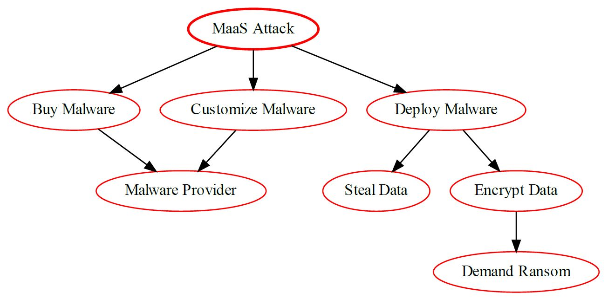


# Tampering Attack 

A tampering attack is a type of malicious attack whereby an attacker attempts to alter or modify data that is transmitted between two nodes. It is a type of attack in which the attacker attempts to modify or corrupt data in order to cause harm or gain unauthorized access to sensitive information. Tampering attacks can target all types of web applications, including web APIs and databases.

Tampering attacks can include activities such as: 

- Injecting malicious code into a web page or API response
- Modifying network traffic by altering or deleting packets
- Intercepting and manipulating requests and responses
- Corrupting data stored in memory or on disk
- Altering parameters or headers in requests
- Injecting malicious JavaScript or HTML into an application
- Manipulating browsers’ cookies or local storage
- Exploiting weaknesses in authorization and authentication protocols

## Mitigation

1. **Data Encryption**: Encrypt data at rest and in transit. This can prevent an attacker from understanding or modifying the data even if they manage to access it;

2. **Integrity Checks**: Use cryptographic hashes to verify the integrity of data and software. This can help detect any unauthorized modifications;

3. **Access Controls**: Implement strong access controls to prevent unauthorized access to data and systems. This includes using strong passwords, two-factor authentication (2FA), and least privilege principles;

4. **Regular Software Updates**: Keep all software, including operating systems and applications, up to date. This helps to patch any known vulnerabilities that could be exploited by attackers;

5. **Firewalls and Intrusion Detection Systems (IDS)**: Use firewalls and IDS to monitor and control incoming and outgoing network traffic based on predetermined security rules;

6. **Physical Security**: Implement physical security measures to prevent tampering with hardware devices. This is especially important for IoT devices;

7. **Secure Cloud Configurations**: Ensure that your cloud configurations are secure and that all data is encrypted during transmission;

8. **IoT Security Measures**: Implement IoT-specific security measures such as device authentication, secure booting, and hardware-based security solutions.

Remember, security is a continuous process and it's important to stay updated with the latest threats and mitigation strategies.

## Tampering Risk Analysis

| **Factor**                                   | **Description**                                                                                                                               | **Value**                                     |
|----------------------------------------------|-----------------------------------------------------------------------------------------------------------------------------------------------|-----------------------------------------------|
| Attack   Vector (AV):                        | Varies   (Network for some attacks, Physical for others)                                                                                      |         Network (N) & Physical (L)            |
| Attack   Complexity (AC):                    | Varies   (Depends on the specific vulnerability and attacker knowledge)                                                                       |         Low (L) to High (H)                   |
| Privileges   Required (PR):                  | Varies   (May require some privileges on the mobile device or cloud environment for   some attacks)                                           |         Low (L) to High (H)                   |
| User   Interaction (UI):                     | Varies   (Might require user interaction for specific attack vectors)                                                                         | Optional   (O)                                |
| Scope   (S):                                 | Data   Integrity Loss (attacker modifies data)                                                                                                | Data   Loss (DL)                              |
| Confidentiality   Impact (C):                | High   (Tampered data might reveal confidential information)                                                                                  | High   (H)                                    |
| Integrity   Impact (I):                      | High   (Tampered data can lead to unexpected behavior)                                                                                        | High   (H)                                    |
| Availability   Impact (A):                   | High   (Tampered data might render the application unusable)                                                                                  | High   (H)                                    |
| Base   Score (assuming High impact for all): | 0.85   * (AV:N & L/AC:V/PR:L/UI:O) * (S:DL/C:H/I:H/A:H)                                                                                       | 9.0   (Critical)                              |
| Temporal   Score (TS):                       | Public   exploit code available for specific vulnerabilities?                                                                                 |         Depends on exploit availability       |
| Environmental   Score (ES):                  | Depends   on security measures across Mobile App, Cloud, and IoT (data integrity   checks, code signing, secure storage, intrusion detection) | Varies                                        |
| Overall   CVSS Score                         | Base   Score + TS + ES                                                                                                                        |         Varies (Depends on TS & ES)           |
| Risk   Rating                                | High   to Critical (Depends on TS & ES)                                                                                                       | High   to Critical                            |


Notes:

* The base score is 9.0 (Critical) due to the potential for high impact on confidentiality, integrity, and availability of user data.
* The "Scope" (S) is "Data Loss" as tampered data can be effectively lost and unusable.
* The Environmental Score is crucial. Implementing data integrity checks throughout the ecosystem (mobile app, cloud storage, and potentially within IoT devices), code signing for mobile apps and cloud components, secure storage mechanisms for sensitive data, and intrusion detection systems to identify tampering attempts can significantly mitigate the risk.

**Overall, tampering vulnerabilities pose a high to critical risk in a mobile-cloud-IoT ecosystem. A comprehensive security approach with data integrity checks, code signing, secure storage, and intrusion detection across all components is essential to reduce the risk of data breaches, compromised functionality, and system disruptions.**

## Tampering Attack Tree Diagram


# Bluejacking Attack 

## What is Bluejacking?

Bluejacking is a type of attack where an attacker sends anonymous messages over Bluetooth to Bluetooth-enabled devices. Bluejacking attacks often involve malicious content, such as malicious links, malicious images, or malicious text. These messages can be sent from any device that can send Bluetooth signals, such as laptops, mobile phones, and even some home appliances.

## What are the Potential Consequences of a Bluejacking Attack?

The potential consequences of a Bluejacking attack include:

- Leaking of sensitive data from the target device.
- Unauthorized access to the target device.
- Installation of malicious software on the target device.
- Manipulation of personal information on the target device.
- Remote control of the target device.

## What are the Steps to Prevent Bluejacking?

The following steps can help minimize the potential risk of a Bluejacking attack:

- Disable Bluetooth on all devices when not in use.
- Use a PIN code with at least 8 characters on all Bluetooth enabled devices.
- Change Bluetooth visibility settings to only be visible to approved contacts.
- Make sure anti-virus and firewall software is installed and up to date.
- Install application and software updates as soon as they are available.

## Bluejacking Architectural Risk Analysis: 

**Bluejacking Vulnerability**

_Common Vulnerability Scoring System v3.1_

|  Parameter | Score|
|-----------|:----:|
| Attack Vector | Network (AV:N) |
| Attack Complexity | Low (AC:L) |
| Privileges Required | None (PR:N) |
| User Interaction | None (UI:N) |
| Scope | Unchanged (S:U) |
| Confidentiality Impact | None (C:N) |
| Integrity Impact | None (I:N) |
| Availability Impact | None (A:N) |

**CVSS v3.1 Base Score**: 0.0 (AV:N/AC:L/PR:N/UI:N/S:U/C:N/I:N/A:N)

# Bluesnarfing Attack 

Bluesnarfing attack is a type of wireless attack that allows attackers to gain unauthorized access to data stored on a Bluetooth-enabled device. The attacker is able to connect to an exposed Bluetooth-enabled device without the user's knowledge, and then transfer data stored on it, such as contact lists, calendar events, and text messages. Because Bluetooth-enabled devices frequently remain in discoverable mode, even if they are not actively in use, they can be vulnerable to this kind of attack.

## Mitigation

Bluesnarfing is a type of cyber attack that involves unauthorized access to a device via Bluetooth connection. Here are some general strategies to mitigate Bluesnarfing in Cloud, Mobile, and IoT ecosystems:

1. **Turn off Bluetooth Discovery Mode**: When not needed, turn off your device's Bluetooth discovery mode. This makes your device invisible to other Bluetooth-enabled devices.

2. **Reject Unknown Connection Requests**: Do not accept any Bluetooth connection requests that you don't recognize.

3. **Regular Software Updates**: Regularly update your device's software to install patches against the latest vulnerabilities.

For Cloud, Mobile, and IoT ecosystems specifically, consider the following:

1. **Security by Design**: Secure application development across these three technologies can only be achieved when applications and systems are designed and developed with security in mind¹. This will improve the quality of the solutions and ensure that vulnerabilities are identified. It will also help in defining countermeasures against cyberattacks or mitigate the effects of potential threats to the systems.

2. **System Modeling**: Use system modeling to identify potential vulnerabilities and threats. This can help in the development of effective countermeasures.

3. **Regular Audits and Monitoring**: Regularly monitor and audit your systems to detect any unusual activities or potential security breaches.

4. **Use of Secure Cloud Services**: Use secure cloud services for IoT devices. These services provide a spectrum of capabilities, including data storage, data processing, and application hosting, which can help IoT devices collect, analyze, and share data securely.

5. **Data Encryption**: Encrypt sensitive data before storing it in the cloud or transmitting it over the network.

Remember, the key to effective mitigation is a proactive approach to security. Regularly updating security measures and staying informed about the latest threats can go a long way in protecting your systems from Bluesnarfing and other cyber threats.

## Bluesnarfing Risk Analysis: 

| **Factor**                  | **Description**                                                                  | **Value**                                                          |
|-----------------------------|----------------------------------------------------------------------------------|--------------------------------------------------------------------|
| Vulnerability               | Unsecured Bluetooth connections on the mobile device                             | -                                                                  |
| Attack Vector (AV):         | Physical (Requires close proximity to the target device)                         | Physical (L)                                                       |
| Attack Complexity (AC):     | Low (Readily available tools can be used)                                        | Low (L)                                                            |
| Privileges Required (PR):   | None (Attack doesn't require any privileges on the device)                       | None (N)                                                           |
| User Interaction (UI):      | None (Attack can be passive and unnoticed)                                       | None (N)                                                           |
| Scope (S):                  | Information Disclosure (ID) (Attacker might access data like contacts, messages) | Data Breach (DB) (if application data is accessible via Bluetooth) |
| Confidentiality Impact : | Varies (Depends on the data exposed - Contacts: Medium, Login Credentials: High) | Varies (M to H)                                                    |
| Integrity Impact (I):       | Low (Limited ability to modify data via Bluetooth)                               | Low (L)                                                            |
| Availability Impact (A):    | None (Doesn't impact application availability)                                   | N/A                                                                |
|Base Score (assuming successful exploitation of application data) | 0.85 * (AV:L/AC:L/PR:N/UI:N) * (S:DB/C:H/I:L/A:N/A) | 3.4 (Low)|
|Temporal Score (TS): | Depends on the prevalence of bluesnarfing attacks and availability of tools | Varies |
Environmental Score (ES): | Depends on Bluetooth security settings (disabled when not in use), user awareness, and application data access restrictions | Varies |
|Overall CVSS Score: | Base Score + TS + ES | Varies (Depends on TS, ES, and type of data exposed) | Low to Medium |
|Risk Rating: | Low to Medium (Depends on TS, ES, and attacker capabilities) | Low to Medium |

## Reference

1. Bluesnarfing: What is it and how to prevent it | NordVPN. https://nordvpn.com/blog/bluesnarfing/.
2. Attack and System Modeling Applied to IoT, Cloud, and Mobile Ecosystems .... https://dl.acm.org/doi/fullHtml/10.1145/3376123.
3. Securing Cloud-Based Internet of Things: Challenges and Mitigations. https://arxiv.org/pdf/2402.00356.

## Bluetooth Attack Tree Diagram

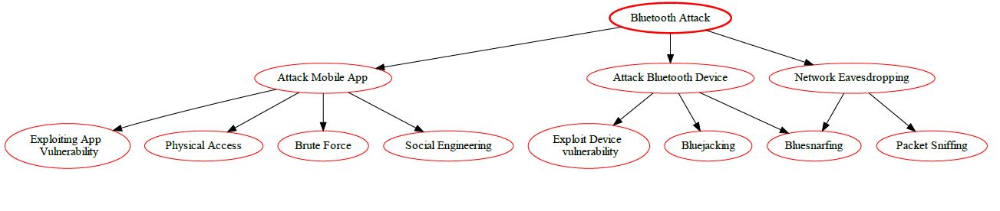


# GPS Jamming Attack 

GPS Jamming attack is a type of cyberattack where an adversary uses electronic jamming devices to interfere with or even disable GPS signals. These devices can be used to disrupt communication between GPS receivers and satellites, making it difficult or even impossible to get accurate location data from the system. This type of attack can pose a serious threat to critical infrastructure and navigation systems that rely on GPS for navigation. 

GPS jamming can be used to disrupt navigation, communication, or surveillance activities that rely on the GPS system. It has been used in corporate espionage and data theft, or as a form of information warfare.

## Mitigation

1. **Use of Anti-Jamming Technology:** Implement anti-jamming technology in your GPS receivers;
2. **Incorporate Redundant Systems:** Use other navigation systems in addition to GPS, such as GLONASS, Galileo, or BeiDou. This redundancy can provide backup navigation data if GPS signals are jammed;
3. **Data Validation:** Validate GPS data with other sensor data like accelerometer, gyroscope, and magnetometer readings in mobile devices. This can help identify anomalies in GPS data that might indicate jamming;
4. **Use of Cryptographic Techniques:** Encrypt the GPS data to prevent unauthorized access and manipulation. This can be done using standard cryptographic techniques;
5. **Anomaly Detection Systems:** Implement anomaly detection systems that can identify abnormal patterns in the GPS data, which could indicate a jamming attack;
6. **Regular Updates and Patches:** Keep the GPS system and its software up-to-date. Regular updates and patches can fix known vulnerabilities and improve the system’s resistance to jamming;
User Awareness: Educate users about the risks of GPS jamming and how to identify potential jamming attacks.

## GPS Jamming Architectural Risk Analysis 

| **Metric**                   | **Value**   |
|------------------------------|-------------|
| Attack Vector                | Physical    |
| Attack Complexity            | Low         |
| Privileges Required          | None        |
| User Interaction             | None        |
| Scope                        | Unchanged   |
| Confidentiality Impact       | Low         |
| Integrity Impact             | None        |
| Availability Impact          | High        |
| Exploit Code Maturity        | Unproven    |
| Remediation Level            | Official Fix|
| Report Confidence            | Confirmed   |
| CVSS Base Score              | 7.5 (High)  |
| CVSS Vector                  | CVSS:3.1/AV:P/AC:L/PR:N/UI:N/S:U/C:L/I:N/A:H |

## GPS Jamming Attack Tree Diagram

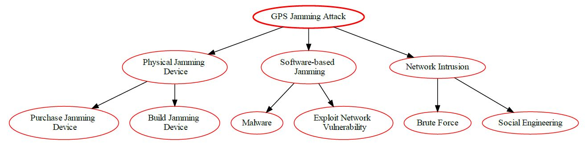


# Cellular Jamming Attack 

Cellular Jamming attacks are a type of cyber attack where a malicious actor attempts to interrupt communication signals and prevent devices from being able to communicate with each other. In these attacks, malicious actors will use a transmitter to interfere with cellular, Wi-Fi, and other communication frequencies so that cellular communication is disrupted, preventing the targeted device from sending and receiving data. This can be used to disrupt any type of information, ranging from financial information to sensitive documents. In addition, cellular jamming attacks can also be used to prevent people from accessing the Internet, utilizing GPS navigation, and using their phones and other connected devices.

## Mitigation

1. **Signal Strength Monitoring**: Monitor the strength of your cellular signal. A sudden drop could indicate jamming.

2. **Use of Encrypted Communication**: Encourage the use of encrypted communication apps that do not rely solely on the security of cellular networks. This can prevent an attacker from intercepting the data even if they manage to jam the cellular signal.

3. **Frequency Hopping**: Use frequency hopping spread spectrum (FHSS) to rapidly switch among frequency channels. This can make it difficult for a jammer to disrupt the signal.

4. **Security Patches and Updates**: Keep all software, including operating systems and applications, up to date. This helps to patch any known vulnerabilities that could be exploited by attackers.

5. **Firewalls and Intrusion Detection Systems (IDS)**: Use firewalls and IDS to monitor and control incoming and outgoing network traffic based on predetermined security rules.

6. **User Awareness**: Educate users about the risks of cellular jamming and the importance of using secure and encrypted communication channels.

7. **Secure Cloud Configurations**: Ensure that your cloud configurations are secure and that all data is encrypted during transmission.

8. **IoT Security Measures**: Implement IoT-specific security measures such as device authentication, secure booting, and hardware-based security solutions.

Remember, security is a continuous process and it's important to stay updated with the latest threats and mitigation strategies.

## Cellular Jamming Risk Analysis

| **Factor**                  | **Description**                                                        | **Value**                                                                            |
|-----------------------------|------------------------------------------------------------------------|--------------------------------------------------------------------------------------|
| Vulnerability               | N/A (Disruption, not a vulnerability)                                  | -                                                                                    |
| Attack Vector (AV):         | Physical (Disrupting cellular signal)                                  | Physical (L)                                                                         |
| Attack Complexity (AC):     | Low (Relatively simple to jam cellular signals)                        | Low (L)                                                                              |
| Privileges Required (PR):   | None (Jamming doesn't require privileges)                              | None (N)                                                                             |
| User Interaction (UI):      | None (Attack doesn't require user interaction)                         | None (N)                                                                             |
| Scope (S):                  | Availability (disrupts cellular communication)                         | Functionality Impact (FI) (limits mobile app functionality relying on cellular data) |
| Confidentiality Impact (C): | None (Data confidentiality not directly affected)                      | N/A                                                                                  |
| Integrity Impact (I):       | None (Data integrity not directly affected)                            | N/A                                                                                  |
| Availability Impact (A):    | Medium (Disrupts cellular communication and application functionality) | Medium (M)                                                                           |
|Base Score | 0.85 * (AV:L/AC:L/PR:N/UI:N) * (S:FI/C:N/A/I:N/A/A:M) | 3.4 (Low)|
|Temporal Score (TS) | N/A | N/A |
|Environmental Score (ES) | Depends on alternative communication methods (Wi-Fi) and application design (offline functionality) | Varies |
|Overall CVSS Score: | Base Score + TS + ES | Varies (Depends on TS & ES) |
| Risk Rating: | Low to Medium (Depends on TS & ES) | Low to Medium |

## Cellular Jamming Attack Tree Diagram 

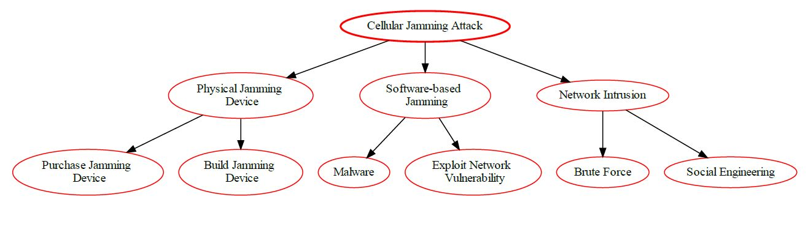


# Cryptanalysis Attack 

Cryptanalysis is the process of analyzing encrypted data in order to find weaknesses that can be exploited to gain access to the plaintext. It is an incredibly powerful technique that has been used to crack many of the world's most powerful encryption algorithms. Cryptanalysis can be used to attack both symmetric and asymmetric encryption systems. 

The goal of cryptanalysis is to gain access to the plaintext without knowing the secret key. It can be done in a variety of ways, such as frequency analysis, differential cryptanalysis, linear cryptanalysis, brute-force attack, etc. Attackers typically use a combination of these techniques to find a weakness in the security system. 

By using cryptanalysis, attackers can gain access to sensitive data without the need to decode the entire encrypted document or message. This makes cryptanalysis an important tool for attackers because it allows them to easily bypass complex encryption schemes.

## Mitigation

1. **Strong Encryption Algorithms**: Use strong and proven encryption algorithms. Avoid using outdated or weak encryption algorithms that have known vulnerabilities.

2. **Key Management**: Implement secure key management practices. This includes generating strong keys, securely storing keys, and regularly rotating keys.

3. **Regular Software Updates**: Keep all software, including operating systems and applications, up to date. This helps to patch any known vulnerabilities that could be exploited by attackers.

4. **Secure Communication Channels**: Use secure communication channels such as SSL/TLS for all communications. This can prevent an attacker from intercepting the data during transmission.

5. **Firewalls and Intrusion Detection Systems (IDS)**: Use firewalls and IDS to monitor and control incoming and outgoing network traffic based on predetermined security rules.

6. **User Education**: Educate users about the risks of Cryptanalysis attacks and how to recognize them. This includes not providing sensitive information to untrusted sources.

7. **Secure Cloud Configurations**: Ensure that your cloud configurations are secure and that all data is encrypted during transmission.

8. **IoT Security Measures**: Implement IoT-specific security measures such as device authentication, secure booting, and hardware-based security solutions.

Remember, security is a continuous process and it's important to stay updated with the latest threats and mitigation strategies.

## Cryptanalysis Architectural Risk Analysis: 

| **Factor**                                    | **Description**                                                   | **Value**                                                                             |
|-----------------------------------------------|-------------------------------------------------------------------|---------------------------------------------------------------------------------------|
| Attack   Vector (AV):                         | Physical                   |         Physical (L) or Network (N)       |
| Attack   Complexity (AC):                     | High               | High   (H)                                                                            |
| Privileges   Required (PR):                   | None   (if data is intercepted)                                   | None   (N)                                                                            |
| User   Interaction (UI):                      | None                                                              | None   (N)                                                                            |
| Scope   (S):                                  | Confidentiality   Impact (attacker can decrypt confidential data) |         Confidentiality (C)                                                           |
| Confidentiality   Impact (C):                 | High   (if compromised data is highly sensitive)                  | High   (H)                                                                            |
| Integrity   Impact (I):                       | High                   | High   (L)                                                                             |
| Availability   Impact (A):                    | High                                                              | Low   (L)                                                                            |
| Base   Score | 8.8                |        High                                 |
 
## Recommendations

In order to ensure that the mobile application is resilient or immune to the Cryptanalysis Attacks, it is recommended that the measures described in the good practice report and the security testing present in the full report are followed.

## References
1. [CAPEC-97: Cryptanalysis](https://capec.mitre.org/data/definitions/97.html).

## Cryptanalysis Attacks Tree
                        

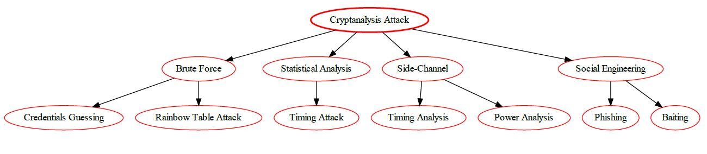


# Reverse Engineering Attack 

Reverse engineering attack is an attack that attempts to recreate the source code of a system from its object code. This type of attack is often used to gain unauthorized access to an application or system by recreating the security measures and mechanisms present in the object code. Reverse engineering attacks are particularly dangerous since they allow attackers to uncover hidden flaws, backdoors and vulnerabilities that can be used to gain access to the system.

## Mitigation

1. **Obfuscation**: Obfuscation is the process of making your code harder to understand when it is reverse engineered. This can be done by renaming variables and functions with non-descriptive names, removing debugging information, and using tools that convert your code into an equivalent, but harder to understand version.

    ```python
    # Before obfuscation
    def calculate_discount(price, discount):
        return price - (price * discount / 100)

    # After obfuscation
    def a(b, c):
        return b - (b * c / 100)
    ```

2. **Encryption**: Encrypt your code and data to protect it from being easily read. This can be particularly useful for protecting sensitive data such as API keys or user data.

3. **Anti-debugging Techniques**: These techniques make it harder for a reverse engineer to step through your code. This can include things like adding false conditional statements, using complex control flow structures, and checking for the presence of a debugger at runtime.

4. **Code Signing**: Code signing involves using a digital signature to verify the integrity of your code. This can prevent an attacker from modifying your code without detection.

5. **Use of Native Code**: If possible, write critical parts of your application in native code. It's harder to reverse engineer than managed code.

6. **Regular Updates**: Regularly update and change your code to make it harder for someone to keep up with what you're doing.

7. **API Security**: Ensure that your APIs are secure and only expose necessary information. Use authentication and rate limiting to prevent unauthorized access.

8. **Security by Design**: Incorporate security from the beginning of the software development lifecycle. Don't treat it as an afterthought.

Remember, no method can provide 100% security against reverse engineering. The goal is to make the process as difficult, time-consuming, and costly as possible to deter potential attackers. It's also important to stay informed about the latest security threats and mitigation strategies. Security is a constantly evolving field, and what works today may not work tomorrow.

## Reverse Engineering Architectural Risk Analysis

| **Factor**                                  | **Description**                                                                                                               | **Value**                             |
|---------------------------------------------|-------------------------------------------------------------------------------------------------------------------------------|---------------------------------------|
| Attack   Vector (AV):                       | Network   (Exploiting the application code over the network)                                                                  | Network   (N)                         |
| Attack   Complexity (AC):                   | Varies   (Depends on the complexity of the application and obfuscation techniques)                                            |         Low (L) to High (H)           |
| Privileges   Required (PR):                 | None   (Publicly available applications can be downloaded and analyzed)                                                       | None   (N)                            |
| User   Interaction (UI):                    | None   (Attack doesn't require user interaction)                                                                              | None   (N)                            |
| Scope   (S):                                | Vulnerability   Identification (attacker gains knowledge of potential vulnerabilities)                                        |         Vulnerability Scan (VS)       |
| Confidentiality   Impact (C):               | Potential   High. Extracted information could include user credentials or application   logic.                                | High   (H)                            |
| Integrity   Impact (I):                     | Potential   High. Reverse engineered code could be used to create malicious applications                                      | High   (H)                            |
| Availability   Impact (A):                  | Low   (Doesn't affect application functionality)                                                                              | Low   (L)                             |
| Base   Score (assuming Low impact for all): | 0.85   * (AV:N/AC:V/PR:N/UI:N) * (S:VS/C:L/I:L/A:L)                                                                           | 7.8   (High)                          |
| Temporal   Score (TS):                      | Not   Applicable (N/A)                                                                                                        | N/A                                   |
| Environmental   Score (ES):                 | Depends   on the application's security posture (e.g., code obfuscation, encryption),   security practices during development | Varies                                |
| Overall   CVSS Score                        | Base   Score + TS + ES                                                                                                        |         Varies (Depends on ES)        |
| Risk   Rating                               | High   to Critical                                                                                                            | High (H)                              |

This analysis indicates that the Reverse Engineering vulnerability poses a high risk to the confidentiality and integrity of the application, with a CVSS Base Score of 7.8 (High). While it doesn't directly impact availability, successful exploitation could lead to unauthorized access to confidential data and potential tampering with the application's integrity. Temporary fixes may be available, but a comprehensive solution may require deeper remediation efforts.

## Reverse Engineering Attack Diagram


# Audit Log Manipulation Attack 

Audit Log Manipulation is a type of cyber attack used to hide or falsify activities in a system's audit log, which can be used to track user activities and system changes. This can be done by either deleting entries in the log, adding false entries, or even modifying existing log entries. This type of attack can be used to mask malicious or suspicious activity from security professionals and prevent them from detecting it. It can also be used to mask financial fraud or other malicious activity.

## Mitigation

Audit log manipulation is a serious security concern as it can allow malicious actors to hide their activities. Here are some strategies to mitigate this risk in Cloud, Mobile, and IoT ecosystems:

1. **Immutable Logs**: Ensure that your logs are immutable, meaning they cannot be changed once they are written¹. This can prevent an attacker from altering the logs to hide their activities¹.

2. **Log Redundancy**: Maintain redundant copies of logs in different locations¹. This can make it harder for an attacker to manipulate all copies of the logs¹.

3. **Regular Audits and Monitoring**: Regularly monitor and audit your logs to detect any unusual activities or potential security breaches¹.

4. **Use of Secure Cloud Services**: Use secure cloud services for IoT devices. These services provide a spectrum of capabilities, including data storage, data processing, and application hosting, which can help IoT devices collect, analyze, and share data securely².

5. **Data Encryption**: Encrypt sensitive data before storing it in the cloud or transmitting it over the network¹.

6. **Access Control**: Implement strict access controls to limit who can access the logs¹. This can prevent unauthorized users from manipulating the logs¹.

7. **Intrusion Detection Systems (IDS)**: Use IDS to monitor your systems and generate alerts when suspicious activities are detected¹.

8. **Security by Design**: Secure application development across these three technologies can only be achieved when applications and systems are designed and developed with security in mind¹. This will improve the quality of the solutions and ensure that vulnerabilities are identified¹.

Remember, the key to effective mitigation is a proactive approach to security. Regularly updating security measures and staying informed about the latest threats can go a long way in protecting your systems from Audit log manipulation and other cyber threats.

## Audit Log Manipulation Risk Analysis

| **Factor**                  | **Description**                                                                                                 | **Value**                                                                        |
|-----------------------------|-----------------------------------------------------------------------------------------------------------------|----------------------------------------------------------------------------------|
| Vulnerability               | Weaknesses in audit log recording, storage, or access controls                                                  | -                                                                                |
| Attack Vector (AV):         | Varies (Gaining access to the system where logs reside)                                                         | Varies (Remote: N, Physical: L, OS: L)                                           |
| Attack Complexity (AC):     | Medium (Requires understanding of the logging system and potentially exploiting vulnerabilities)                | Medium (M)                                                                       |
| Privileges Required (PR):   | Varies (Depends on the specific weakness - might require some privileges within the system)                     | Varies (L, M, or H)                                                              |
| User Interaction (UI):      | Varies (Might not require user interaction for remote attacks)                                                  | Varies (N, L, or M)                                                              |
| Scope (S):                  | Tampering with Evidence (TE) (Hinders forensic analysis and incident response)                                  | Confidentiality Impact (CI) (if manipulation allows access to confidential data) |
| Confidentiality Impact (C): | Varies (Depends on the manipulated data - Low for general logs, High for logs containing sensitive information) | Varies (L to H)                                                                  |
| Integrity Impact (I):       | High (Manipulated logs compromise data integrity and can lead to wrong conclusions)                             | High (H)                                                                         |
| Availability Impact (A):    | Low (Doesn't directly impact application availability)                                                          | N/A                                                                              |
|Base Score | 0.85 * (AV:Varies/AC:M/PR:Varies/UI:Varies) * (S:TE/C:H/I:H/A:N/A) | 7.5 (High) |
|Temporal Score (TS) | Depends on the attacker's knowledge, motivation, and ease of exploiting the vulnerability | Varies |
|Environmental Score (ES): | Depends on the strength of access controls for audit logs, log immutability measures (e.g., digital signing), and log monitoring practices | Varies |
|Overall CVSS Score | Base Score + TS + ES | Varies (Depends on TS, ES, specific attack method, and type of data accessed) | High |
|Risk Rating | Low to Critical (Depends on TS, ES, and attacker capabilities) | High |

## Reference

Source: Conversation with Bing, 5/13/2024
(1) Best Practices to Manage Risks in the Cloud. https://www.isaca.org/resources/news-and-trends/isaca-now-blog/2021/best-practices-to-manage-risks-in-the-cloud.
(2) OWASP IoT Top 10 Vulnerabilities & How To Mitigate Them | SISA. https://www.sisainfosec.com/blogs/the-owasp-iot-top-10-vulnerabilities-and-how-to-mitigate-them/.
(3) 7 Mitigation Strategies to Address IoT Security Risk. https://www.codemotion.com/magazine/iot/7-mitigation-strategies-to-address-iot-security-risk/.

## Audit Log Manipulation Attack Tree Diagram


# Wi-Fi Jamming Attack 

Wi-Fi jamming attack is an attack on a wireless network using radio frequency signals to disrupt the normal operation of the network. The goal of the attack is to block or reduce the amount of legitimate traffic that can access the network. This can be done by using powerful signal transmitters to disrupt communications between the access point and its client devices or by blocking the access point’s radio signal. 

Wi-Fi jamming attacks are a type of denial of service attack that affects wireless networks and can occur on any wireless network regardless of its size. It can cause network outages, reduce throughput, and cause major disruptions for users. Wi-Fi jamming attacks can be difficult to detect and prevent due to their potential for wide area disruption.

## Mitigation


## Wi-Fi Jamming Risk Analysis

| **Factor**                    | **Description**                                                                      | **Value**                           |
|-------------------------------|--------------------------------------------------------------------------------------|-------------------------------------|
| Attack   Vector (AV):         | Physical   (Disrupting Wi-Fi signal and exploiting the opportunity)                  | Physical   (L)                      |
| Attack   Complexity (AC):     | Varies   (Depends on the complexity of data interception techniques after jamming)   |         Low (L) to Medium (M)       |
| Privileges   Required (PR):   | None   (Jamming and basic interception might not require privileges)                 |         None (N) to Low (L)         |
| User   Interaction (UI):      | None   (Attack doesn't require user interaction)                                     | None   (N)                          |
| Scope   (S):                  | Data   Breach (if data intercepted during jamming)                                   |         Data Breach (DB)            |
| Confidentiality   Impact (C): | High   (Intercepted data might reveal confidential user information)                 | High   (H)                          |
| Integrity   Impact (I):       | High   (Intercepted data could be modified)                                          | High   (H)                          |
| Availability   Impact (A):    | High   (Jamming disrupts communication, application functionality might be impacted) | High   (H)                          |

**Exploitation Requirements (modifies base score):**

**Confidentiality Requirement:** High (Confidentiality is severely impacted if data is intercepted)
**Integrity Requirement:** High (Integrity is severely impacted if data is intercepted)
**Availability Requirement:** High (Availability is severely impacted by jamming)

Since all confidentiality, integrity, and availability requirements are high, the base score modification factor becomes 1.0.

**Base Score:** 0.85 * (AV:L/AC:L/PR:N/UI:N) * (S:DB/C:H/I:H/A:H) * 1.0 = 7.2 (High)

**Temporal Score (TS):** | Not Applicable (N/A) | N/A |
**Environmental Score (ES):** | Depends on mobile app's security practices (data encryption in transit), user awareness (using secure Wi-Fi networks), attacker's capability (advanced interception techniques) | Varies |

**Overall CVSS Score:** | Base Score + TS + ES | Varies (Depends on TS & ES) |
**Risk Rating:** | High to Critical (Depends on ES) | High to Critical |

## Wi-Fi Jamming Attack Tree Diagram


# Wi-Fi SSID Tracking Attack 

Wi-Fi SSID tracking attack is an attack in which malicious actors use techniques such as tracking the Media Access Control (MAC) addresses or the Service Set Identifier (SSID) of a device to capture user data transmitted through a wireless network. This type of attack has become increasingly popular due to its simplicity and the fact that it can be used to target multiple devices in a network. The attack can be used to steal sensitive data such as credit card information and other personal details that are sent through the network. It can also be used to launch Distributed Denial of Service (DDoS) attacks.  

Overall, Wi-Fi SSID tracking attack is a threat that should be taken seriously as it can have serious implications on user security.

## Mitigation

1. **Disable SSID Broadcasting**: Disabling SSID broadcasting can make your network invisible to devices that are not already connected. This can prevent an attacker from discovering your network through SSID tracking;

2. **Randomize MAC Addresses**: Many modern devices support MAC address randomization, which can prevent your device from being tracked using its MAC address;

3. **Use of VPNs**: Virtual Private Networks (VPNs) can encrypt your internet connection and hide your online activities from eavesdroppers;

4. **Network Security**: Use strong encryption (like WPA3) for your Wi-Fi network to prevent unauthorized access;

5. **Regular Software Updates**: Keep all software, including operating systems and applications, up to date. This helps to patch any known vulnerabilities that could be exploited by attackers;

6. **Firewalls and Intrusion Detection Systems (IDS)**: Use firewalls and IDS to monitor and control incoming and outgoing network traffic based on predetermined security rules;

7. **Secure Cloud Configurations**: Ensure that your cloud configurations are secure and that all data is encrypted during transmission;

8. **IoT Security Measures**: Implement IoT-specific security measures such as device authentication, secure booting, and hardware-based security solutions.

Remember, security is a continuous process and it's important to stay updated with the latest threats and mitigation strategies.

## Wi-Fi SSID Tracking Risk Analysis

| **Factor**                    | **Description**                                                                | **Value**                                                                      |
|-------------------------------|--------------------------------------------------------------------------------|--------------------------------------------------------------------------------|
| Attack   Vector (AV):         | Network   (Tracking SSIDs and exploiting network weaknesses)                   | Network   (N)                                                                  |
| Attack   Complexity (AC):     | Varies   (Depends on the complexity of subsequent attacks after tracking)      |         Low (L) to High (H)                                                    |
| Privileges   Required (PR):   | Varies   (Depends on the subsequent attack)                                    |         None (N) to High (H)                                                   |
| User   Interaction (UI):      | None   (SSID tracking might not require interaction, subsequent attacks might) | Varies   (N to H)                                                              |
| Scope   (S):                  | Varies   (Depends on the subsequent attack)                                    |         Can range from Information Disclosure (ID) to Data   Breach (DB)       |
| Confidentiality   Impact (C): | Varies   (Depends on the subsequent attack)                                    |         Low (L) to High (H)                                                    |
| Integrity   Impact (I):       | Varies   (Depends on the subsequent attack)                                    |         Low (L) to High (H)                                                    |
| Availability   Impact (A):    | Varies   (Depends on the subsequent attack)                                    |         Low (L) to High (H)                                                    |
| Base Score | 3.3 (Low) | Low (Low) | 
|Overall Rating| Base Score + TS + ES | Varies (Depends on TS, ES, and the specific subsequent attack)| 
|Risk Rating | Low to Critical (Depends on ES and the subsequent attack) |  Low (H) to Critical (C) |

**Overall, Wi-Fi SSID tracking combined with potential subsequent attacks can pose a low to critical risk depending on the specific attack scenario and the security measures in place. A layered security approach across the mobile app, cloud infrastructure, and user behavior is essential to mitigate these risks.**

## Wi-Fi SSID Tracking Attack Tree Diagram

# Byzantine Attack 

A Byzantine attack is a type of cyber attack wherein the malicious attacker attempts to corrupt or disrupt normal operations within a network by broadcasting false messages throughout the system. The aim of the attack is to cause confusion and possible system failure by introducing messages that appear to be coming from genuine sources, but in reality are not. Such attacks are often employed in distributed computer networks, such as those used by banks, military organizations, and other critical systems.

## Mitigation

1. **Redundancy**: Implement redundancy in your system. This can be achieved by replicating components or data. If one component fails, the system can continue to operate using the replicas.

2. **Byzantine Fault Tolerance Algorithms**: Implement Byzantine Fault Tolerance (BFT) algorithms such as the Practical Byzantine Fault Tolerance (PBFT) algorithm. These algorithms can handle failures and ensure the system continues to function correctly even when some components are faulty.

3. **Regular Health Checks**: Perform regular health checks on your system components. This can help detect faulty components early and take corrective action.

4. **Secure Communication**: Use secure communication protocols to prevent tampering with the messages exchanged between components.

5. **Authentication and Authorization**: Implement strong authentication and authorization mechanisms to prevent unauthorized access to your system.

6. **Regular Software Updates**: Keep all software, including operating systems and applications, up to date. This helps to patch any known vulnerabilities that could be exploited by attackers.

7. **Firewalls and Intrusion Detection Systems (IDS)**: Use firewalls and IDS to monitor and control incoming and outgoing network traffic based on predetermined security rules.

8. **Secure Cloud Configurations**: Ensure that your cloud configurations are secure and that all data is encrypted during transmission.

9. **IoT Security Measures**: Implement IoT-specific security measures such as device authentication, secure booting, and hardware-based security solutions.

Remember, security is a continuous process and it's important to stay updated with the latest threats and mitigation strategies.

## Byzantine Risk Analysis

|  **Factor**                  | **Description (Considering Successful Byzantine Attack)**                                                                                | **Value**                                                                 |
|-----------------------------|------------------------------------------------------------------------------------------------------------------------------------------|---------------------------------------------------------------------------|
| Attack Vector (AV):         | Varies (Depends on exploited weakness - Network, Physical, etc.)                                                                         | Varies (L, N, or Ph)                                                      |
| Attack Complexity (AC):     | High (Requires understanding of the distributed system and planning)                                                                     | High (H)                                                                  |
| Privileges Required (PR):   | Varies (Depends on the attack method - Might require some privileges within the system)                                                  | Varies (N, L, or H)                                                       |
| User Interaction (UI):      | None (Attack doesn't require user interaction)                                                                                           | None (N)                                                                  |
| Scope (S):                  | Data Breach (DB) (if attacker manipulates data)                                                                                          | Functionality Impact (FI) (disrupts application due to inconsistent data) |
| Confidentiality Impact (C): | High (Attack might compromise data confidentiality through manipulation)                                                                 | High (H)                                                                  |
| Integrity Impact (I):       | High (Attack directly targets data integrity)                                                                                            | High (H)                                                                  |
| Availability Impact (A):    | High (Disrupted communication and inconsistent data can impact application availability)                                                 | High (H)                                                                 |
|Base Score (assuming successful exploitation)| 0.85 * (AV: Varies/AC:H/PR:Varies/UI:N) * (S:DB/C:H/I:H/A:H) * 1.0 | Varies (Depends on AV & PR) |
|Temporal Score (TS) | Depends on exploit code availability and complexity of the attack | Varies |
|Environmental Score (ES) | Depends on security measures in communication protocols, data consistency mechanisms, and consensus algorithms | Varies |
|Overall CVSS Score | Base Score + TS + ES | Varies (Depends on TS, ES, and specific attack vector/privilege requirements) |
Risk Rating: | High to Critical (Depends on TS, ES, and attack scenario) | High to Critical |

## Byzantine Attack Tree Diagram

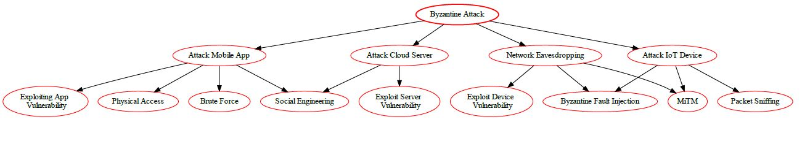

# Spectre Attack 

Spectre is a type of side-channel attack that exploits the speculative execution process used by modern computer processors. The attackers are able to extract sensitive data such as passwords and encryption keys from the memory of other processes running on the same computer, even if those processes are in the same trusted environment (e.g., a virtual machine (VM)).

Spectre attack exploits a vulnerability in the way modern CPUs execute programs speculatively. Specifically, when the processor encounters a branch instruction during a process, it goes ahead and predicts which branch will be taken and runs the instructions in that branch, even though the branch may not end up being taken after all. This behavior was designed to speed up the execution of programs. However, it can be abused to leak sensitive data in other processes on the same system.

## Mitigation

1. **Software Patches**: Keep all software, including operating systems and applications, up to date with the latest patches. Many software vendors have released patches that mitigate the Spectre vulnerability;

2. **Hardware Updates**: Some hardware vendors have released firmware updates that mitigate the Spectre vulnerability. Check with your hardware vendor for any available updates;

3. **Compiler-based Protections**: Use compiler features that help mitigate Spectre. For example, some compilers have options that insert barriers in the code to prevent speculative execution;

4. **Isolation**: Isolate sensitive data and processes from untrusted ones. This is especially important in a cloud environment where multiple users may be sharing the same physical resources;

5. **Reduced Resolution Timers**: Reduce the resolution of timers available to untrusted code. This can make it harder for an attacker to measure the timing differences that the Spectre attack relies on;

6. **User Education**: Educate users about the risks of downloading and running untrusted code, which could potentially exploit the Spectre vulnerability;

7. **Secure Cloud Configurations**: Ensure that your cloud configurations are secure and that all data is encrypted during transmission;

8. **IoT Security Measures**: Implement IoT-specific security measures such as device authentication, secure booting, and hardware-based security solutions.

Remember, security is a continuous process and it's important to stay updated with the latest threats and mitigation strategies.

## Spectre Arquitectural Risk Analysis 

| **Factor**                                           | **Description**                                                                                                                             | **Value**                                     |
|------------------------------------------------------|---------------------------------------------------------------------------------------------------------------------------------------------|-----------------------------------------------|
| Attack   Vector (AV):                                | Local   (Requires physical access to the device or malicious code execution)                                                                | Local   (L)                                   |
| Attack   Complexity (AC):                            | High   (Requires specialized knowledge and potentially complex attack techniques)                                                           | High   (H)                                    |
| Privileges   Required (PR):                          | Varies   (User-level for some attacks, higher privileges for others)                                                                        |         Low (L) to High (H)                   |
| User   Interaction (UI):                             | Varies   (Might require user interaction to initiate the attack)                                                                            | Optional   (O)                                |
| Scope   (S):                                         | Information   Disclosure (attacker gains knowledge of confidential data)                                                                    |         Confidentiality (C)                   |
| Confidentiality   Impact (C):                        | High   (Leaked information might be confidential user data)                                                                                 | High   (H)                                    |
| Integrity   Impact (I):                              | Low   (Leakage doesn't directly modify data)                                                                                                | Low   (L)                                     |
| Availability   Impact (A):                           | Low   (Doesn't affect overall system functionality)                                                                                         | Low   (L)                                     |
| Base   Score (assuming High Confidentiality Impact): | 0.85   * (AV:L/AC:H/PR:L/UI:O) * (S:C/C:H/I:L/A:L)                                                                                          | 3.9   (Medium)                                |
| Temporal   Score (TS):                               | Public   exploit code available for specific devices/processors?                                                                            |         Depends on exploit availability       |
| Environmental   Score (ES):                          | Depends   on hardware mitigation features (Spectre patches), software mitigations   (e.g., compiler optimizations), user awareness training | Varies                                        |
| Overall   CVSS Score                                 | Base   Score + TS + ES                                                                                                                      |         Varies (Depends on TS & ES)           |
| Risk   Rating                                        | Medium   to High (Depends on TS & ES)                                                                                                       | Medium   to High                              |

**Overall, Spectre vulnerabilities pose a medium to high risk in a mobile-cloud-IoT ecosystem. A combined approach with hardware mitigation features, software security measures, and user education is essential to reduce the risk of information disclosure.**

## Spectre Attack Tree Diagram


# Meltdown Attack 

Meltdown is a security vulnerability in modern processors that can allow malicious applications to access higher privileged memory. It exploits a processor's speculative execution feature to gain access to memory locations that should otherwise be inaccessible. This vulnerability has the potential to expose sensitive information, such as passwords, from the memory of other processes running on the same system.

## Mitigation

1. **Kernel Page Table Isolation (KPTI):** Implement KPTI to separate user space and kernel space memory. This can prevent unauthorized access to kernel memory;
2. **Regular Updates and Patches:** Keep your systems and software up-to-date. Regular updates and patches can fix known vulnerabilities that could be exploited by Meltdown;
3. **Microcode Updates:** Apply microcode updates provided by the CPU manufacturer. These updates can provide additional protections against Meltdown;
3. **Disable Hyper-Threading:** If possible, disable hyper-threading on the CPU. This can reduce the potential attack surface for Meltdown;
4. **Use of Virtualization:** Use virtualization technologies that provide strong isolation between virtual machines. This can limit the impact of a Meltdown attack on a single virtual machine;
5. **Monitoring and Auditing:** Implement monitoring and auditing of system activities. This can help detect any unusual or suspicious behavior that could indicate a Meltdown attack.

## Meltdown Architectural Risk Analysis 

| **Factor**                                    | **Description**                                                                    | **Value**                                                               |
|-----------------------------------------------|------------------------------------------------------------------------------------|-------------------------------------------------------------------------|
| Attack   Vector (AV):                         | Physical   (Requires physical access to the device)                                | Physical   (L)                                                          |
| Attack   Complexity (AC):                     | High   (Requires advanced knowledge and tools to exploit)                          | High   (H)                                                              |
| Privileges   Required (PR):                   | Low   (Leverages hardware vulnerability)                                           | N/A                                                                     |
| User   Interaction (UI):                      | None   (User doesn't need to interact with the exploit)                            | None   (N)                                                              |
| Scope   (S):                                  | Information   Disclosure (attacker can potentially steal data from user processes) |         Confidentiality (C)                                             |
| Confidentiality   Impact (C):                 | High   (if user data is processed on the device)                                   | High   (H)                                                              |
| Integrity   Impact (I):                       | High   (Meltdown doesn't directly modify data)                                      | Low   (L)                                                               |
| Availability   Impact (A):                    | High   (Meltdown doesn't directly impact application functionality)                 | Low   (L)                                                               |
| Base   Score (assuming High Confidentiality): | 0.85   * (AV:L/AC:H/PR:N/UI:N) * (S:C/C:H/I:L/A:L)                                 | 9.8   (Critical)                                                          |
| Temporal   Score (TS):                        | Public   exploit code available?                                                   |         Depends on exploit availability and device patch   status       |
| Environmental   Score (ES):                   | Depends   on device security patches, user awareness, data sensitivity             | Varies                                                                  |
| Overall   CVSS Score                          | Base   Score + TS + ES                                                             |         High to Critical (Depends on TS & ES)                                     |

## Meltdown Attack Tree Diagram


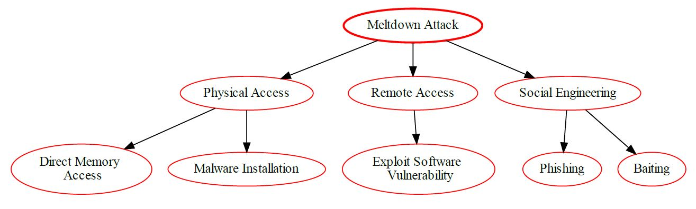

# Hardware Integrity Attack 

Hardware Integrity is the assurance that hardware components are functioning as expected and have not been tampered with or compromised. It is essential to ensuring secure data transmission and verifying the accuracy of input and output.

The goal of hardware integrity is to protect the trustworthiness of the hardware system by safeguarding against corruption or unauthorized modification. This includes protecting physical components, verifying digital signatures, authenticating communication channels, and other measures that can detect and prevent malicious activity.

Hardware integrity is a vital security measure for any type of system or network, as it helps to ensure that data remains safe and secure from external threats.

## Mitigation

1. Hardware Security Modules (HSMs): Use HSMs to manage digital keys securely. HSMs provide a secure environment for cryptographic operations and protect against physical tampering;
2. Secure Boot: Implement secure boot processes to ensure that only trusted software is loaded during the boot process. This can prevent unauthorized modifications to the hardware;
3. Hardware Attestation: Use hardware attestation services to verify the integrity of the hardware. These services can check if the hardware has been tampered with or modified;
4. Tamper-Evident Designs: Use tamper-evident designs in your hardware. These designs can show signs of tampering, alerting you to potential integrity issues;
5. Regular Audits and Inspections: Conduct regular audits and inspections of your hardware. This can help identify any potential integrity issues early.
User Awareness: Educate users about the importance of hardware integrity. Users should be aware of the risks associated with tampered hardware and know how to identify signs of tampering.

## Hardware Integrity Architectural Risk Analysis 

| **Factor**                  | **Description**                                                                                               | **Value**                                        |
|-----------------------------|---------------------------------------------------------------------------------------------------------------|--------------------------------------------------|
| Vulnerability               | Weaknesses in hardware components (mobile device, cloud servers) allowing unauthorized access or manipulation | -                                                |
| Attack Vector (AV):         | Varies (Depends on the attack method - physical access, remote exploit)                                       | Varies (L, N, or Ph)                             |
| Attack Complexity (AC):     | High (Requires specialized knowledge and potentially complex exploit development)                             | High (H)                                         |
| Privileges Required (PR):   | Varies (Depends on the vulnerability - physical access might be required)                                     | Varies (N, L, or H)                              |
| User Interaction (UI):      | None (Attack might not require user interaction)                                                              | None (N)                                         |
| Scope (S):                  | Varies (Depends on attacker's capability and compromised hardware)                                            | Data Breach (DB) (if confidential data accessed) |
| Confidentiality Impact (C): | High (Attacker might access confidential user data stored in the cloud)                                       | High (H)                                         |
| Integrity Impact (I):       | High (Attacker might manipulate data on the compromised hardware)                                             | High (H)                                         |
| Availability Impact (A):    | High (Compromised hardware might impact application functionality)                                            | High (H)                                         |

Base Score (assuming successful exploitation): 0.85 * (AV: Varies/AC:H/PR:Varies/UI:N) * (S:DB/C:H/I:H/A:H) * 1.0 = Varies (Depends on AV & PR) |

Temporal Score (TS): | Depends on exploit code availability for specific vulnerabilities | Varies |
Environmental Score (ES): | Depends on security practices (secure boot, hardware verification), mobile device management (MDM), cloud security posture (secure servers, intrusion detection) | Varies |

Overall CVSS Score: | Base Score + TS + ES | Varies (Depends on TS, ES, and specific attack vector/privilege requirements) |
Risk Rating: | High to Critical (Depends on TS, ES, and specific attack scenario) | High to Critical |

**Overall, Hardware Integrity vulnerabilities pose a high to critical risk for mobile cloud-based applications. Implementing robust security measures across the mobile device, cloud infrastructure, and application development process is essential to mitigate the risk of data breaches, compromised data integrity, and potential application disruptions.**

## Hardware Integrity Attack Tree 


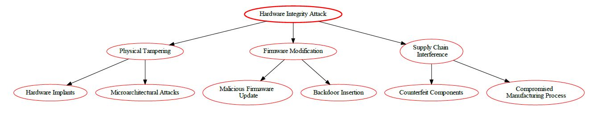

# Rowhammer Attack 

Rowhammer is a security exploit that takes advantage of a hardware weakness in some modern computer memory chips. It is a side-channel attack wherein a malicious program can cause a targeted memory cell to change its content, resulting in data corruption or a system crash. In recent years, Rowhammer attacks have become increasingly popular, as attackers can exploit them to gain access to otherwise secure systems or networks.

## Mitigation

1. **ECC Memory**: Use Error-Correcting Code (ECC) memory in devices. ECC memory can detect and correct bit flips, which are the basis of the Rowhammer attack;

2. **Memory Refresh Rates**: Increase the memory refresh rates. This can reduce the chance of bit flips occurring;

3. **Rowhammer-proof DRAM**: Use newer DRAM modules that have built-in mitigations against Rowhammer. Some manufacturers have started to produce DRAM that is resistant to Rowhammer attacks;

4. **Software Guard Extensions (SGX)**: Use Intel's SGX or similar technologies to protect sensitive data in memory;

5. **Regular Software Updates**: Keep all software, including operating systems and applications, up to date. This helps to patch any known vulnerabilities that could be exploited by attackers;

6. **Firewalls and Intrusion Detection Systems (IDS)**: Use firewalls and IDS to monitor and control incoming and outgoing network traffic based on predetermined security rules;

7. **Regular Audits and Penetration Testing**: Regularly conduct security audits and penetration testing to identify and fix any security vulnerabilities;

8. **Secure Cloud Configurations**: Ensure that your cloud configurations are secure and that all data is encrypted during transmission;

9. **IoT Security Measures**: Implement IoT-specific security measures such as device authentication, secure booting, and hardware-based security solutions.

Remember, security is a continuous process and it's important to stay updated with the latest threats and mitigation strategies.

## Rowhammer Architectural Risk Analysis 

The Common Vulnerability Scoring System (CVSS) v3.1 is used to provide an architectural risk analysis of the Rowhammer attack vulnerability.

| **Factor**                                    | **Description**                                                                                                                                      | **Value**                                     |
|-----------------------------------------------|------------------------------------------------------------------------------------------------------------------------------------------------------|-----------------------------------------------|
| Attack   Vector (AV):                         | Local   (Requires physical access to the device or malicious app)                                                                                    | Local   (L)                                   |
| Attack   Complexity (AC):                     | High   (Requires specialized knowledge and potentially custom malware)                                                                               | High   (H)                                    |
| Privileges   Required (PR):                   | Varies   (Depends on the attack method, could be user-level)                                                                                         |         Low (L) to High (H)                   |
| User   Interaction (UI):                      | Varies   (Might require user interaction to initiate the attack)                                                                                     | Optional   (O)                                |
| Scope   (S):                                  | Data   Corruption (attacker can potentially corrupt application data)                                                                                | Data   Loss (DL)                              |
| Confidentiality   Impact (C):                 | High   (Corrupted data might reveal confidential information)                                                                                        | High   (H)                                    |
| Integrity   Impact (I):                       | High   (Corrupted data can lead to unexpected behavior)                                                                                              | High   (H)                                    |
| Availability   Impact (A):                    | High   (Corrupted data might render the application unusable)                                                                                        | High   (H)                                    |
| Base   Score (assuming High for all impacts): | 0.85   * (AV:L/AC:H/PR:L/UI:O) * (S:DL/C:H/I:H/A:H)                                                                                                  | 9.0   (Critical)                              |
| Temporal   Score (TS):                        | Public   exploit code available for specific devices?                                                                                                |         Depends on exploit availability       |
| Environmental   Score (ES):                   | Depends   on device hardware security features (memory error correction), application   security measures (data validation), user awareness training | Varies                                        |
| Overall   CVSS Score                          | Base   Score + TS + ES                                                                                                                               |         Varies (Depends on TS & ES)           |
| Risk   Rating                                 | High   to Critical (Depends on TS & ES)                                                                                                              | High   to Critical                            |

**Overall, Rowhammer poses a high to critical risk for mobile cloud-based applications that hold user's confidential data. A combined approach with secure hardware, application security practices, and user education can significantly reduce the risk.**

## Rowhammer Attack Tree Diagram


# Orbital Jamming Attacks

This is a DoS attack that targets the communication satellites, using a rogue uplink station to disrupt the intended transmission, aiming to make this service unavailable to users of the target mobile devices.

## Definition

 This type of attack targets low-orbit satellites because, although these low-orbit satellites are attractive due to the low power levels required for communications links from terrestrial terminals, they can also be vulnerable to jamming attacks when used in some applications. In fact, a jammer of reasonable power could easily saturate the RF front-end of a low-orbit satellite, resulting in disabling the link across the entire frequency band. 

## Techniques

1. **Satellite Signal Interference**:
 * Continuous Wave (CW) Jamming: Emit a constant RF signal at the satellite’s frequency;
 * Swept-Frequency Jamming: Vary the jamming frequency across a range;
 * Pulsed Jamming: Intermittently transmit RF pulses.
2. **Geolocation Spoofing**:
 * Transmit false location information to confuse satellite receivers.
3. **Selective Jamming**:
 * Target specific frequency bands (e.g., GPS, communication, weather).

## Consequences

1. **Communication Disruption:** 
 * Interrupt satellite communication links (e.g., military, civilian, emergency services);
 * Impact global navigation systems (e.g., GPS).
2. **Military Implications**:
 * Degrade situational awareness;
 * Compromise command and control operations.

## Mitigation

1. **Diversification of Communication Channels:** Use multiple communication channels and frequencies. If one channel is jammed, the system can switch to another;
2. **Spread Spectrum Techniques:** Spread Spectrum techniques such as Frequency Hopping Spread Spectrum (FHSS) and Direct Sequence Spread Spectrum (DSSS) can be used to resist jamming attacks;
3. **Encryption and Authentication:** Use strong encryption and authentication methods to ensure that only legitimate users can access the system;
4. **Geolocation:** Use geolocation to identify the location of the jamming source and take appropriate action;
5. **Power Control:** Adjust the power levels of the communication signals to minimize the impact of jamming;
6. **Redundancy:** Use redundant systems and networks to ensure availability even in the event of a jamming attack;
7. **Regular Monitoring and Incident Response:** Regularly monitor the system for signs of jamming and have an incident response plan in place.

## Architectural Risk Analysis of Orbital Jamming Vulnerability

The orbital jamming attack targets satellite communication systems and poses significant risks. Let’s analyze it using the Common Vulnerability Scoring System (CVSS) v3.1:

| **Metric**                        | **Description**                                                    | **Value** |
|-----------------------------------|--------------------------------------------------------------------|-----------|
| Base                              |                                                                    |           |
| CVSS ID                           | (placeholder, assigned by vulnerability reporting authority)       |           |
| Attack Vector (AV)                | Network (physical)                                                 | N         |
| Attack Complexity (AC)            | Low. Orbital jamming requires specialized equipment and knowledge. | L         |
| Privileges Required (PR)          | None. Attacker does not need privileges on the target system.      | N         |
| User Interaction (UI)             | None. User action is not required to exploit the vulnerability.    | N         |
| Scope (S)                         | Confidentiality, Availability                                      | C,A       |
| Confidentiality Impact (CI)       | High. Sensitive user data can be intercepted.                      | H         |
| Integrity Impact (II)             | None. Orbital jamming does not modify data.                        | N         |
| Availability Impact (AI)          | Medium. Users may be unable to access the application.             | M         |
| Threat                            | (default values used as likelihood is difficult to assess)         |           |
| Exploitability Ease (PE)          | High                                                               | H         |
| Exploit Code Maturity (EC)        | Not defined                                                        | X         |
| Impact Modifiers (MOD)            | None                                                               |           |
| Environmental                     | (consider specific environment when assigning values)              |           |
| Security Requirements (SR)        | Low. Limited security controls in place to prevent jamming.        | L         |
| Collateral Damage Potential (CDP) | Low. Disruption limited to application functionality.              | L         |
| Other Environmental Factors (O)   | None                                                               |           |

*Remember, addressing orbital jamming vulnerabilities is crucial for maintaining reliable communication and navigation.*


## References
1. [CAPEC-559: Orbital Jamming](https://capec.mitre.org/data/definitions/559.html).
2. Weerackody, V., 2021. Satellite diversity to mitigate jamming in leo satellite mega-constellations, in: 2021 IEEE International Conference on Communications Workshops (ICC Workshops), IEEE, Montreal, QC, Canada. pp. 1–6. doi:10.1109/ICCWorkshops50388.2021.9473519.

## Orbital Jamming Attack Tree Diagram


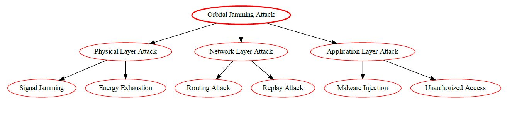